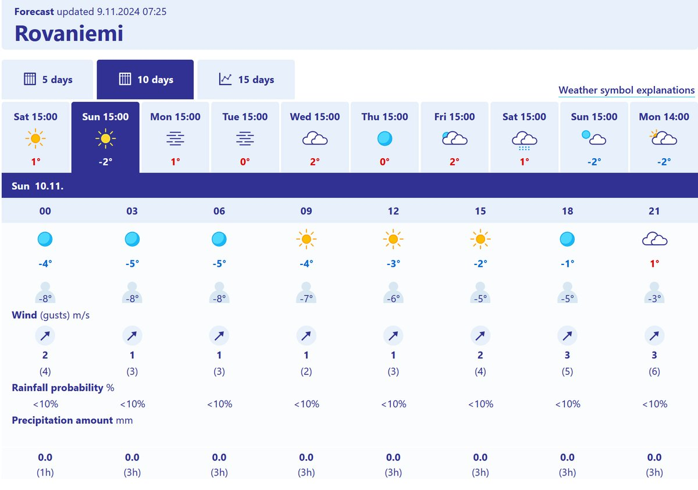

# Thread - 2024-11-09

**Original:** https://x.com/RiikonenMarko/status/1855142069179695471

---

### 1/2 - 2024-11-09 06:55 UTC

They don't turn on the guns for just one night. But I'd say winter hasn't been favorable for the snow making so far and the picture looks pretty glum for the foreseeable future, so maybe they want to utilize the singular temp slump coming night. Ice fog would be on the cards around from 3 am when the winds have calmed down.

---

### 2/2 - 2024-11-10 09:13 UTC

All lights were off last night at Ounasvaara Ski Resort, no activity.

---

