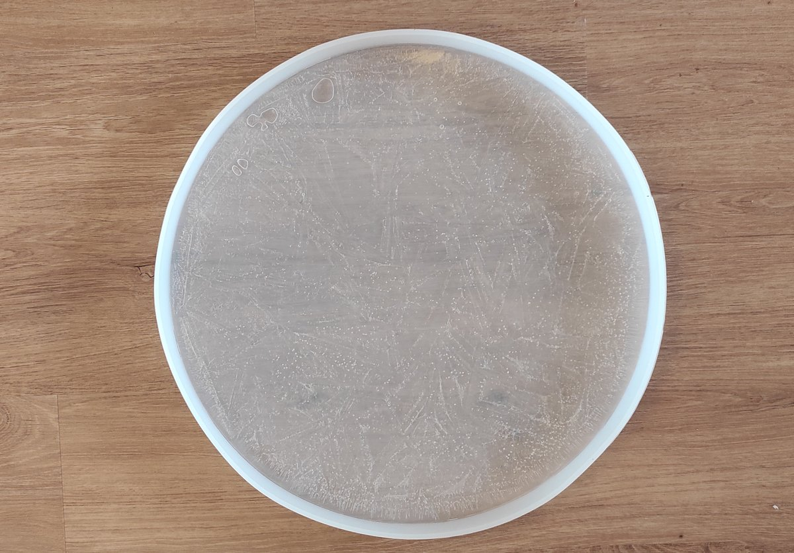

# Thread - 2024-11-24

**Original:** https://x.com/RiikonenMarko/status/1860620455289188403

---

### 1/1 - 2024-11-24 09:44 UTC

I am trying to grow my own puddle ice plate displays this winter. Part one, freezing the plate last night was success. A rigid mold may result in breaking the ice plate, but in this pliable 50 cm silicon mold the plate came out nice and intact. Next I will get a plastic tub on which the ice plate will act as a lid. In the bottom of the tub will be an usb cup heater with some water to provide moisture for the crystal growth on the plate underside. That's the plan.

---

