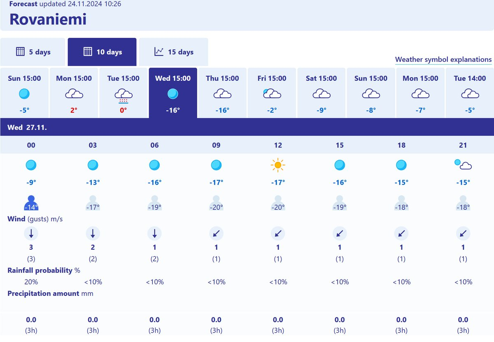

# Thread - 2024-11-24

**Original:** https://x.com/RiikonenMarko/status/1860616386533274109

---

### 1/1 - 2024-11-24 09:28 UTC

Forecast finally starting to look the business. Low winds from Wednesday to Sunday except for Friday. But I have a little problem: when summer arrived I gave up my parking slot with electric outlet to save money and didn't get it back now. So I can't preheat the motor and risk breaking it if I start too cold. I have bought an insulation mat to put under the bonnet to keep the motor warm longer after driving. In theory I could go regularly for a drive the keep it constantly warm during periods of deeper cold. We'll see.

---

