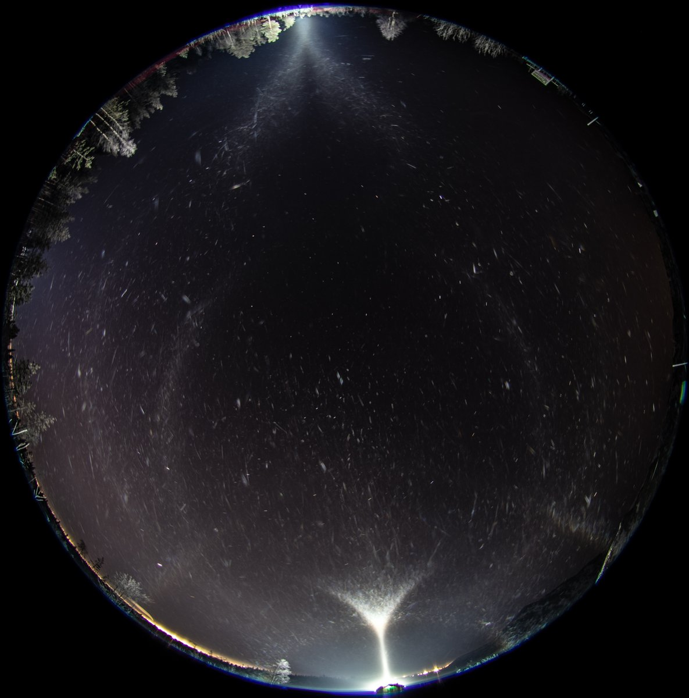

# Thread - 2024-11-28

**Original:** https://x.com/RiikonenMarko/status/1862024504370741674

---

### 1/1 - 2024-11-28 06:43 UTC

Last night (27/28 November 2024) I was out some four hours in the evening, driving around and then ending up at Anttilanvaara which seems to be always a good place when in doubt. The diamond dust was sparse, not enough crystals. That's why the display shown here is so dark. And it looked like it is not gonna get better. As I had skipped sleep in the daytime and the previous night I decided to call it a quits. I think I missed nothing: in the morning there was diamond dust but streetlights gave no halos.

---

