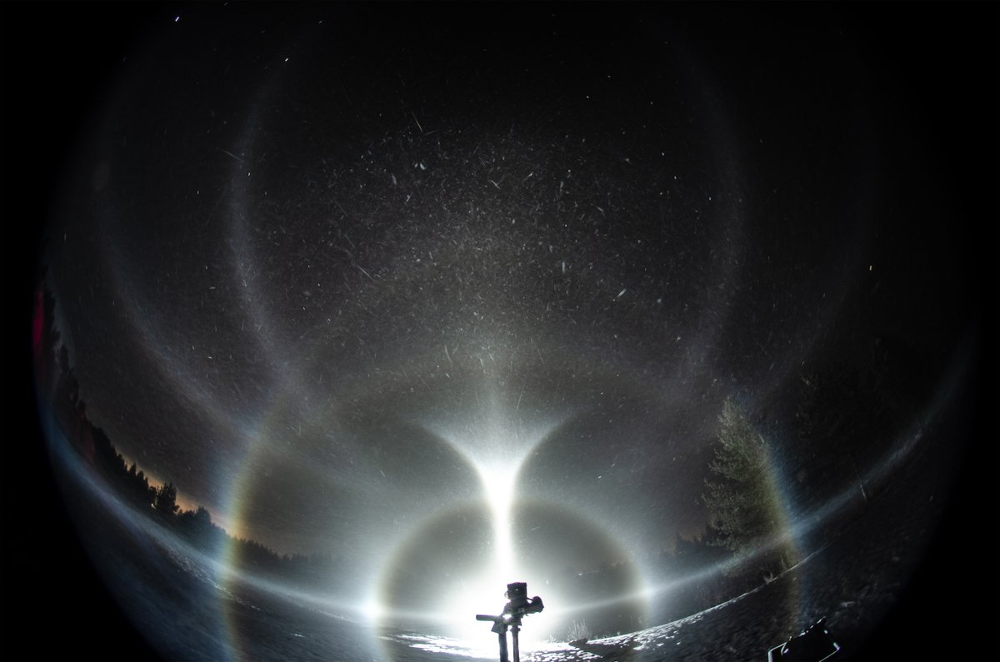
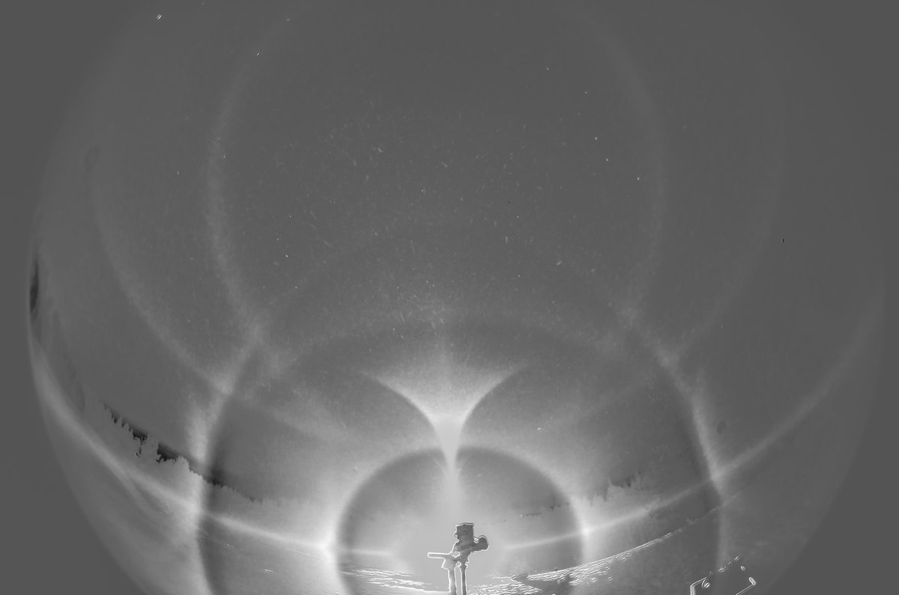
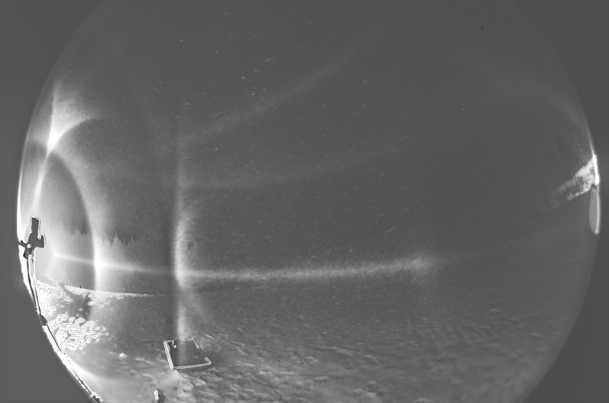
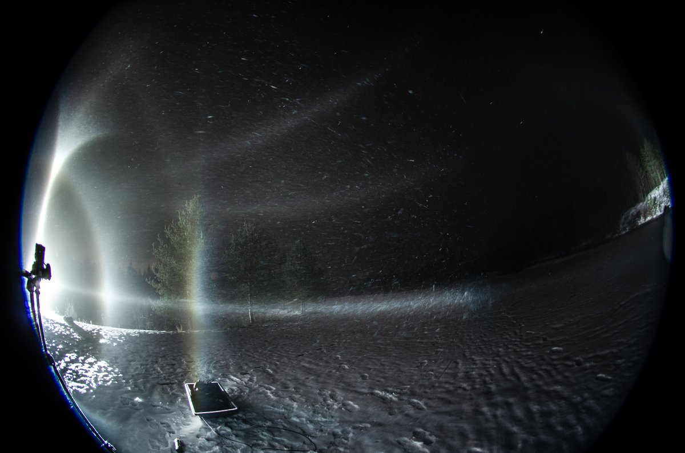
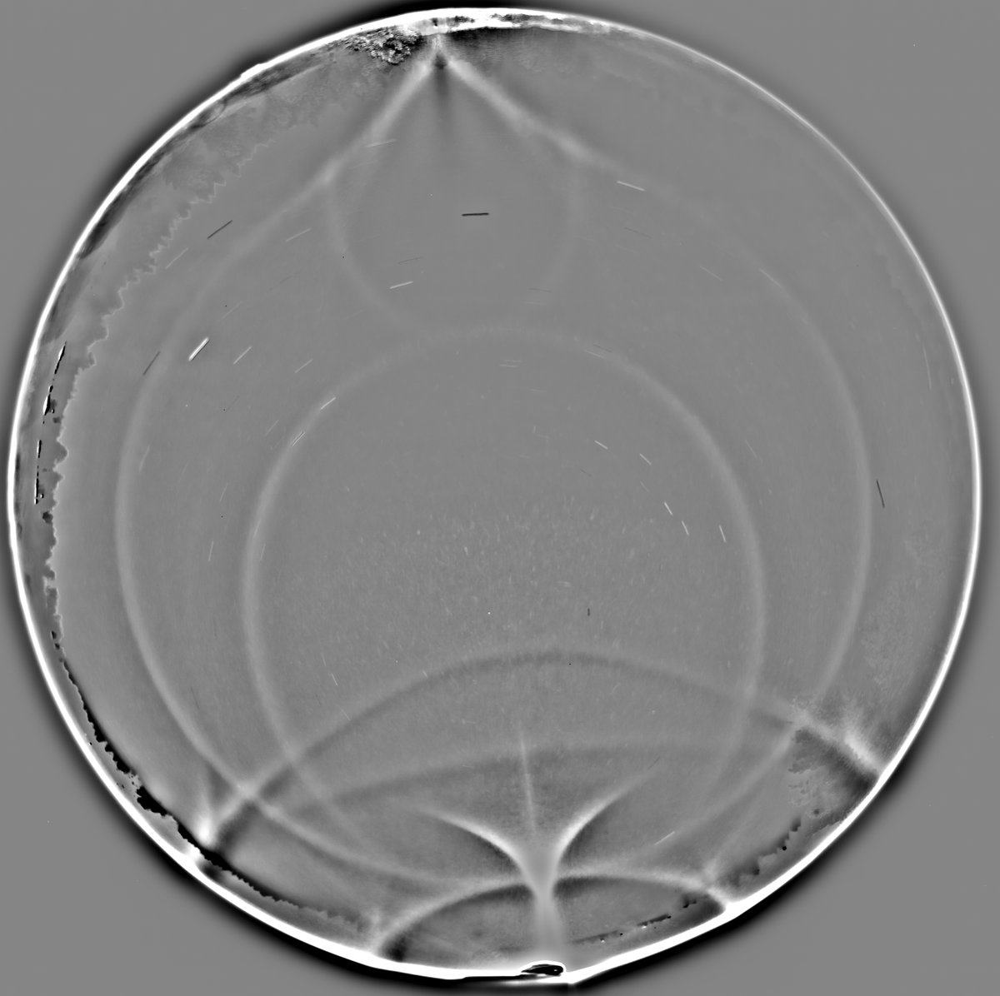
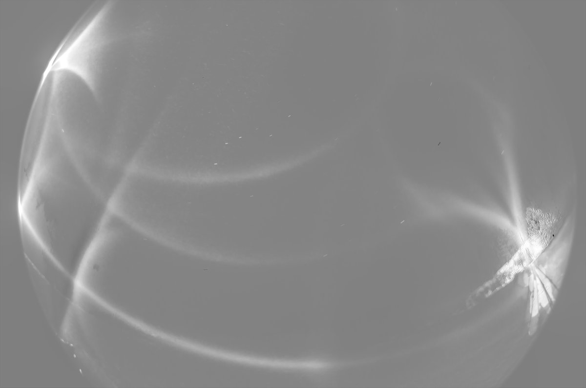
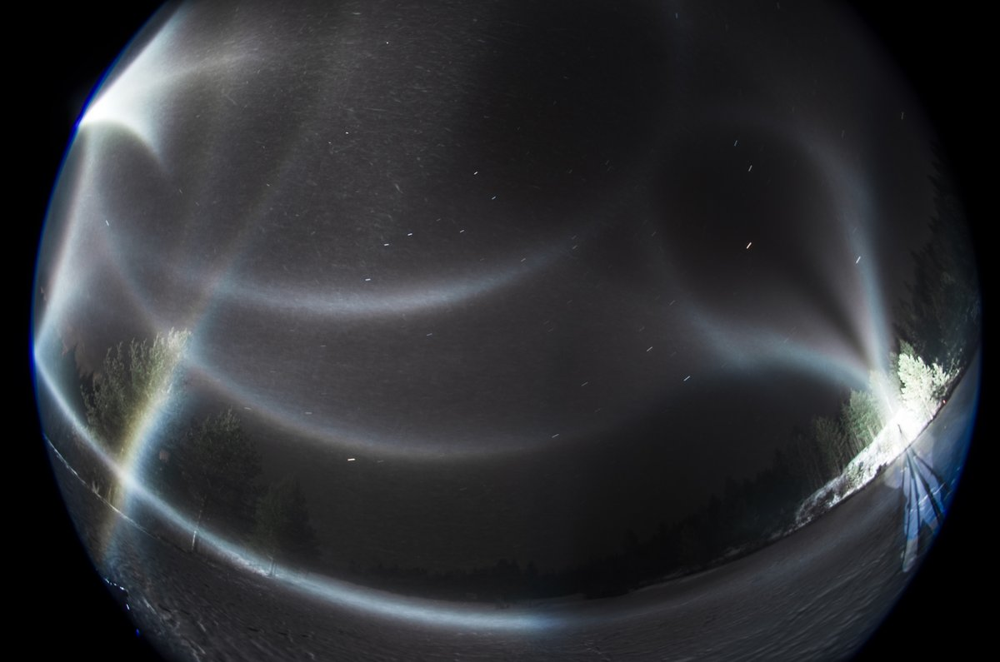
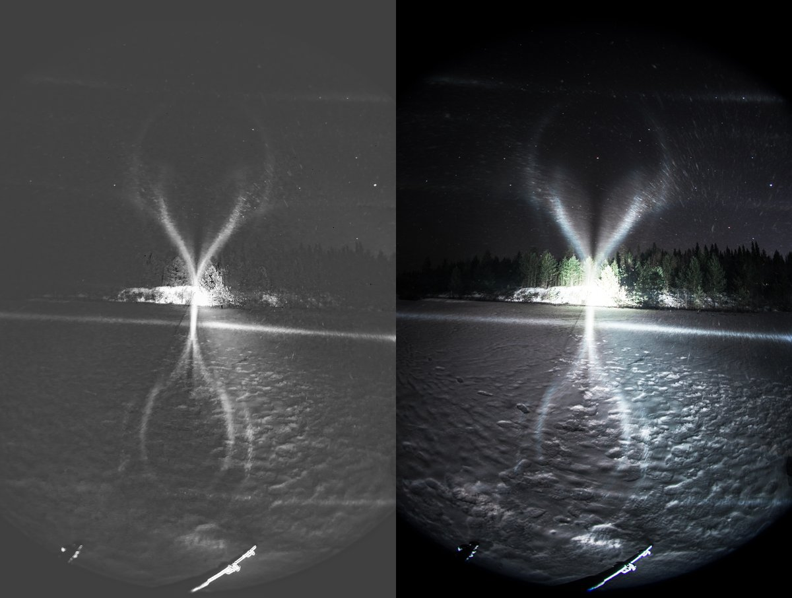
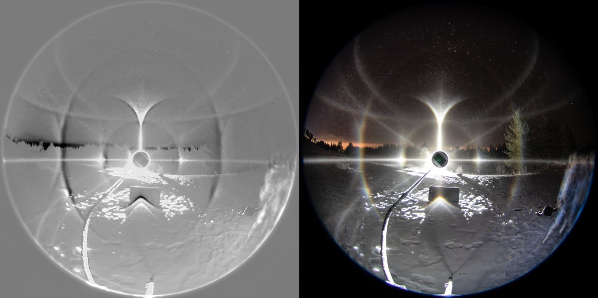

# Thread - 2024-11-28

**Original:** https://x.com/RiikonenMarko/status/1862121796272578754

---

### 1/3 - 2024-11-28 13:10 UTC

More photos from 26/27 November 2024 night. These cropped fisheye images were taken with Nikon D7000. All are stacks from two to a couple more photos. For some reason the Nikon originals were quite dark. The sliders in Photoshop did their magic, but of course some loss of color information has taken place.

There is really nothing that specifically calls for attention here. So some words about the visual experience. Counterhelic (subhelic) arc and Wegener against the sky were nice and solid. But most of all I liked the full Tricker arc loop against the ground. The counterhelic arc glitter tangenting it was clear, too. Effectively I was watching a full globe halo display. The counteranthelic (subanthelic) arc, that is also seen well against the ground in the image, my brain did not register. Camera was about 190 cm above the ground.

---

### 2/3 - 2024-11-28 13:10 UTC

Well maybe there is after all something to point out, namely the Tricker arc blue spot which is seen in the all-sky image taken with Canon 80D. I don't remember it having been photographed before. Counterhelic arc has also a blue spot at the intensity threshold, but I am not seeing it.

26/27 November 2024 Rovaniemi.

---

### 3/3 - 2024-11-28 13:10 UTC

Here I purposedly shadowed the tangent arc location with the sledge to see if there is lowervex Parry. I could not see it visually, but given how clear it is in the photo makes me suspect I was sloppy. If crystals were full triangles, you would have only uppervex Parry.

The location was the golf course pond. Sky had cleared in the evening and I left my place around midnight, but it was still some four hours until the music started. Didn't carry thermometer, the car gave -9 C when I wrapped it up around 5:30.

26/27 November 2024 Rovaniemi.

---

