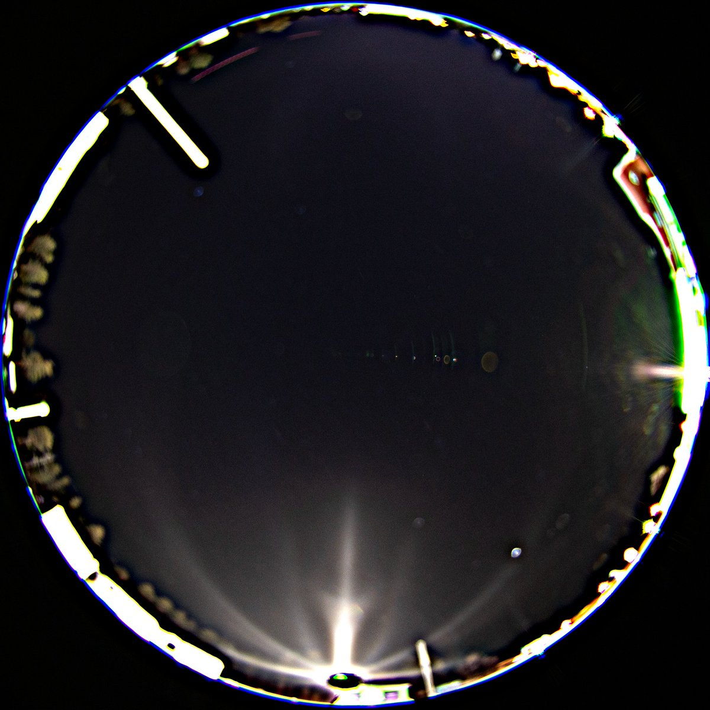
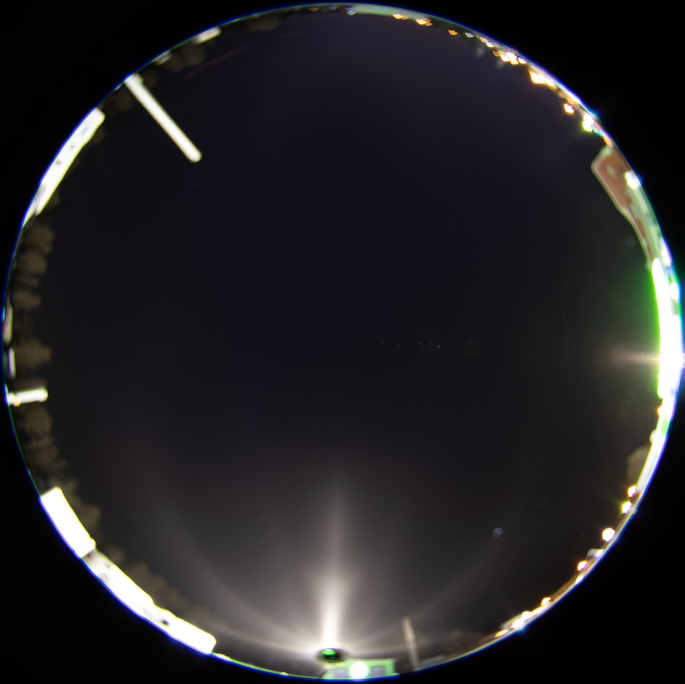

# Thread - 2024-12-06

**Original:** https://x.com/RiikonenMarko/status/1864992859096519160

---

### 1/1 - 2024-12-06 11:18 UTC

It had been already two clear nights, but without ice fog because of wind. And it looked like the next night, Tue-Wed, would be no different. But at one point on Tuesday evening the local cloud at ski center lifted up and seemed to land down at the arctic circle tourist trap area. I followed and managed to take quick photos in the floody beam of the caravan park single light before it disappeared. Temp in car thermometer was - 12 C.

The object of interest is the doubled helic arc. It has been observed earlier at least by Eresmaa in 2021 and me in 2010. What comes to mine, I thought at the time that both arcs were helic arcs  – there were two of them because there were two lights on that pole, pointing at different directions: https://t.co/ZMEBZ9DVCx

However, in Eresmaa's case https://t.co/BbaoJzyJGQ there was speculation of the doubled arc being helic arc and some other arc. But no conclusion could be arrived at the identity of the other arc. At first in the comments 120° parhelion was floated, but Lefaudeux though it is unlikely and suggested (as relayed by Eresmaa) it could be Wegener, Tape or Hastings. I weighed in with the example of my 2010 observation to suggest both were helic arcs from two lights.

Anyway, given this caravan park light was single light, the two arcs must be of different identity and this likely applies also for the both earlier observations.

4/5 December 2024 Rovaniemi.

---

