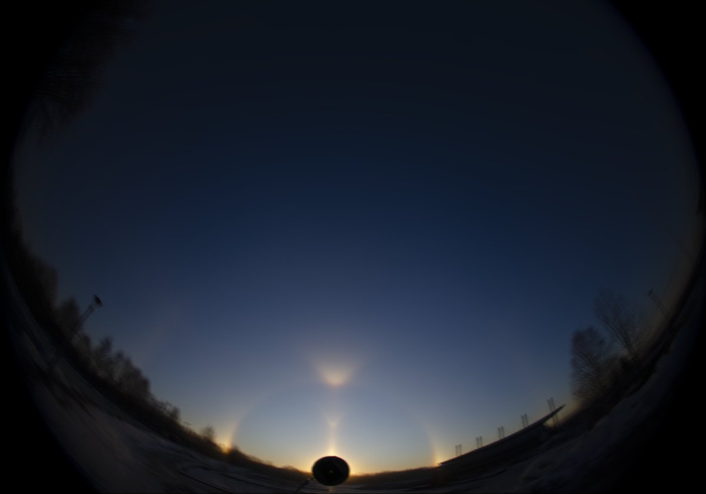
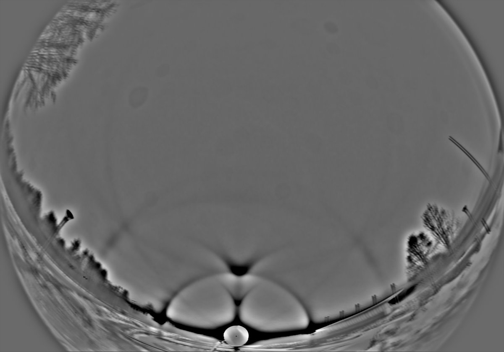
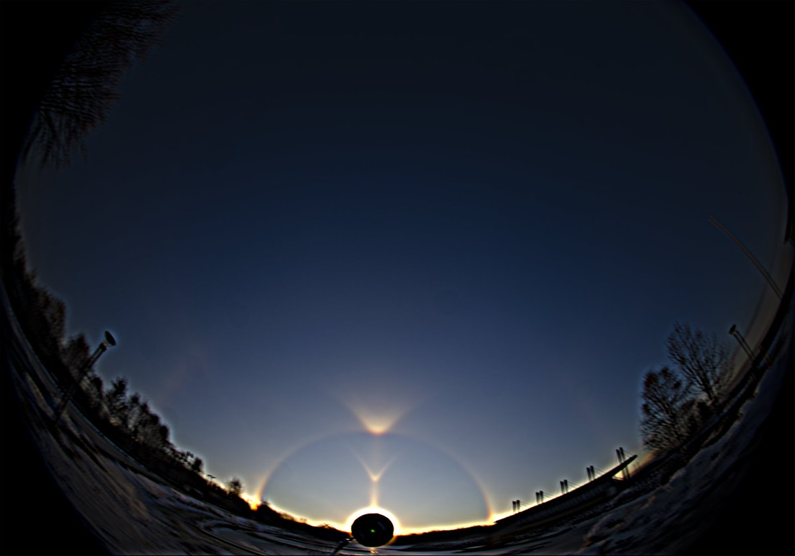
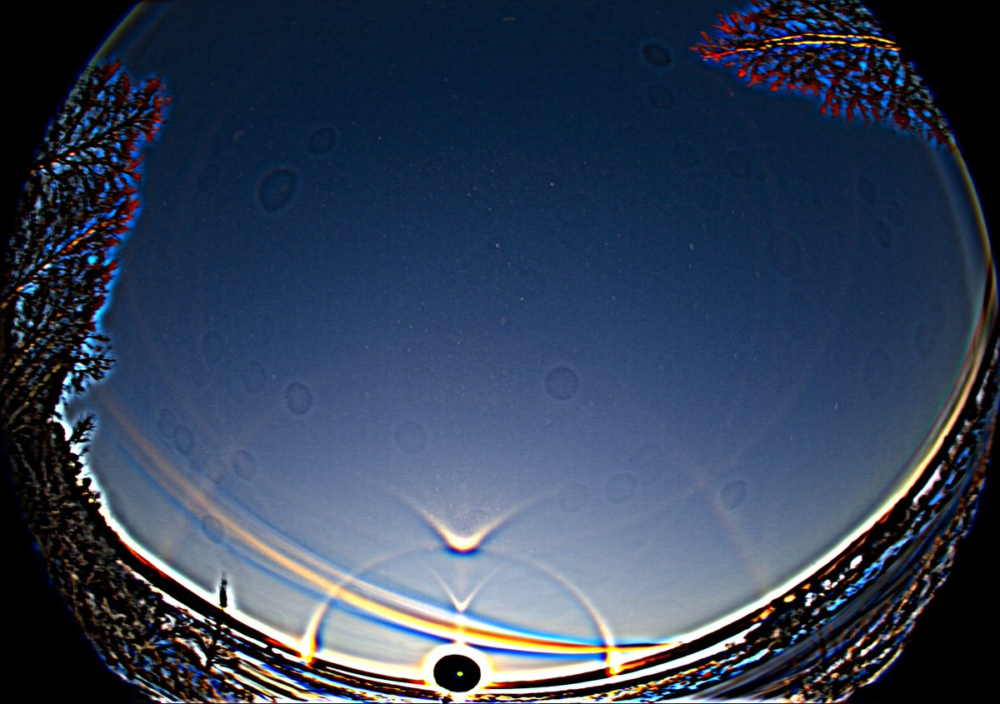
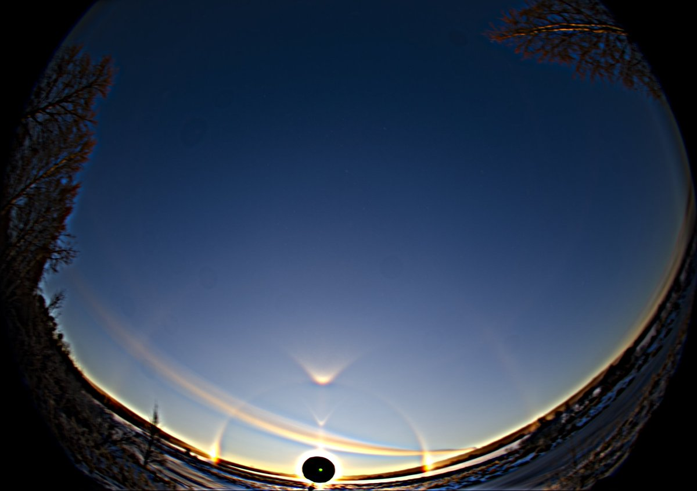
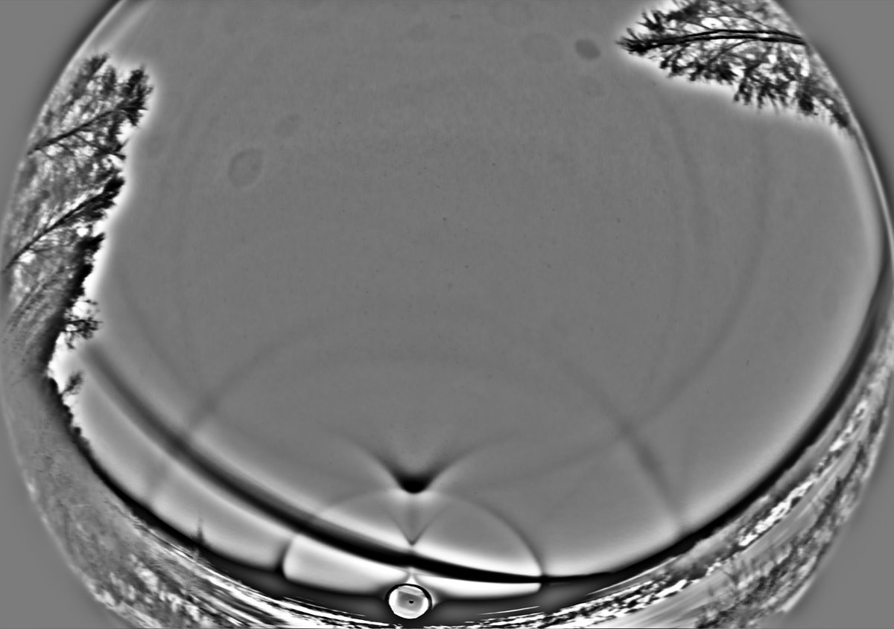

# Thread - 2024-12-07

**Original:** https://x.com/RiikonenMarko/status/1865372399668990125

---

### 1/2 - 2024-12-07 12:26 UTC

The display on 27 November 2024 in Rovaniemi with Moilanen arc. I was gonna take a crystal sample, had the liquid poured on petri dish and microscope up and ready. But I had left the light at the apartment.

Photo interval 3 seconds, 121 frames.

---

### 2/2 - 2024-12-07 12:26 UTC

65 frames (27 November 2024 Rovaniemi). Both helic and counterhelic arc are present. Power plant plume is trailing just underneath the Moila.

I arrived at the scene midday. An hour earlier there was no Moila but an impressive Parry: https://www.taivaanvahti.fi/observations/show/129583

---

