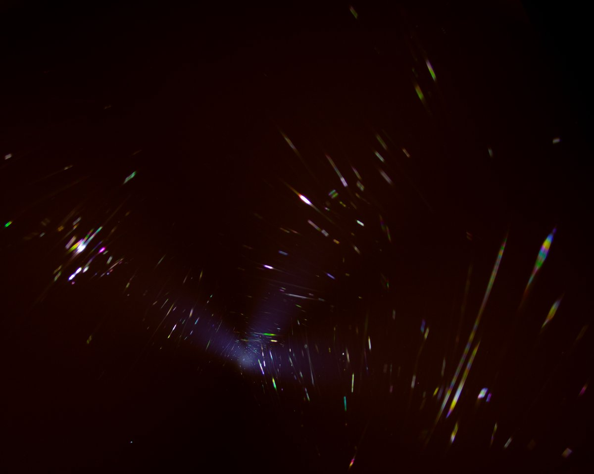
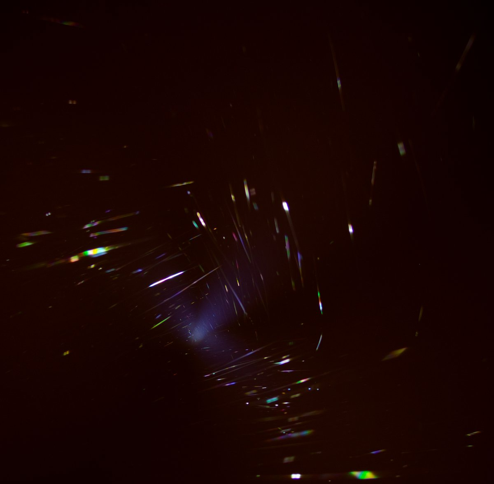
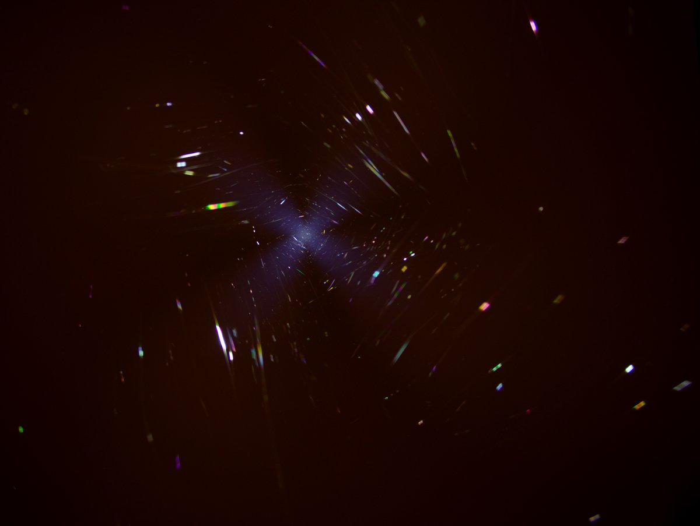
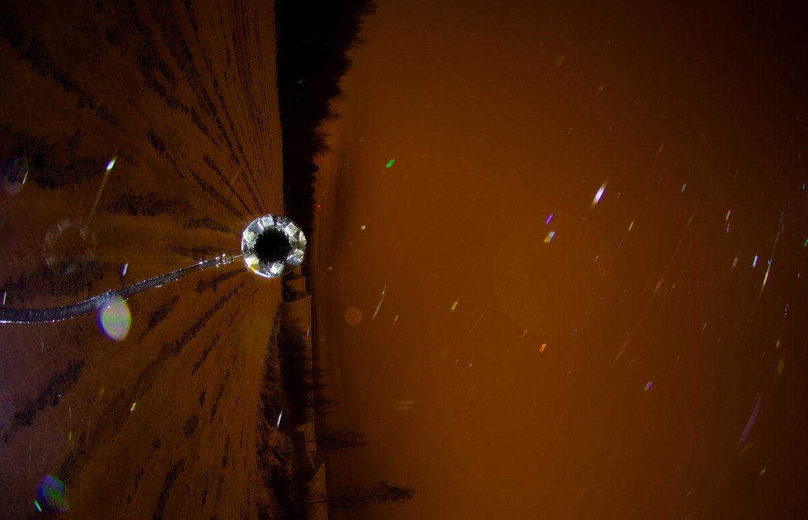
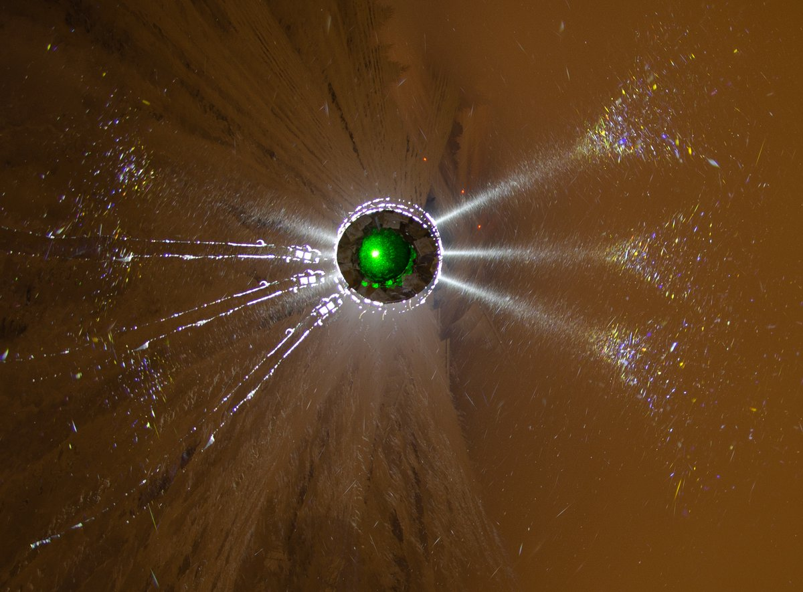
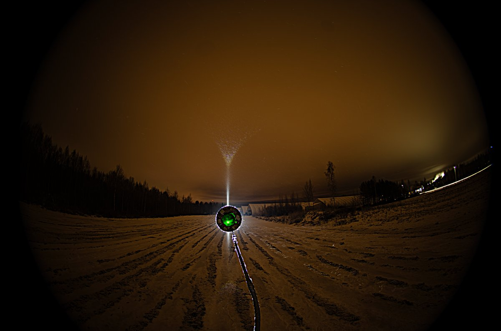
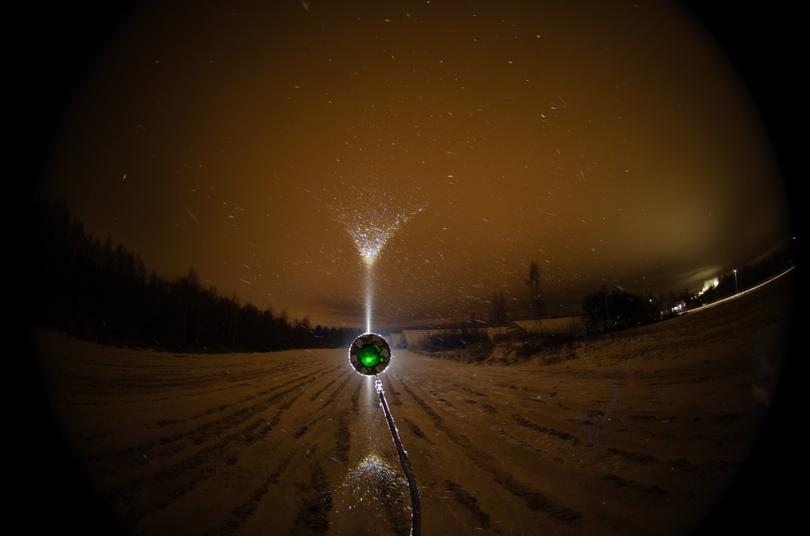

# Thread - 2024-12-07

**Original:** https://x.com/RiikonenMarko/status/1865340229193810147

---

### 1/3 - 2024-12-07 10:19 UTC

A display that had only column crystals made the psychedelic colors shown in these four images (28-29 November 2024 Rovaniemi). When I pointed a hand-held lamp in different directions I thought of seeing them when pointing straight up (three first images, stacks of 3 or 4 rotated photos, 2s exp) but a single photo where the lamp was apparently pointing more horizontally shows them too (4th image, 5s exp).

Now the question is are these from thin film intereference? In post https://t.co/w8WV3TdBPo the colors are from thin film interference as told by Lefadeux in the comments. But the color palette looks different for the glints in this display: https://t.co/AOjSC5gehz

Those look more like what I got this time. In think Lefa wondered if the glints in that other display might instead be from refraction. They are clearly part of the column 357 intensity threshold which is supposed to be white.

Thin film interference in airborne crystals was described at least already in 2002 by Foster and Hallett ('The alignment of ice crystals in changing electric fields') in a cloud chamber experiment.

---

### 2/3 - 2024-12-07 10:19 UTC

Here is the tangent arc photographed just before I switched on to the psychedelic colors documentation (28-29 November 2024 Rovaniemi). First one has three single photos rotated. Second and third images are ave and max stacks of some more photos. Photos were all 5s exp.

---

### 3/3 - 2024-12-23 08:05 UTC

Correction on the date. This stuff was on the night of November 30 - December 1.

---

