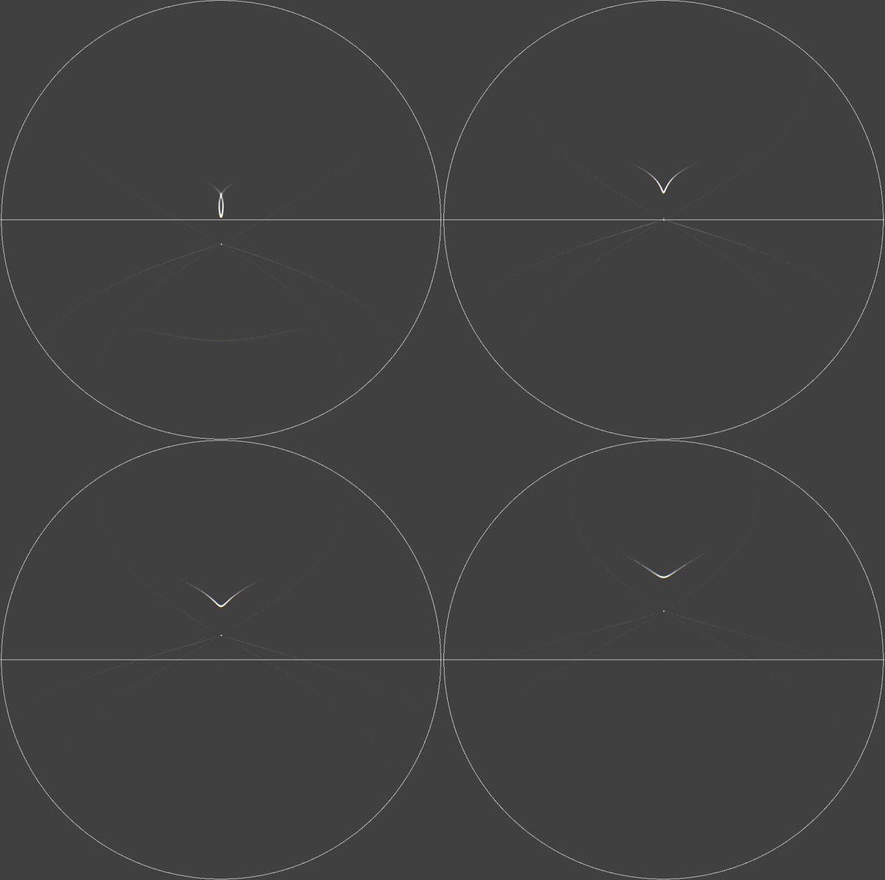

# Thread - 2024-12-08

**Original:** https://x.com/RiikonenMarko/status/1865693080495571268

---

### 1/1 - 2024-12-08 09:41 UTC

Something to look for: Moilanen crystal helic arc. It must be there – if light goes in a crystal face, some of it will reflect from that face. Simulations are for -10, 0, 10 and 20 degree light elevations.

In the -10 simulation I have included also a feature that looks like upside down 23° plate arc. We don't know, but if Moilanen crystals have also horizontally oriented faces, then this arc can form of raypaths entering the bottom horizontal face and exiting the exotic Moilanen face when light is below horizon.

Simulations' intensities are to compare. A weak normal helic arc was added for reference. Moilanen helic arc is the middle arc, appearing only below the light.

---

