# Thread - 2024-12-14

**Original:** https://x.com/RiikonenMarko/status/1867910472399266037

---

### 1/4 - 2024-12-14 12:32 UTC

Quick report from last night (13/14 December 2024 Rovaniemi) before going. This a stack of some 20 images from Anttilanvaara, versions of ave and a max stack. The lamp was resting on the ground but the road had a slight upwards incline in that direction, so maybe the lamp is only like 2 degrees below horizon.

Can't give confident identification on the arcs on the top and bottom of 22° halo. I feel like the blue of the bottom arc is not quite as tanget to the 22° halo as the blue of the upper one. Which would maybe suggest Parry. There is also a hint of Moilanen arc. Temp was around -23 C.

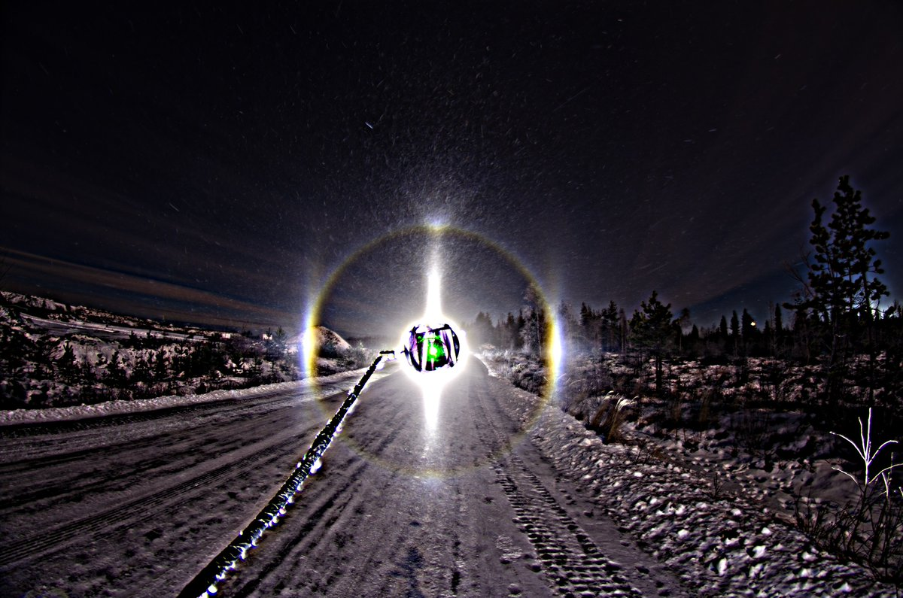

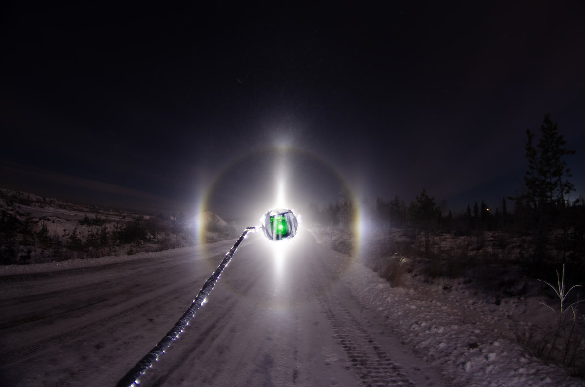

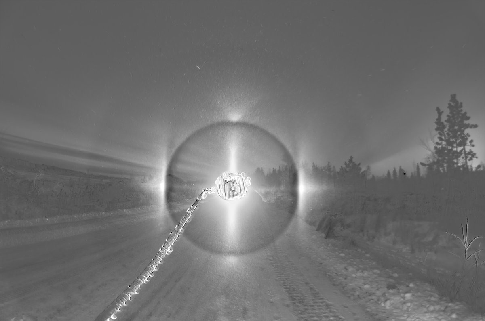

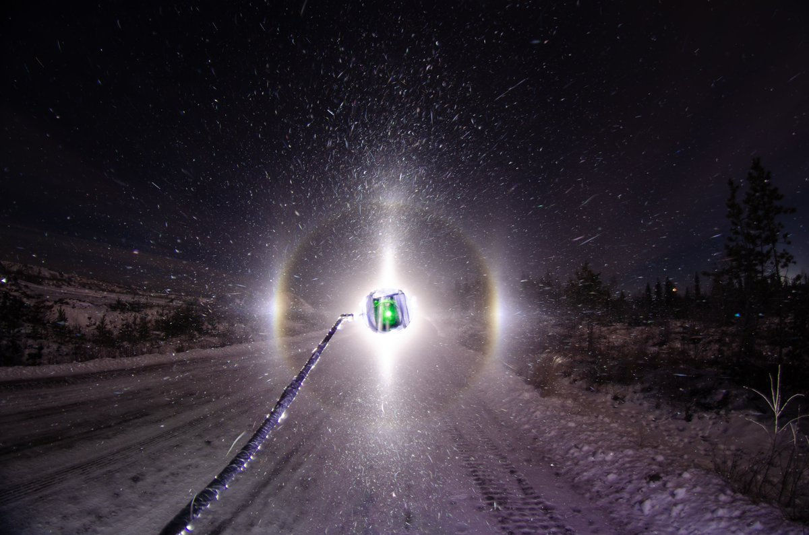

---

### 2/4 - 2024-12-14 12:58 UTC

13/14 December 2024 Rovaniemi. This was near Anttilanvaara. There is tanarc / Parry but nothing below the lamp. Too much light? The depression right in front of the camera would have normally provided a nice shadow but now moon shining from behind the back really lit it up the snow. 30 x 15s exp. The swarm was a bit of a weakling. My portable thermometer was at -25 C.

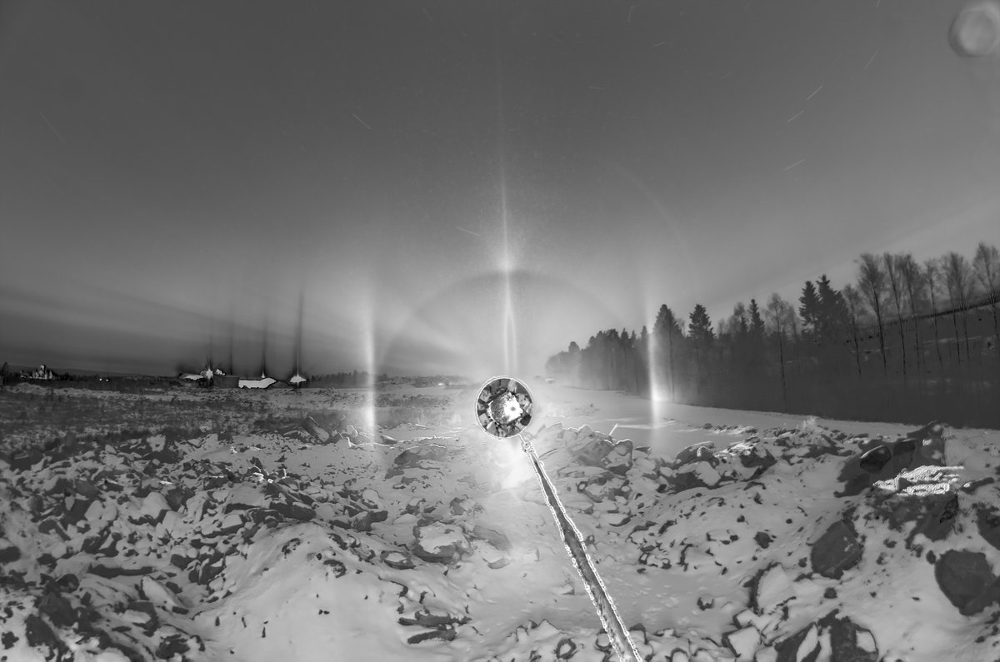

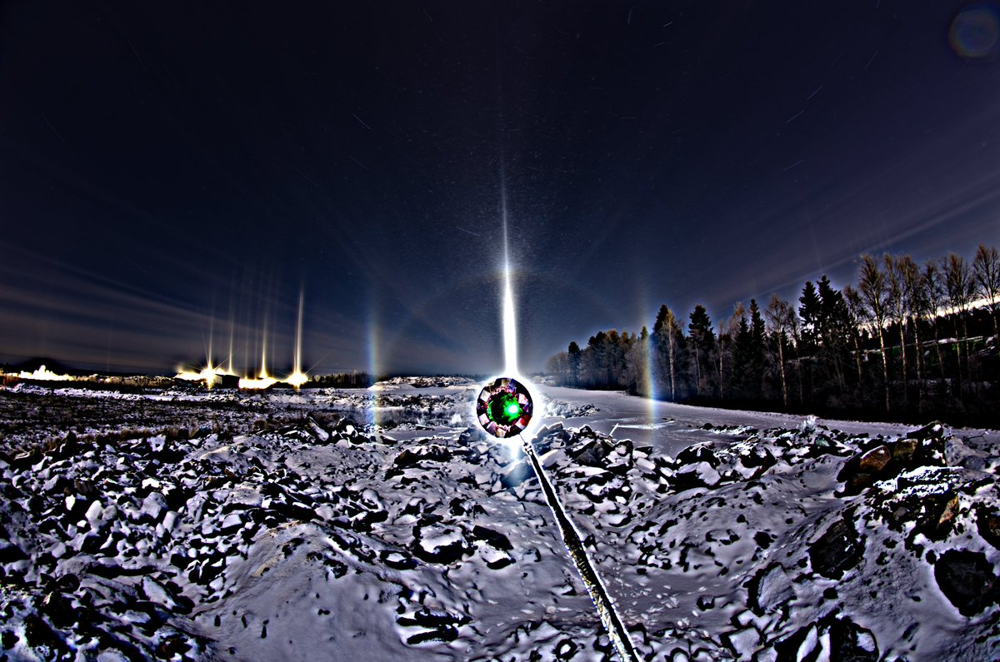

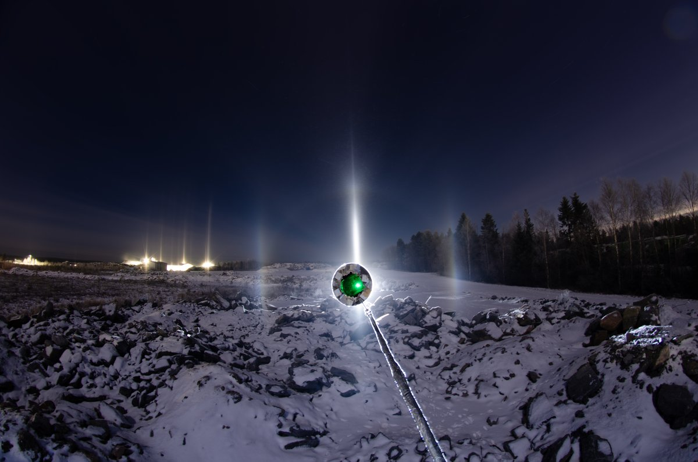

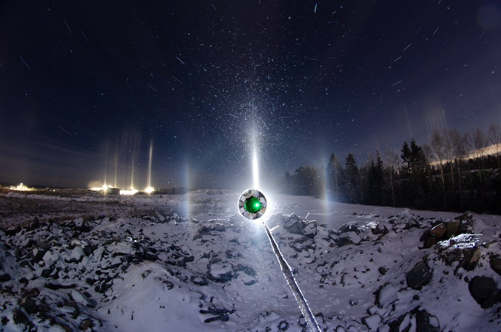

---

### 3/4 - 2024-12-14 13:15 UTC

13/14 December 2024 Rovaniemi. Around midnight the ice fog thickened and seemed to have engulfed pretty much all of the city what I drove around a little. This is in Anttilanvaara again. The last set and then I called it a wrap at 1 am because the forecast for was steady temp I and was pretty certain it is not gonna improve. But I had to put all batteries charging and so on at the apartment (there is quite a bit of things to do to be ready to go again) and eat before going to sleep, so just before that at 3 am I went for a car warm-up ride and it was the same crap. As it seemed to be on another warm-up ride at 8 am at twilight. But I saw something interesting on that ride: pillar sprites in the sky were rippling like in time-lapse due to the (relatively) high wind. Never seen them like that before. It is quite unusual for the ice fog to stay on in such wind.

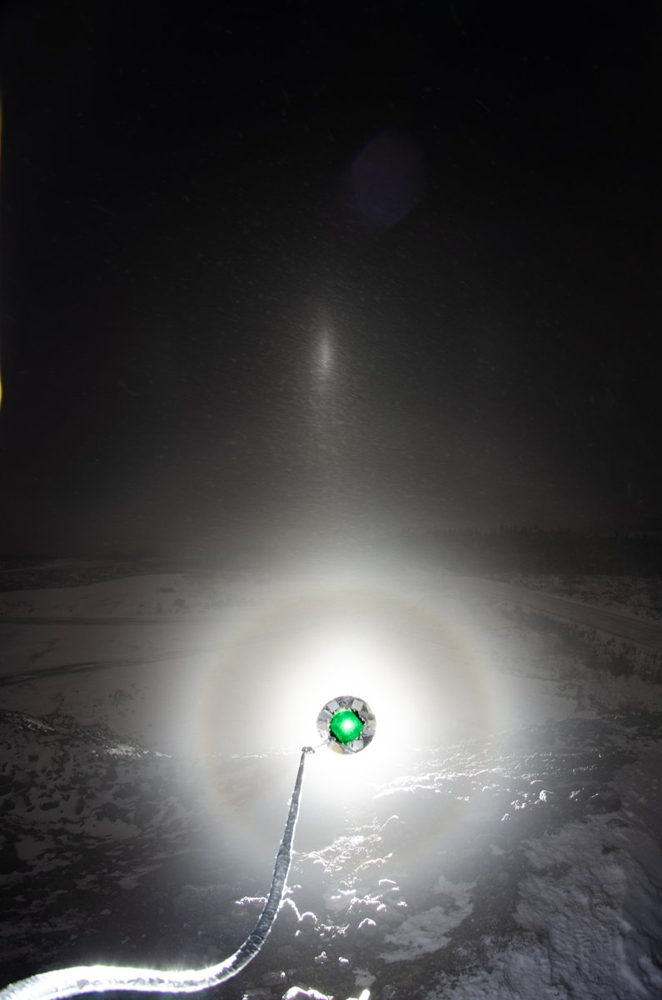

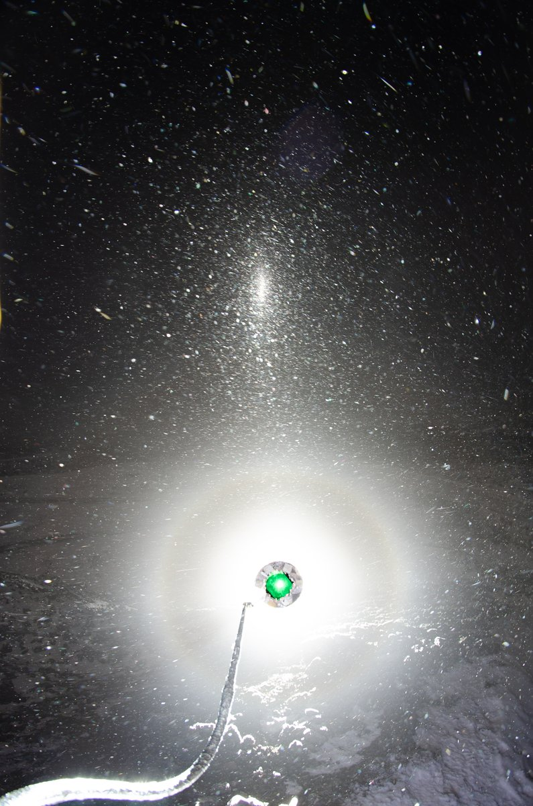

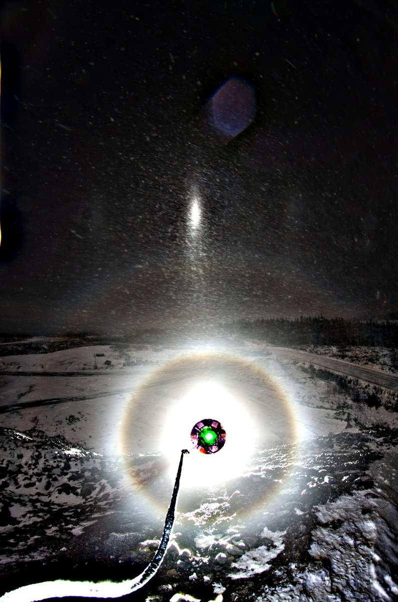

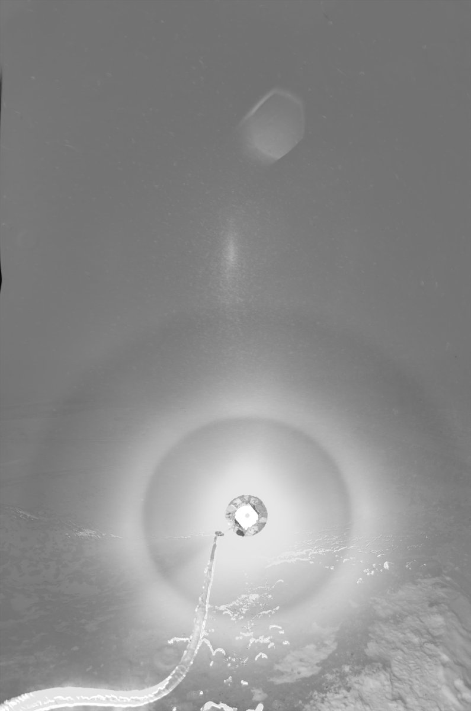

---

### 4/4 - 2024-12-14 13:30 UTC

13/14 December 2024 Rovaniemi. Here is the configuration for the last set with countersun and 22° halo. Anttilanvaara is actually better now because there has appeared this huge pile of asphalt rubble right next to the road to provide a long distance for the mid-low lamp shots (or maybe you could sometimes put the lamp on the top). I was a bit dangerous as there is really no snow cover yet and all those jagged edges are just waiting for you to stumble – which I did many times but managed to out intact.

This was actually all of the lamp stuff for this night. Only some lunar photos waiting to be stacked, both high cloud and ice fog. Don't expect anything from them.

It is getting dark right now and I need to eat and go as the ice fog is there. A full night's chase ahead: the forecast is for totally calm and -30 C in the morning hours. Which means -35 C or more in the usual roaming grounds. Maybe odd radii on the cards which was completely absent last winter despite the many cold nights.

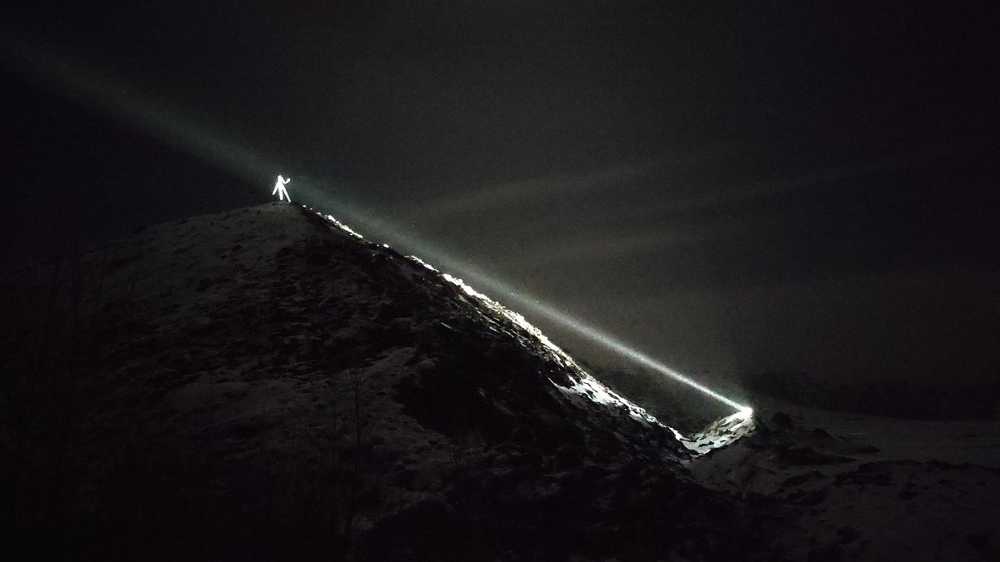

---

