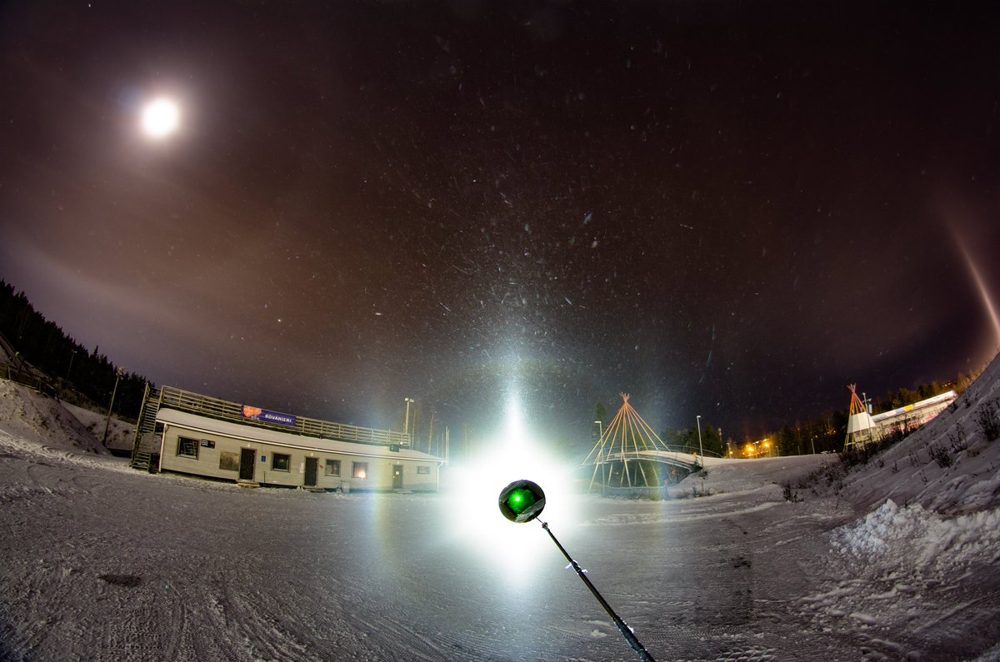
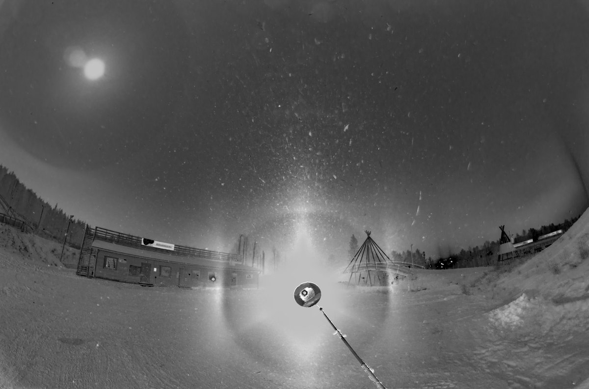
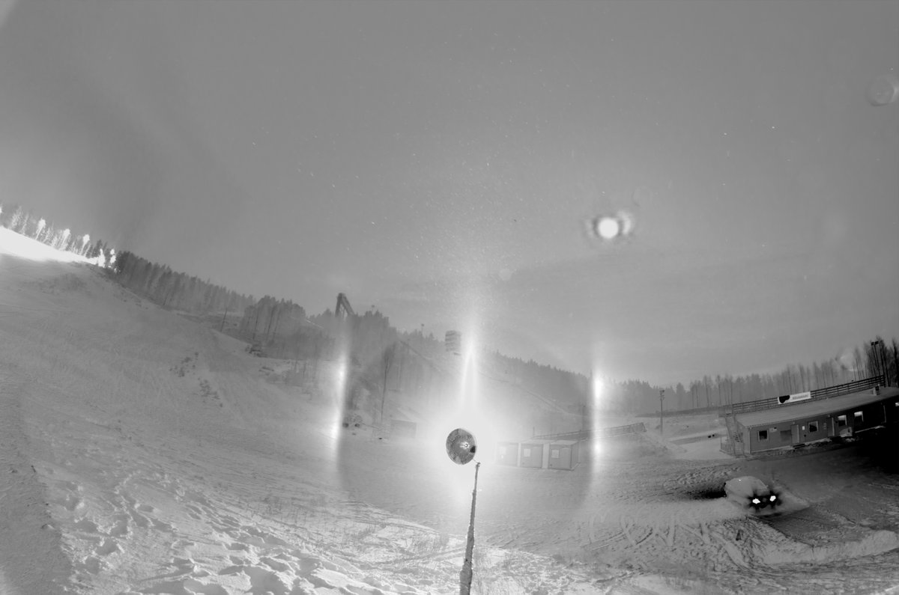
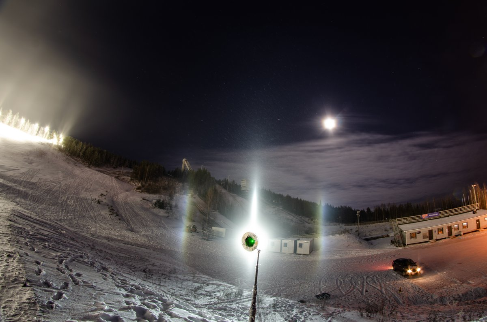

# Thread - 2024-12-20

**Original:** https://x.com/RiikonenMarko/status/1870007531147313487

---

### 1/1 - 2024-12-20 07:25 UTC

There was some action on the night of 16/17 December 2024 Rovaniemi in the morning hours at the ski center. I left the apartment at 4:45 for this run. The two stages shown were shortlived, stacks consisting of two and three three photos with 30s exposures. The ice fog was restricted only at the ski center and I left at 7 am as it seemed not give anything worth photographing anymore. Temp at the railway station was around -21 C, Apukka -23 C.

Noteworthy is of course the helic arc with no V-shaped arc at the top of 22° halo. Such behaviour is not that unusual, we do have earlier cases. There are even helic arcs with no brightening at the top of 22° halo at all.

---

