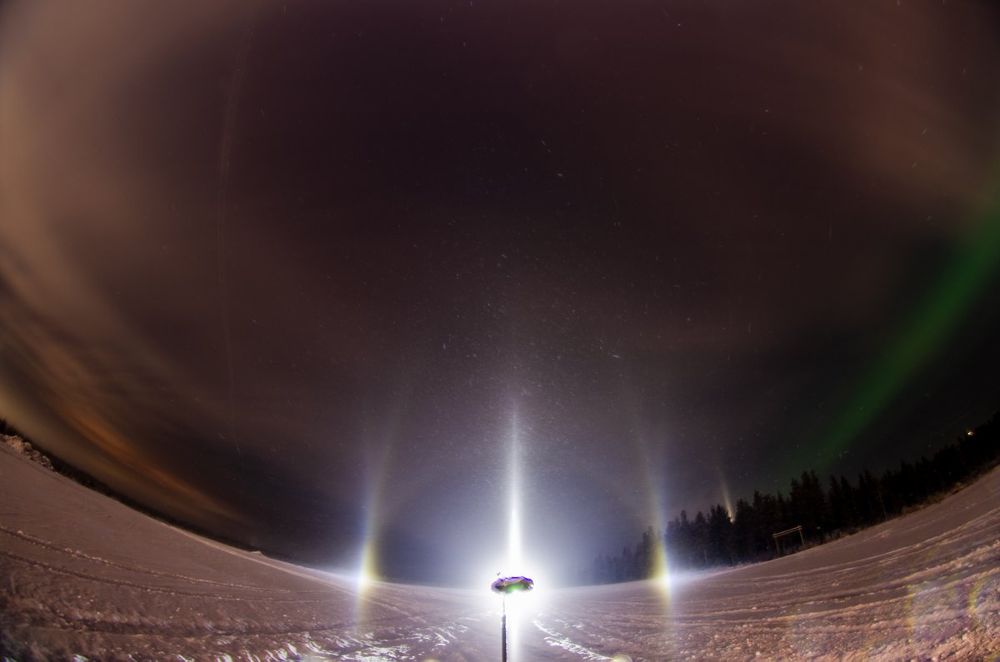
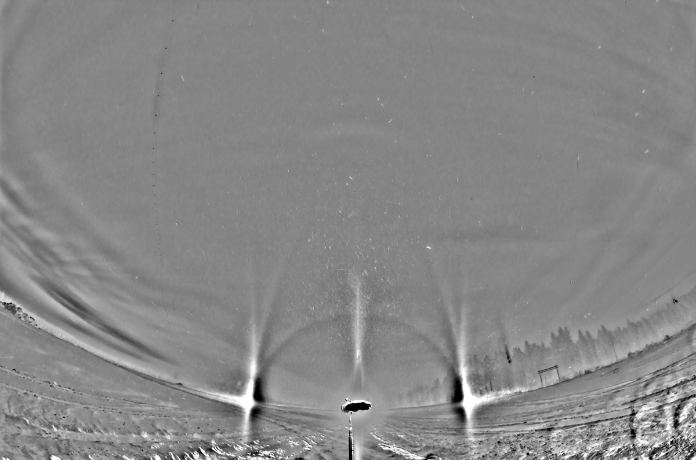
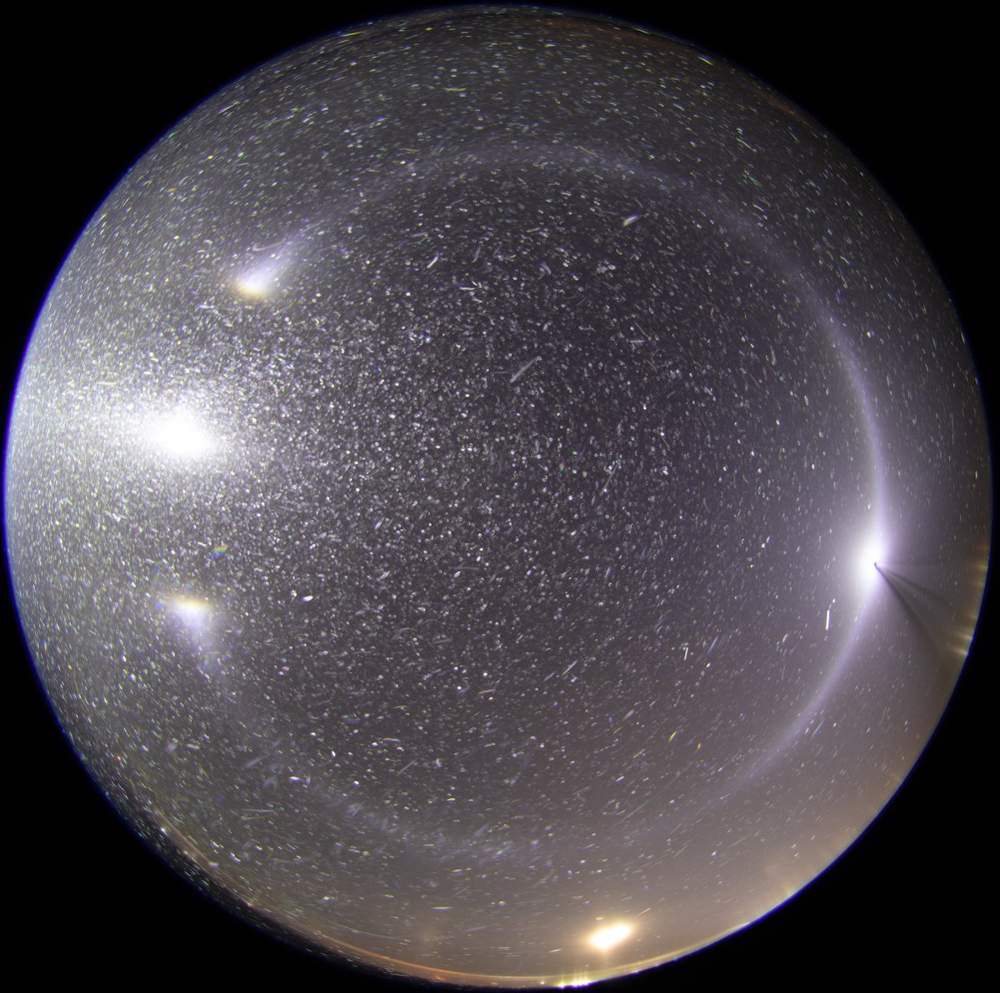
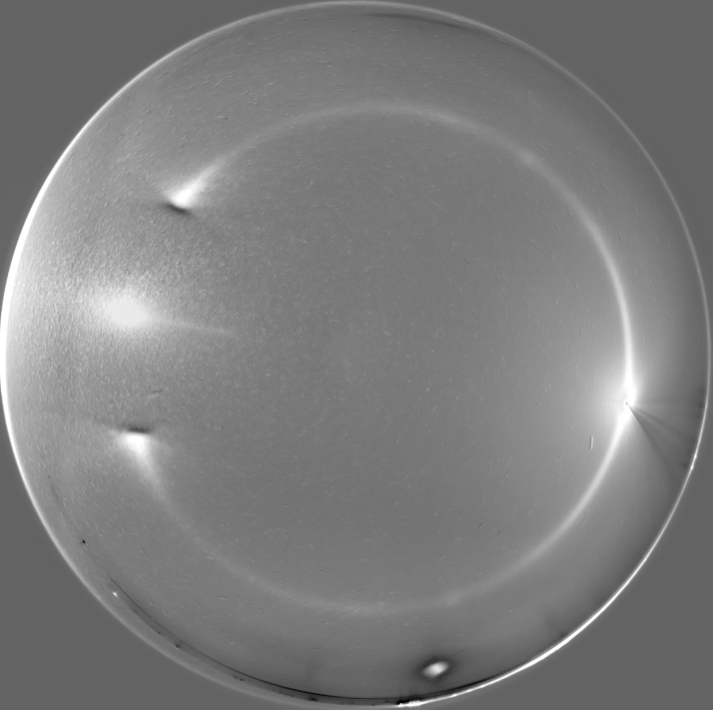
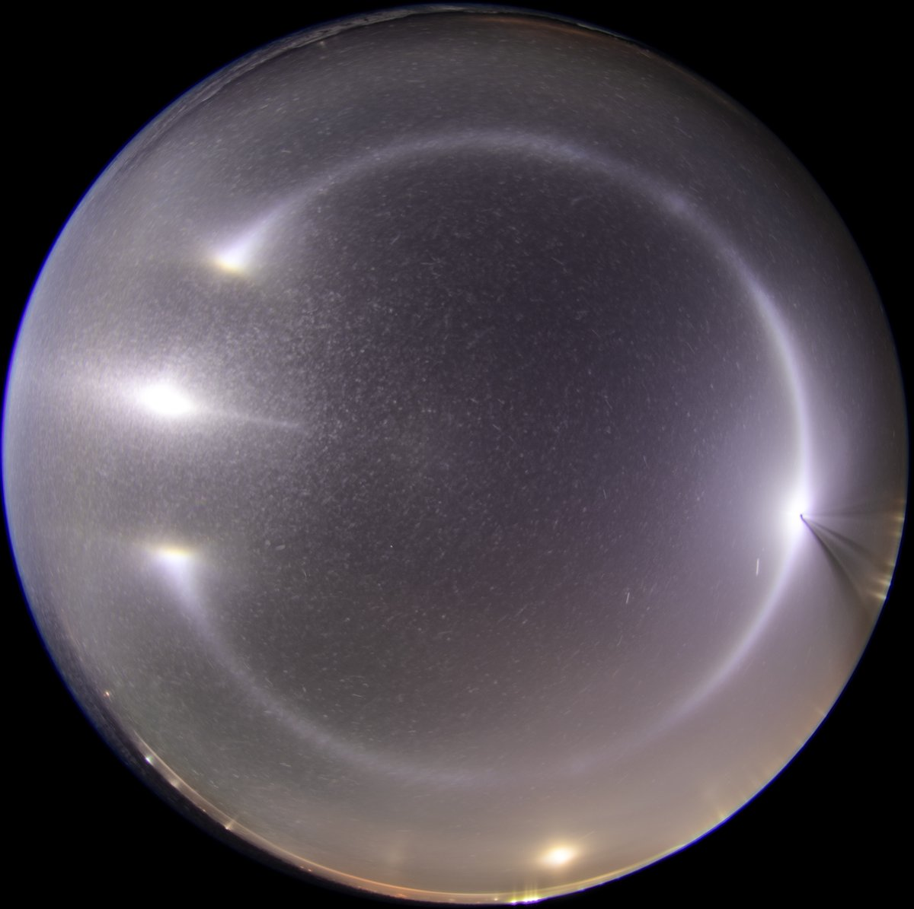

# Thread - 2024-12-21

**Original:** https://x.com/RiikonenMarko/status/1870490474508955836

---

### 1/2 - 2024-12-21 15:24 UTC

18/19 December 2024 Rovaniemi. The ice fog that developed in the morning of 18 December carried on until the evening and got this stack before the action was gone.

There is some interest in getting crystals samples of displays with these long arcs. Particularly of those pure displays in which the arcs appear without parhelia and counterparhelia. This was too short lived for any sample. 9 images in the stack.

---

### 2/2 - 2024-12-22 16:50 UTC

18/19 December 2024 Rovaniemi. I am losing track amid all the action. Contrary to what I say in the above post, the action didn't die down after those photos. Instead the ice fog shifted a bit and I shifted along, ending up on the asphalt pile in Anttilanvaara. There is a tiny smudge of countercircumzenith arc in the stack, telling the lamp was right at the visibility threshold for it, 31-32 degrees below horizon. A little more shallow elevation would have been more interesting.

Anyway, after this display the diamond dust withered away.

---

