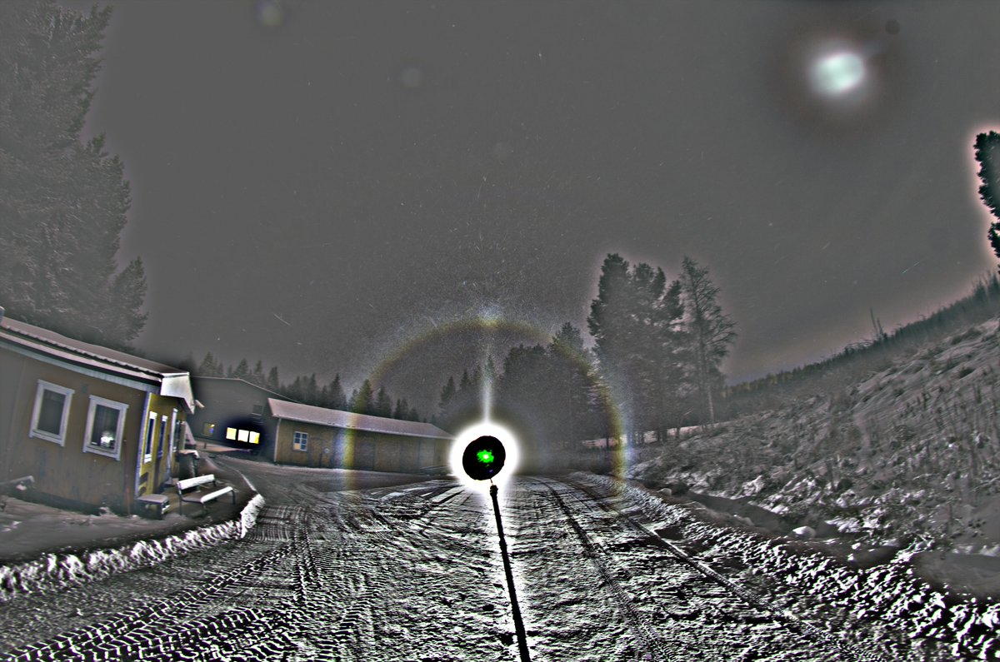
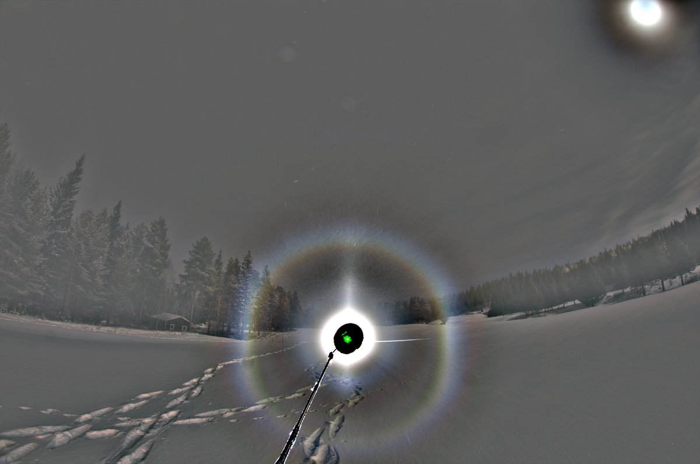
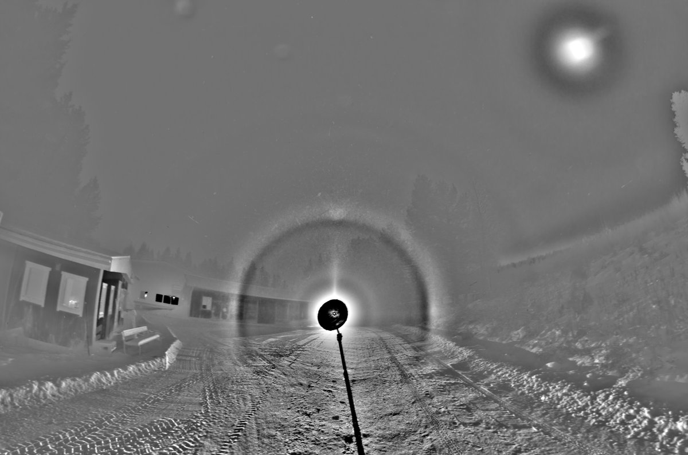
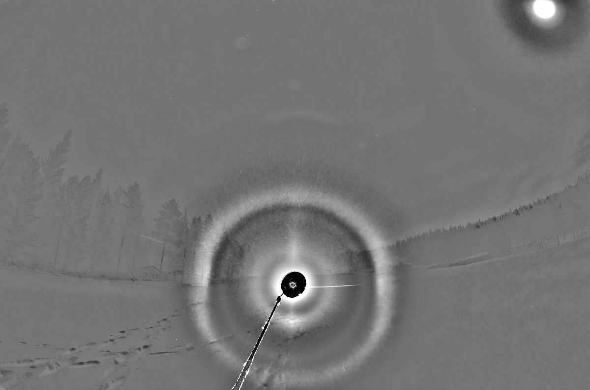
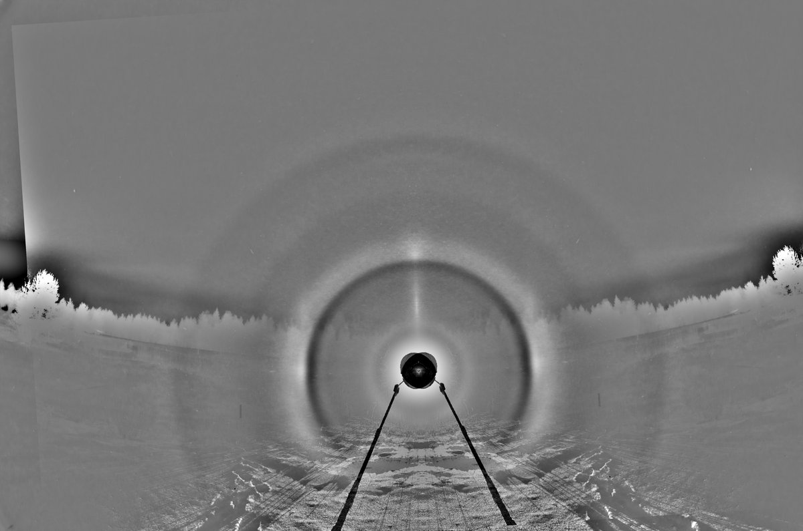
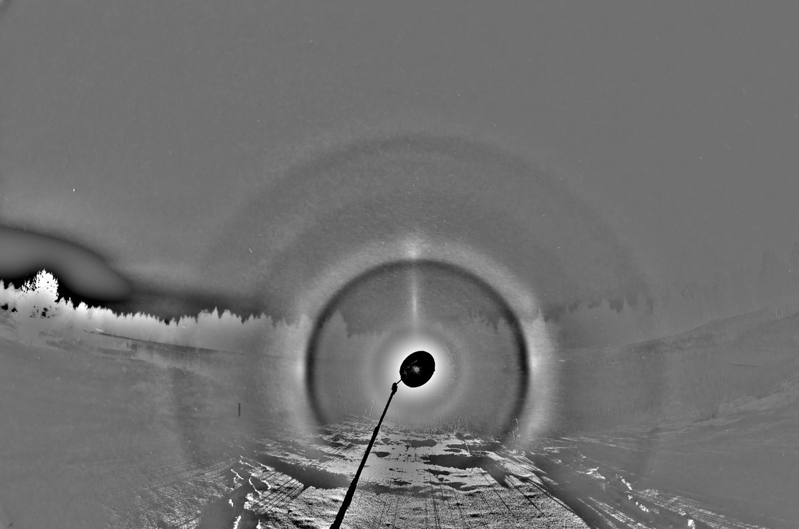
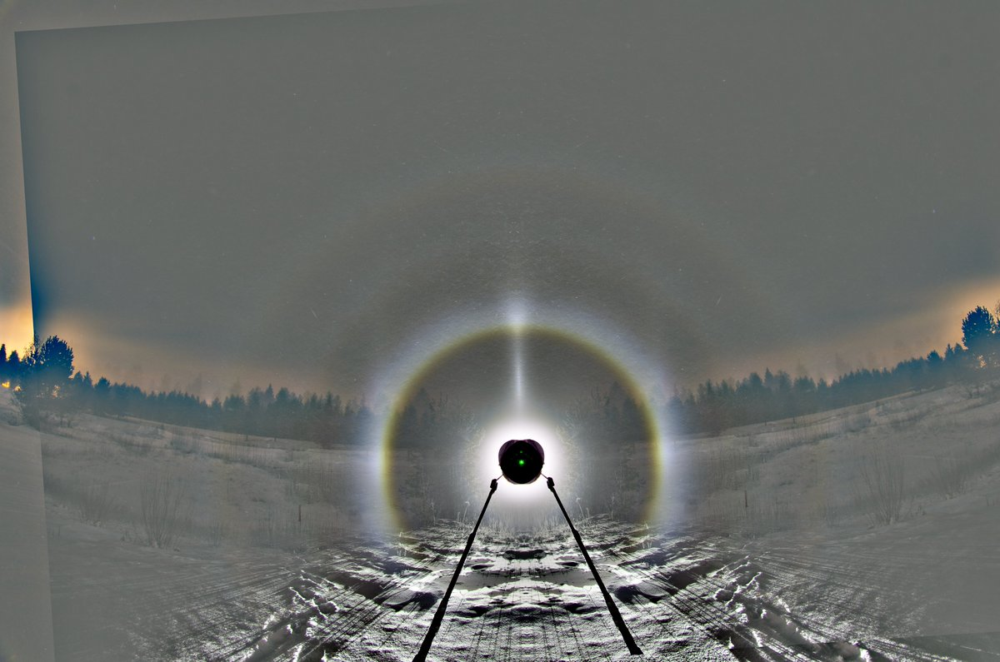

# Thread - 2024-12-21

**Original:** https://x.com/RiikonenMarko/status/1870381472936325397

---

### 1/2 - 2024-12-21 08:11 UTC

On the night of 17/18 December 2024 Rovaniemi I again got up at the morning hours, this time around 3:45. As I arrived at the golf course maintenance shacks and set up the system for the first quick photos, I felt diarrhea en route. But I calculated it wouldn't pose imminent risk  and left only when after about an hour ice fog composition changed for the worse (which this time meant really good streetlight pillars). Here is the stack of those first photos, 32 x 30s. I suspected odd radii visually and indeed 9° halo is there. The lamp is on my car roof and about level with camera.

The odd radii suspicion compelled me to move to the actual golf course for less restless background. Now the lamp was on the ground, about 4.5 degrees below horizon judging by the subsun location. And this time, as shown by the second set of images, we have what I would say a more convincing case of "lower 9° B" from 23-6 raypath.

I could see this 9° halo and its lower spot also from the camera screen as well as an upper spot which I didn't realize then was countersun. If the lamp is 4.75 or more degrees below horizon then the 9° upper spot is contributed more than 50% by 3-16 rays over the usual 13-6, allowing to make a claim for this as yet unobserved halo "upper 9° B". So I moved the equipment one more time, placing the lamp more low down on the golf course pond (next post down). But alas there was no upper spot on 9° halo even with countersun superposition removed. The crystals must have had only one pyramid tier, making only the lower arc due to how such composed pyramid crystals fall. So the international race for catching the last remaining member of the 9° plate arc quartet is still on.

The temperature in the railway station was around -20 C, Apukka -23 C. So it was a case of quite high temperature odd radii.

---

### 2/2 - 2024-12-21 08:11 UTC

17/18 December 2024 Rovaniemi.

While the "lower 9° B" may be said more confidently caught now, the game is still open for the first celestial light source instance. The observation window opens below 4.75 degree solar (or lunar) elevation: that's when the B spot starts to dominate over the 3-26 rays of the "lower 9° A". Countersun (subsun) may be hampering if there is a separate population of plates. If only pyramid crystals are present, countersun made by their basal faces is not powerful enough to overwhelm the 23-6 spot.

There is an oddity in the fourth image of the previous post: the part of the main ring seen against the ground has gained artefactly colours. Also the rather prominent ring inside it is very much suspect as there is not too much suggestion of it in the upper part. Does this go down to the lamp (Olight Javelot Turbo) or something else, I have no idea.

---

