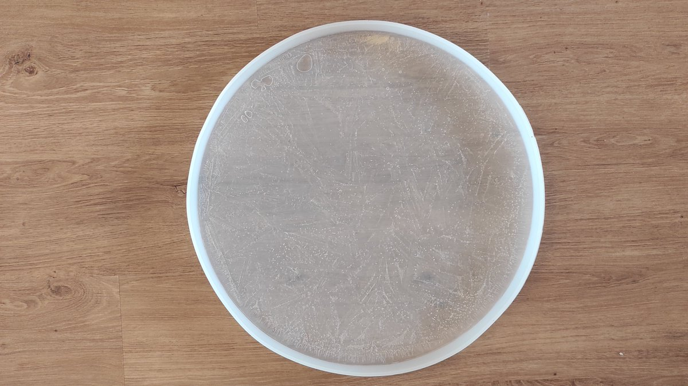
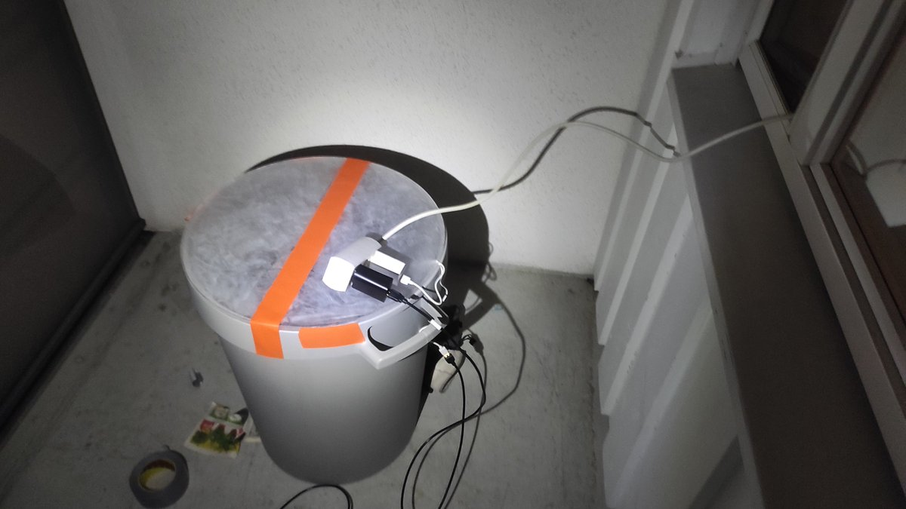

# Thread - 2024-12-22

**Original:** https://x.com/RiikonenMarko/status/1870791131123830925

---

### 1/1 - 2024-12-22 11:18 UTC

Here is my first try for trying to imitate the frozen puddle halos on my balcony. Inside that tub is a little cup of water with two usb cup warmers underneath. It didn't work. Water froze, warmers didn't provide enough heat. Of course water molecules evaporate from frozen surface, too, but maybe too slowly. But because also the warmers' cords broke like a brittle twigs in the -20 C temp, it is not a feasible method.

But the experiment still managed to prove it works. The characteristic chequered pattern developed on the ice plate underside. I could see white spots with orange rims typical of these displays and some spectral colors upon closer inspection in lamp beam.

I have been trying to search for an alternative off-the-shelf heat source. Maybe some terrarium heat mat. But such devices are more expensive so next I will try thermal candles. I will make a hole for metallic cup in the bottom of the tub, elevate the tub, and place a candle underneath. You can buy candles with like 8 hours burning time.

The second image shows the 50 cm sillicone mould for freezing the plate. It is important to have a flexible mould in order for the plate not to break from expansion upon freezing.

---

