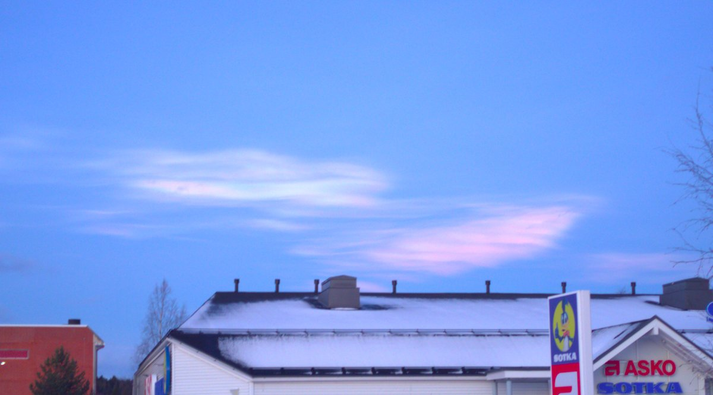

# Thread - 2024-12-22

**Original:** https://x.com/RiikonenMarko/status/1870869067449417764

---

### 1/1 - 2024-12-22 16:28 UTC

I saw iridescent (red-green) nacreous clouds opposite the sun on 10 December 2024 Rovaniemi. Atypically, I was carrying the phone with me, which allowed for a photo. At that moment the clouds on the sun side were no more colored. While sun side cloud colors are formed by corona mechanism, these opposite clouds must be due to glory mechanism. I recall in the German AKM forum a photo is published of iridescent clouds opposite to the sun. I was not able to find that post now. I estimated the colored clouds I saw were between 315-360 az from the sun. Sun was 2 degrees below the horizon. I have increased the saturation of the photo 33%.

On another note, given nacreous clouds are known also from China's Yunnan and Nairobi https://t.co/ihRewohg6N the synonym Polar Stratospheric Clouds looks ready for the knacker's yard – just call them Stratospheric Clouds. Or mother-of-pearl clouds which is another synonym.

The Nairobi case was discussed in Taivaanvahti: https://t.co/FCHyrCMi1r The photo was taken in 2020 during supermoon. Lasse Nurminen did some digging and it turned out that during two of the supermoons that year the atmospheric soundings in Kenya recorded below -80 C temps – well enough for nacreous cloud formation.

Here are the 10 December 2024 observations in Taivaanvahti: https://t.co/dPmG7cGLJ6

---

