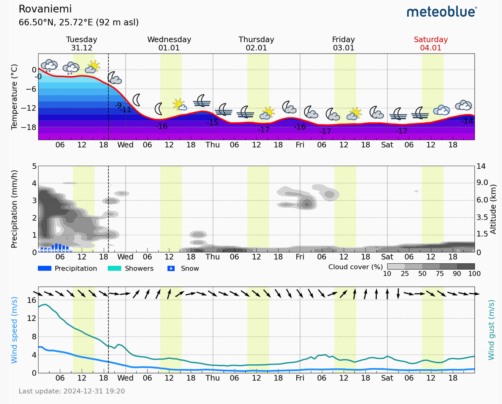

# Thread - 2024-12-31

**Original:** https://x.com/RiikonenMarko/status/1874146739894313219

---

### 1/2 - 2024-12-31 17:32 UTC

Serious looking forecast for Rovaniemi from Meteoblue. Winds die down and cloud hugs the ground. The only gripe I have is too low temps. Expectation is crap, but it can't be crap all the way through, there are always pleasant exceptions. https://www.meteoblue.com/en/weather/week/rovaniemi_finland_638936

---

### 2/2 - 2025-01-01 11:00 UTC

Nothing doing last night. The ski center was dark, nothing happening, apparently because of the new year's night. There would have been ice fog, conditions were on. I saw some ghosty singular pillars in the industrial area. Must be that they formed in the firework's smokes.

---

