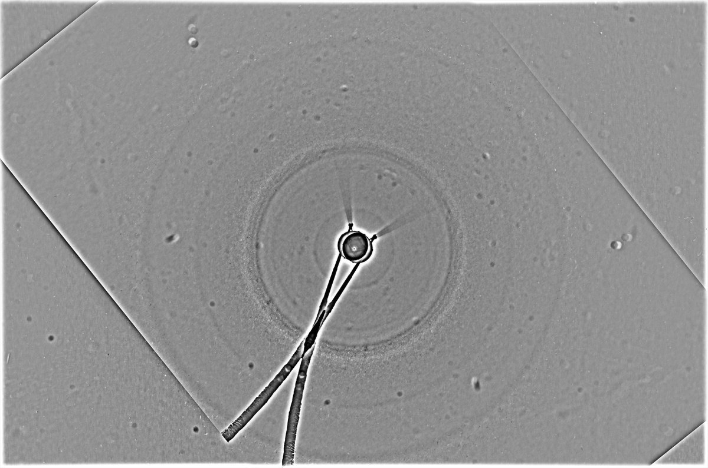
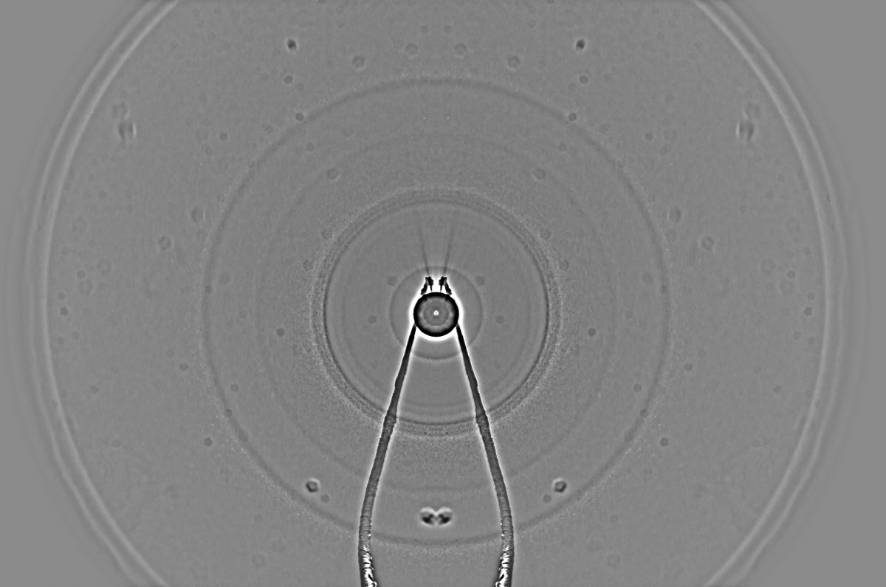

# Thread - 2025-01-03

**Original:** https://x.com/RiikonenMarko/status/1875222470774374412

---

### 1/1 - 2025-01-03 16:47 UTC

Quite busy with all things halos. Ice fogs not good or even non-existent so I did some snow pack on the nights of 1/2 (left) and 2/3 January 2024 Rovaniemi. While on it I didn't take a look at it on the first night, but on the second night I took and 9° halo was visually really striking, the best I have seen. But it is the same old, same old, still no exotic rings.

Exposures 2.5s, aperture something like 16. Lamp Olight Javelot Turbo. 22 and 48 frames in the stacks. Manfrotto was not at full height, last telescope legs were not extended and central bar was down. Camera height is some consideration. Because if the camera it too high your throws' reach may be lacking so that the top part of the display will not be fleshed out so well. Nearer to the lamp I had the sledge in front of the beam to shadow the ground.

You should have the stamina to keep throwing because these really benefit from more frames. But it is hard work.

I have also encouraging results from ice plate experiments on my balcony.

---

