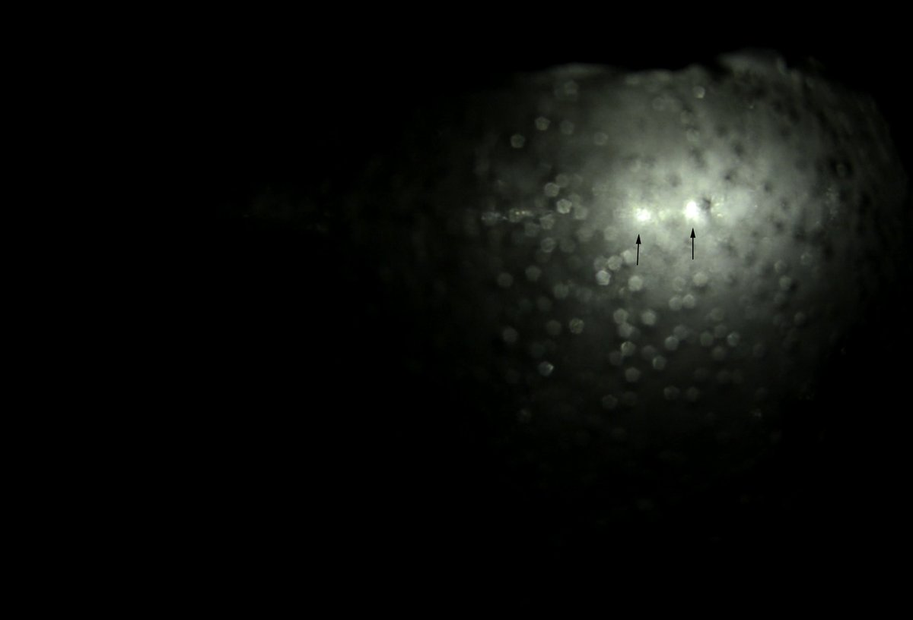
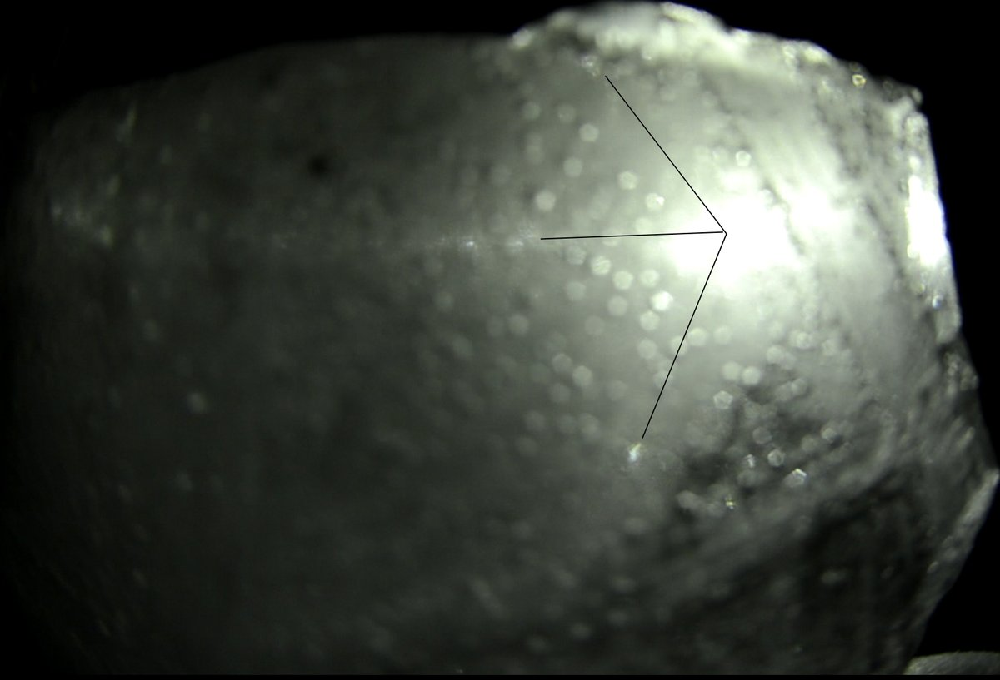
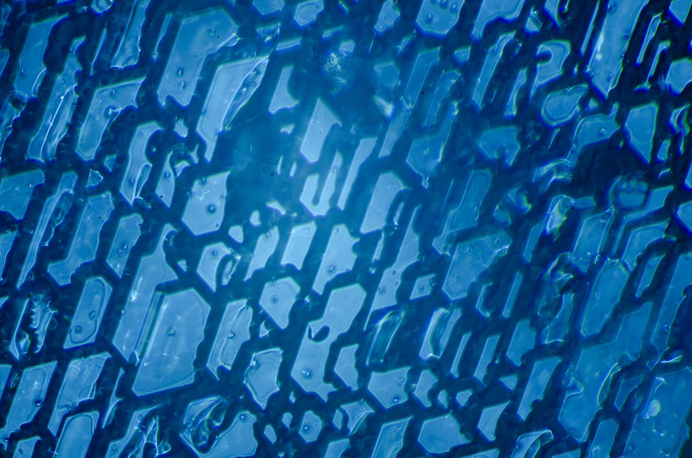
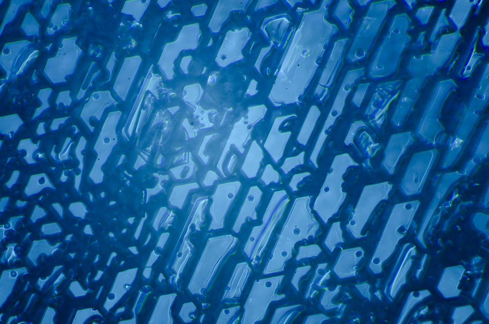
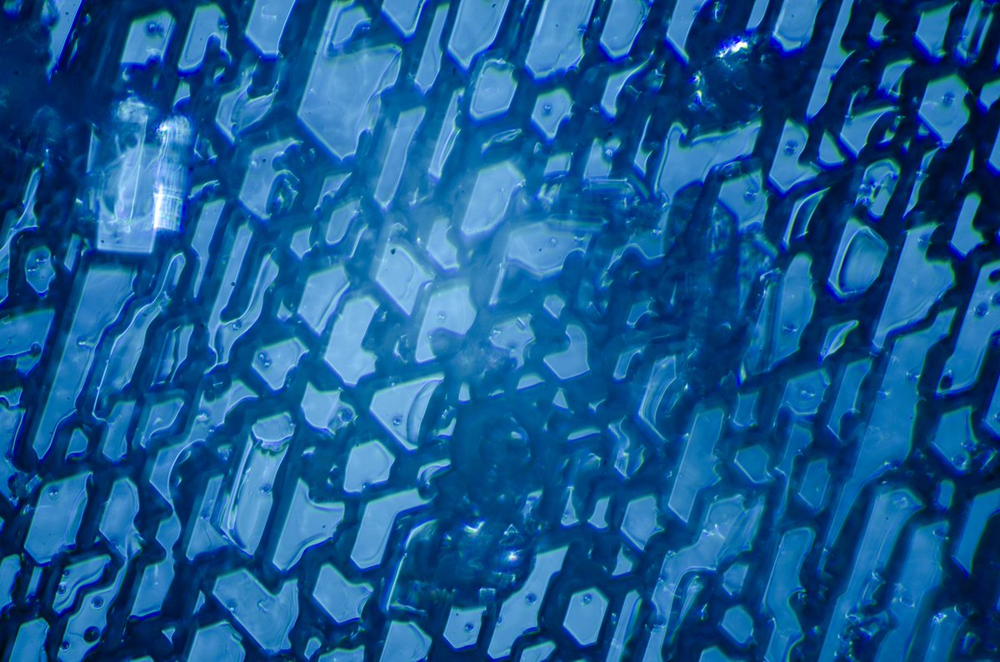
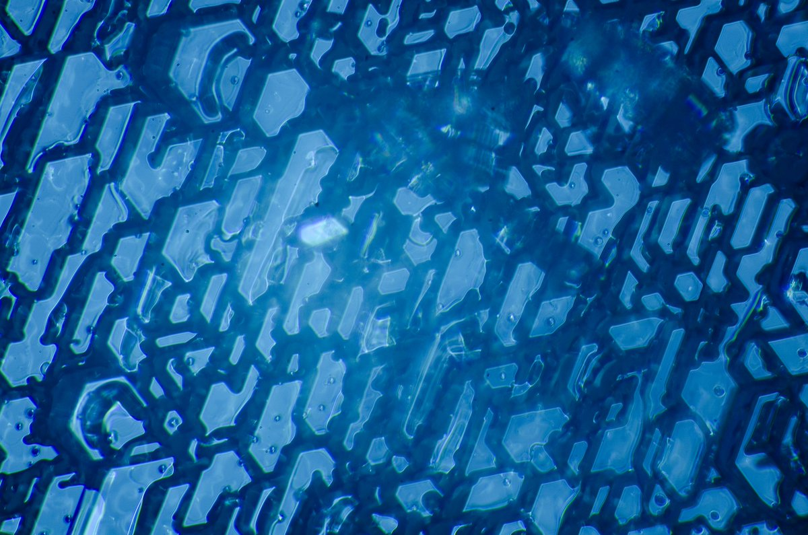
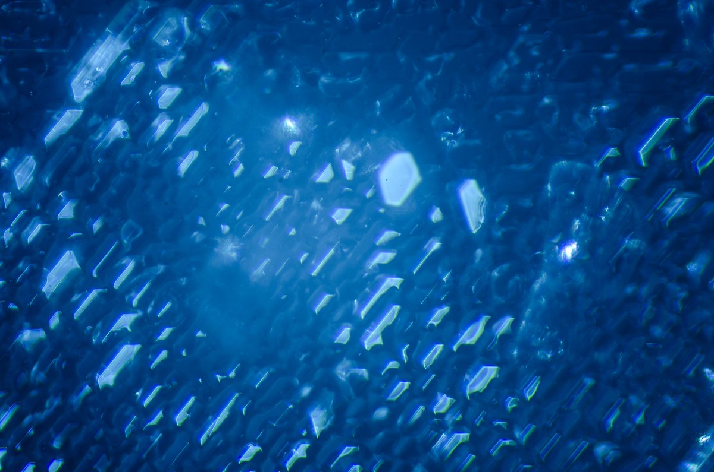
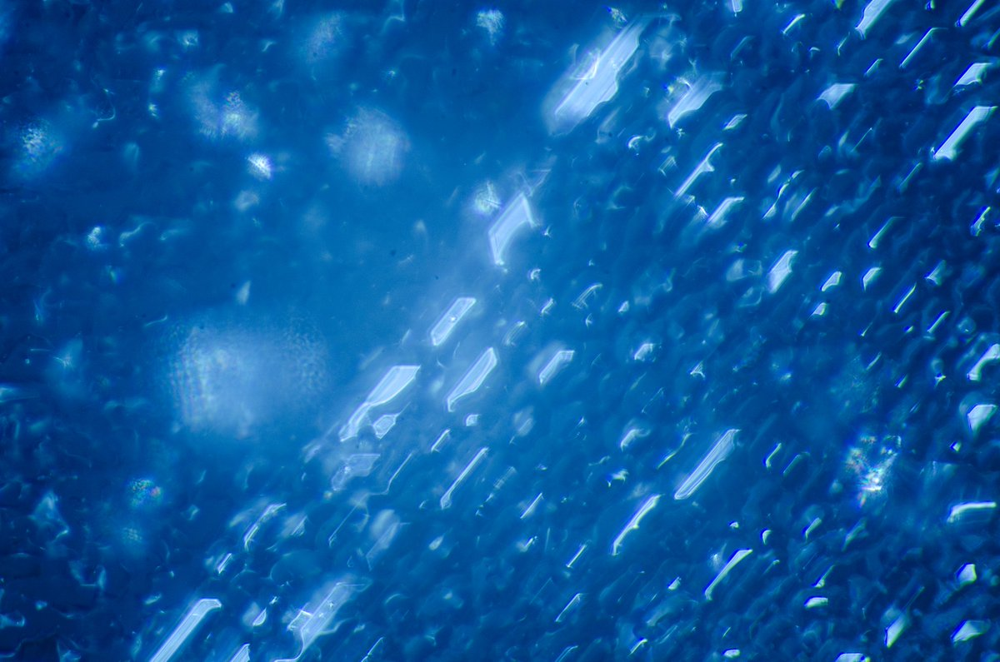
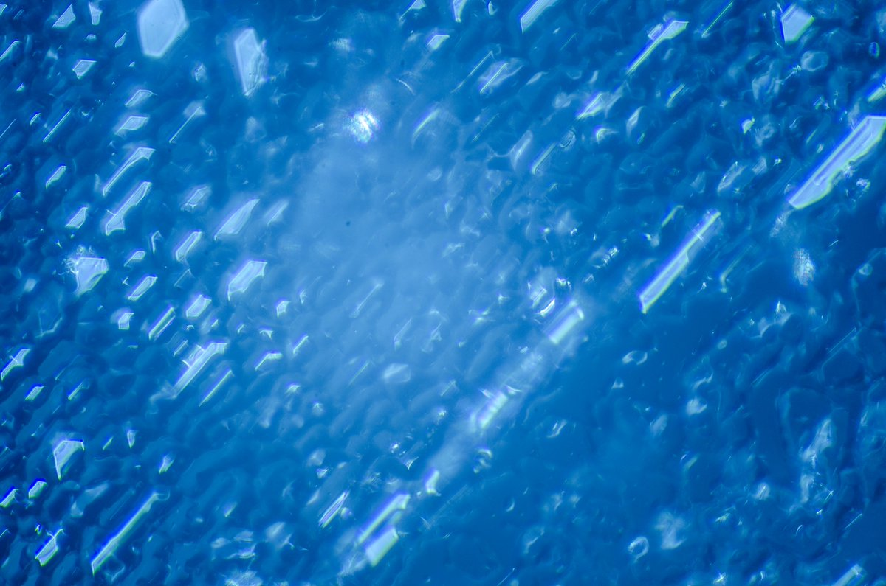

# Thread - 2025-01-06

**Original:** https://x.com/RiikonenMarko/status/1876257895530045865

---

### 1/6 - 2025-01-06 13:21 UTC

Correlating Herincs display with crystal photos (5/6 January 2025 Rovaniemi). First the video. The focus is on the mosaic patch that in the beginning is on the back but from 00:18 turned to the fore position. In reflected light I could only see the white arcs and spots. In transmitted light (00:56) there was more: a triforked figure made by colored spots and vague white arcs; and two brighter spots near each other, the other one of which was colored. It overexposed in the video despite my adjusting the shutter speed for underexposure.

[🎬 1876257895530045865-5VW3lTl0EORbZVpP.mp4](media/1876257895530045865-5VW3lTl0EORbZVpP.mp4)

---

### 2/6 - 2025-01-06 13:21 UTC

5/6 January 2025 Rovaniemi. Screen-grabs of the two bright spots and the triforked figure. Visually the other brighter spot was colored, having blue on one edge and red on the other, with larger white area in between. The three forked figure is something that is seen quite commonly on ice plates, here it not well defined.

---

### 3/6 - 2025-01-06 13:21 UTC

5/6 January 2025 Rovaniemi. All of this mosaic patch seemed to have a uniform crystal growth as shown by the photos. I can understand the colored bright spot: it probably forms from the angle between basal faces of those slightly tilted plate crystals and the smooth, planar backside of the ice plate. But how those trifork colored parhelia come about, I don't know.

These are in reflected light. You need to move the lamp around the sample until at a specific angle suddenly the undefined ice plate surface lights up with these crystals.  

This piece was broken from a large ice plate for the study under the microscope. In the next two posts are videos of the whole plate.

---

### 4/6 - 2025-01-06 13:21 UTC

5/6 January 2025 Rovaniemi. The whole plate in transmitted light. This is completely home-made. The plate was frozen in a 50 cm silicone mold and then placed as a lid on a tub at the bottom of which is a heated water filled cup to provide moisture for the crystal growth.

[🎬 1876257910613033117-Xxk8v-RtsZ0KYKcT.mp4](media/1876257910613033117-Xxk8v-RtsZ0KYKcT.mp4)

---

### 5/6 - 2025-01-06 13:22 UTC

5/6 January 2025 Rovaniemi. The whole plate in reflected light.

[🎬 1876257915532877825-b4EJumulJ_Y7Lt8u.mp4](media/1876257915532877825-b4EJumulJ_Y7Lt8u.mp4)

---

### 6/6 - 2025-01-06 13:50 UTC

5/6 January 2025 Rovaniemi. These crystals, from a different part of the above ice plate, are more upright. Ice plates in general have spots from Parry oriented crystals, but I have been wondering why I don't see the responsible crystals under the microscope – only the crystals that are in (approximate) plate orientations. But now finding these crystals (in a very narrow mosaic patch on the plate) seems to suggest an answer. The led lamp in my hand had be pretty much level with the surface of the ice plate to light up the scene. So it was like a setting sun on the ice plate with a lot of shadow. Had these crystals been more upright they could not have been lit up anymore and would have remained cloaked from sight. Should need to find some way to light them up.

---

