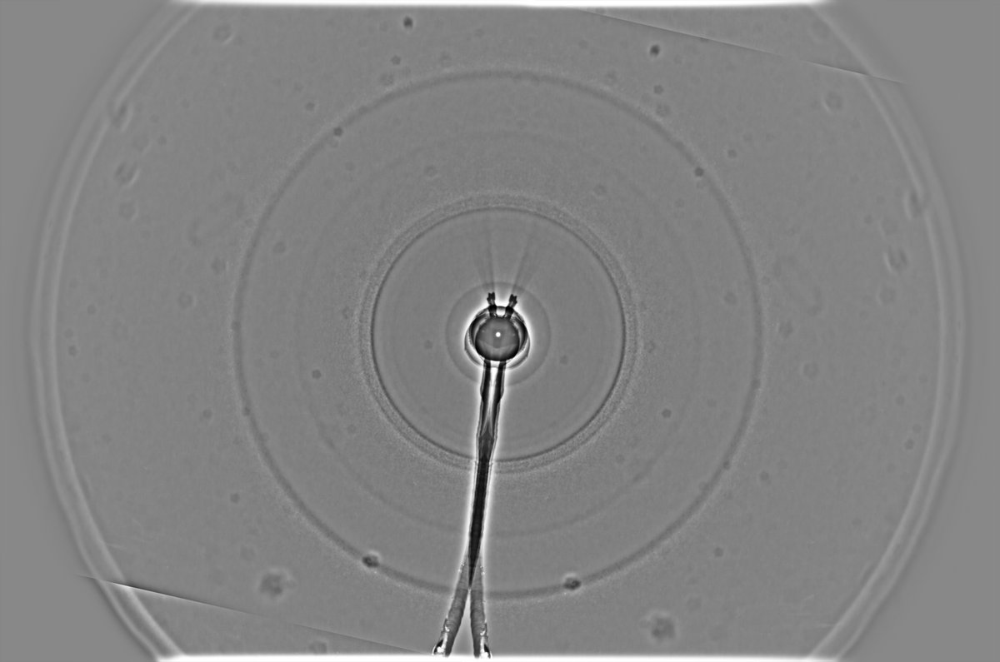
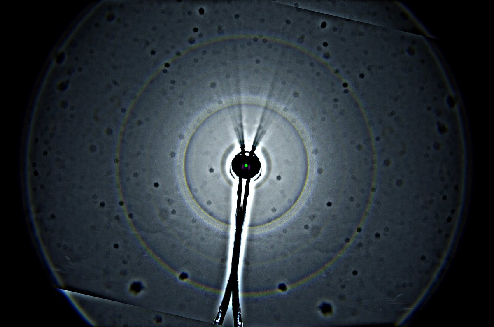

# Thread - 2025-01-06

**Original:** https://x.com/RiikonenMarko/status/1876231334089175546

---

### 1/1 - 2025-01-06 11:36 UTC

Another statistical snow-throw. Included is also 2 x usm version to show the state of the sensor dirt. Well, some of those spots are probably snow on the lens. This was on the night of 4/5 January 2025, Rovaniemi. The location is Toramo pit where I had thrown two nights earlier https://t.co/BAK1zE7DBY In comparison, 23° halo has weakened now. Also this must have been poorer display in general: despite stacking 128 frames it looks weaker than the 2/3 night display with 48 frames.

---

