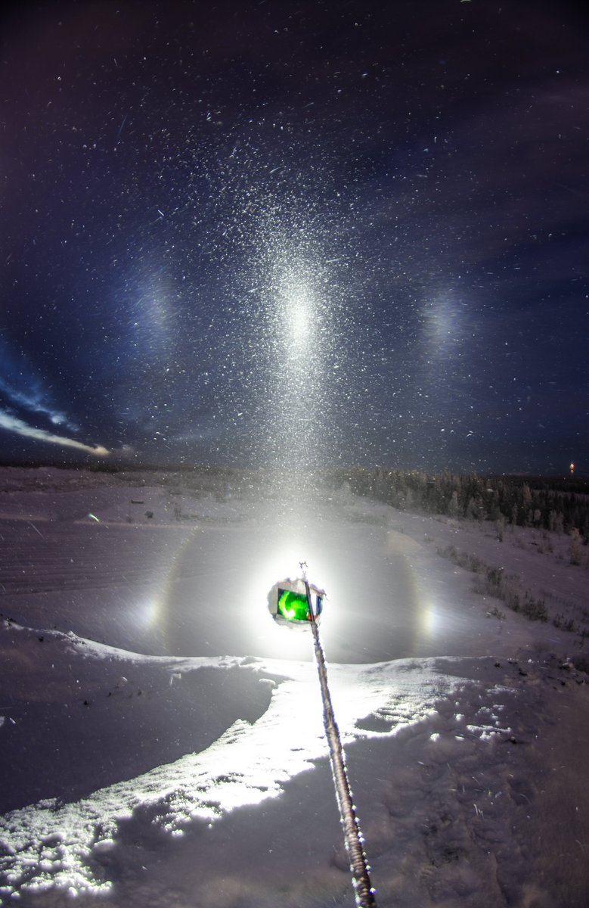
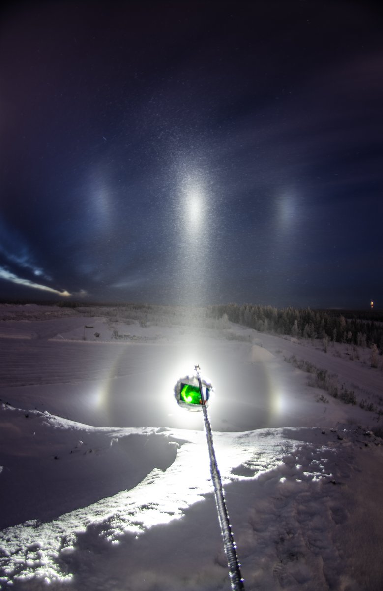
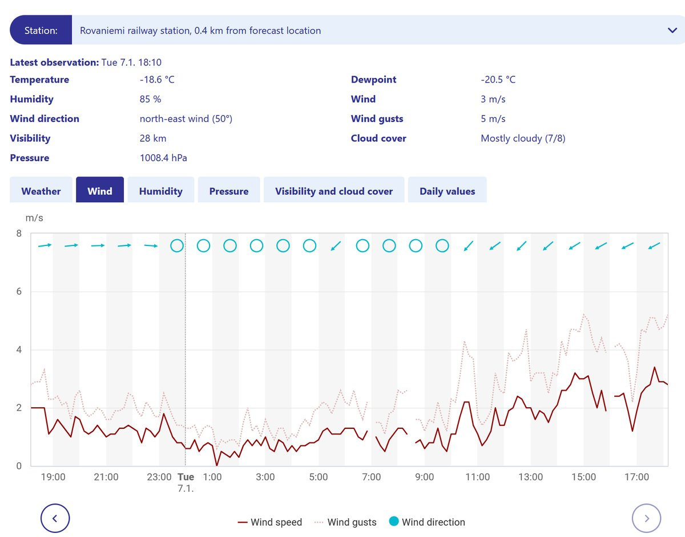

# Thread - 2025-01-07

**Original:** https://x.com/RiikonenMarko/status/1876673327244390575

---

### 1/1 - 2025-01-07 16:52 UTC

Woke up after midday an looked out: icefoggy down at the industrial area (7/8 January 2025 Rovaniemi). So when the sun was down but sky still lit up, I saddled up. Total crap, much like in the morning https://t.co/B4vXuaYftd But I thought it anyway good idea to take semi-low lamp shots from the Anttilanvaara asphalt pile. Lo and behold, as I set it up, the ice fog refined momentarily, as shown by the first two images, which are max and ave of 11 frame stacks of 25s exposures. There was also counterparhelic circle opposite to the lamp as well as normal parhelic circle going all around, but they were not any good that I would regret of having this limited view.

Wind was unusually strong for ice fog occurrence. FMI wind graph for the railway station, that is 4.5 km away, attached. The photos for the stack were taken 16:35-16:39. Temp at the railway station was -18 C.

Ice fog vanished when the wind boosted up at around 17:00 after a momentary lull.

---

