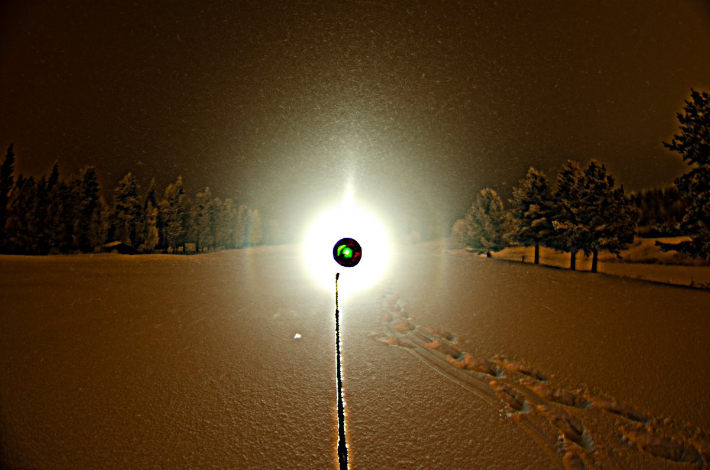
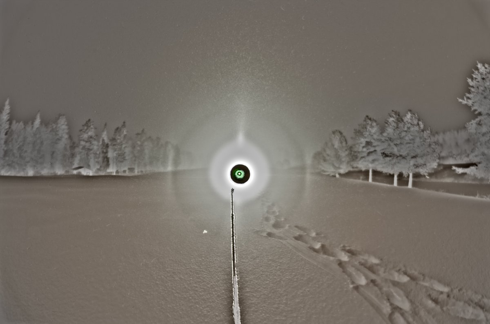
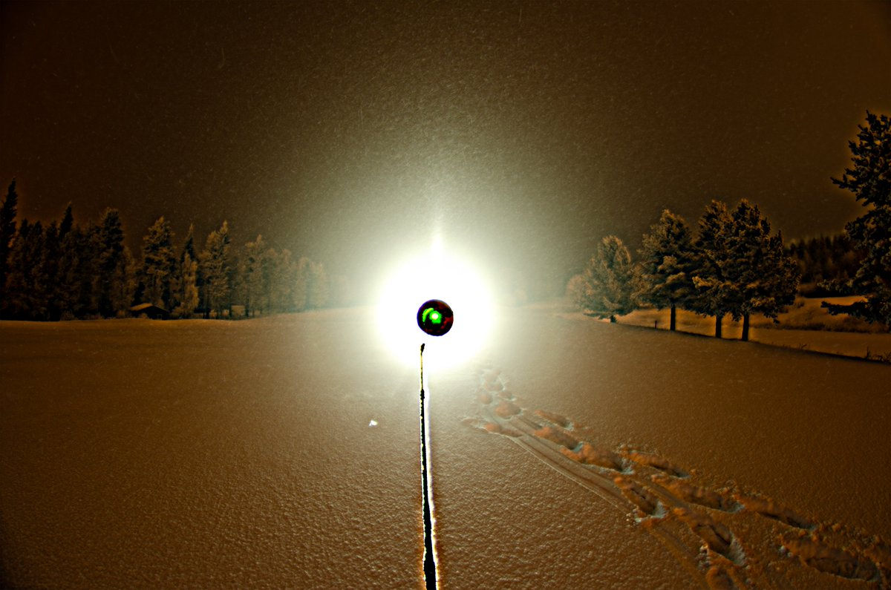
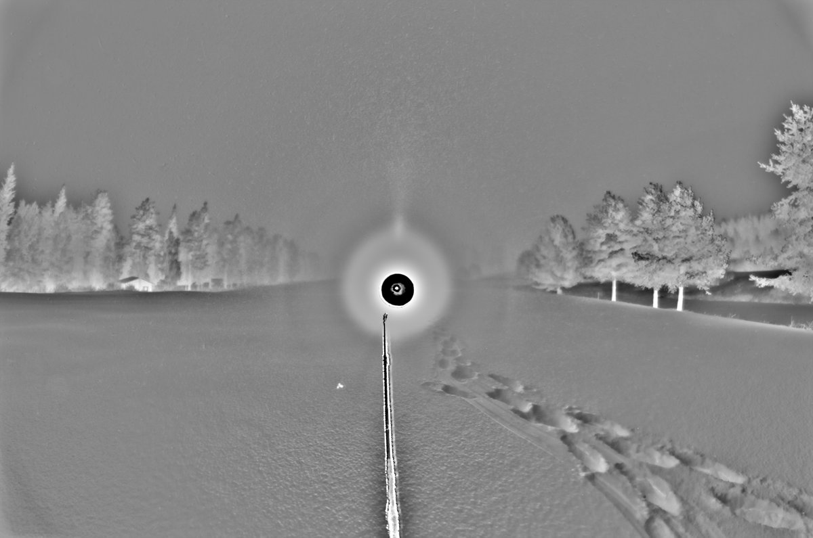

# Thread - 2025-01-07

**Original:** https://x.com/RiikonenMarko/status/1876600477938270370

---

### 1/1 - 2025-01-07 12:03 UTC

Most crappiest ice fog last night at the Ounasvaara golf track (6/7 January 2025 Rovaniemi). First there was 22° halo / parhelia on the sides visible to the eye weakly, but then it changed for even worse and I could see only pillar (last two images). Camera however still picked up the halo on sides. These are about 30 and 60 frame stacks of 10s exposures. Ice fog was snowfall-like. Then larger snowflakes increased and I called it a quits. Funny though, as this happened, sharp Jedi-sword pillars appeared on ski center lights. But if you would turn on the spotlight, you would most likely have only that – the pillar. So I was not distracted and went to apartment to sleep – it was already 3 am. 

Temp rose to around -13 C at the end, right on the threshold for the big stuff. If snowfall hadn't increased that might have happened.

---

