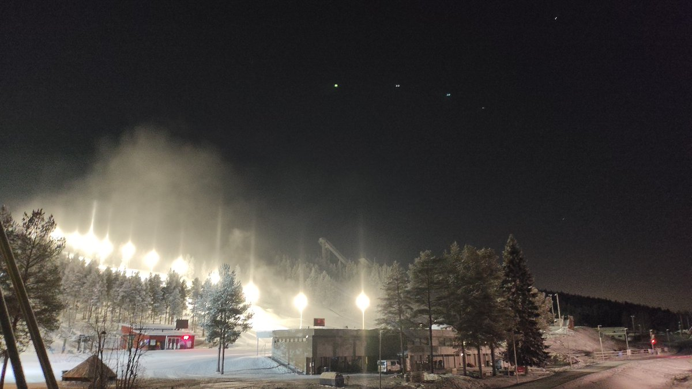

# Thread - 2025-01-10

**Original:** https://x.com/RiikonenMarko/status/1877589557937373475

---

### 1/2 - 2025-01-10 05:33 UTC

It's getting worse. The gunning practices, that is. Midday yesterday I visited the slopes and clearly air was not on: no cloud at all, I needed to drive right at the ski center to see that there was actually a snow gun running at the bottom. The temp in the ski center digital display was -17 C.

Now, around 5:30 am, I just made another round, starting from the industrial area. Totally calm, Suosiola plume rose straight up and then trailed slowly east, icefogging a section of the industrial area. Just weak pillars so I drove on. At the ski center there was actually ice fog, as shown by the image. But it was a sapped thing, limited strictly to the very slope the guns were on – not in line at all with the fulsomeness of the Suosiola plume. The air can not have been in the mix. But apparently sometimes tiny action can be spawned from just water spray.

The red digital display (which is seen also in the Ounasvaara webcam) was now at -18 C. Until this, the temp has needed to start with number 2 for them to close the air valves. I wonder if they have decided to forgo the pressure air for good.

---

### 2/2 - 2025-01-10 20:14 UTC

Same thing this evening, 11 January. Only pillars above this same slope where the guns are running. Less cloud now, from the golftrack I saw only weak pillars against clear sky.

---

