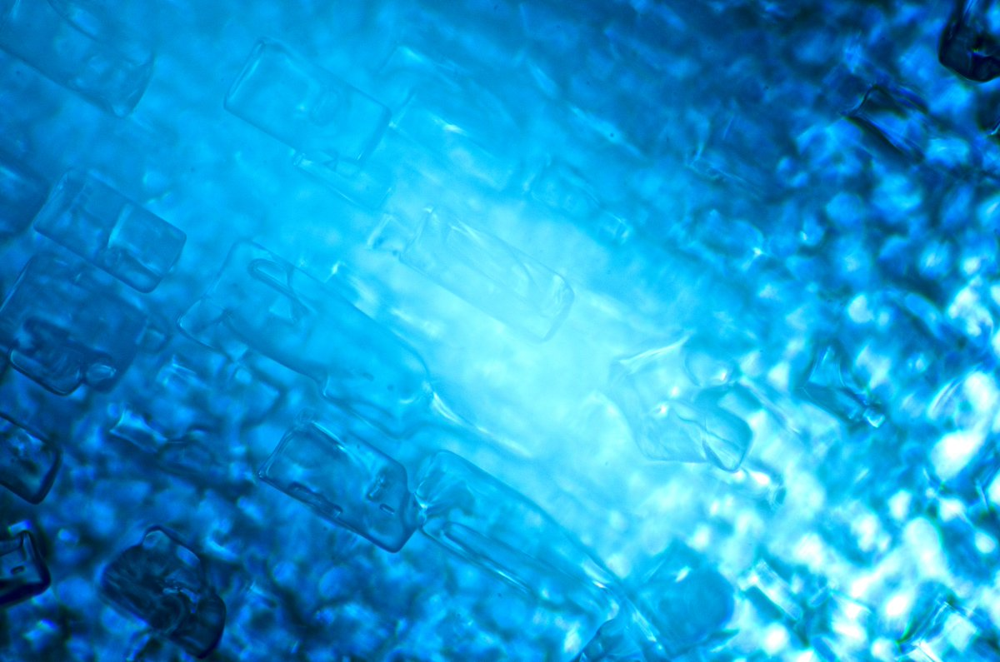

# Thread - 2025-01-11

**Original:** https://x.com/RiikonenMarko/status/1878034362890866860

---

### 1/2 - 2025-01-11 11:00 UTC

Videoed another home-made ice plate on my balcony last night. It has pretty good Ujvarosi star. The light, Acebeam L19, is on tripod inside the apartment, as far at the back as possible. Still it doesn't quite light up the whole of the 50 cm diameter plate, but it is good enough.

Also some nice 46° spots on those spikes at . This particular plate was frozen during one warmer day in the midst of the ongoing cold snap. It may be that warmer temps provide better template by giving larger mosaic squares. 

I tried crystal photography as well. The plate need to be broken into smaller pieces to put under the microscope but after that I didn't see anymore much at all of the Ujvarosi star in those plates. In between I had also studied the plate in reflected light, maybe the Parry crystals eroded during all the disturbance.

So for the next time I am thinking to take just quick look at the plate and then immediately get on with the microscopic studies. And do that with the pieces immersed in gasoline. Because this time I noticed clearly how the led light starts eating the crystals during microscopy. Gasoline will provide some protection. Another option would be to use dimmer light. Not for me though. Unless it is very cold, my microscope arm slides down by the gravity, changing the focus, and with my Nikon D7000 the exposures would be too long to get any sharp images.

[🎬 1878034362890866860-Wk0SNLFJfZOiukZw.mp4](media/1878034362890866860-Wk0SNLFJfZOiukZw.mp4)

---

### 2/2 - 2025-01-11 16:13 UTC

Are here the sought-after Parry crystals? This is from the plate in the above post. The area of these crystals was larger but I just took this one photo because they looked so crappy. Maybe they had eroded.

If these are indeed the Parry crystals, something is still missing: the Ujvarosi star has the Parry spots in six pronged star formation which means we should see these crystals pointing at 60 degree angle to each other.

So I am not getting excited yet.

In the above post timestamp had disappeared somewhere. Should have read: "Also some nice 46° spots on those spikes at 0:43"

---

