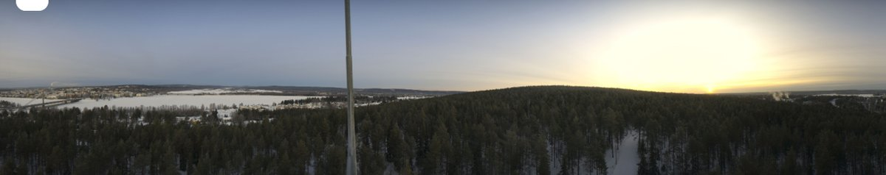
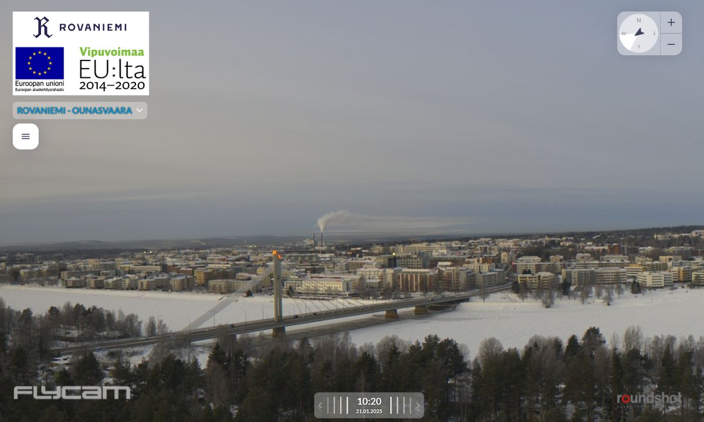
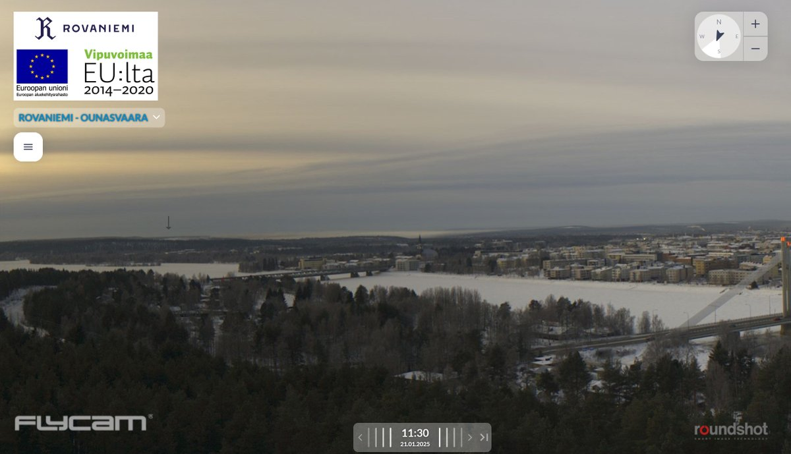
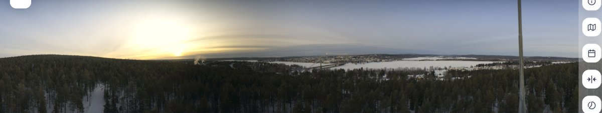
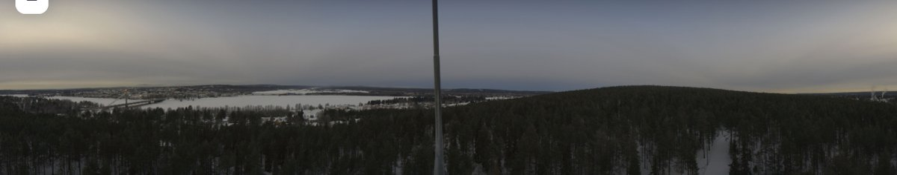
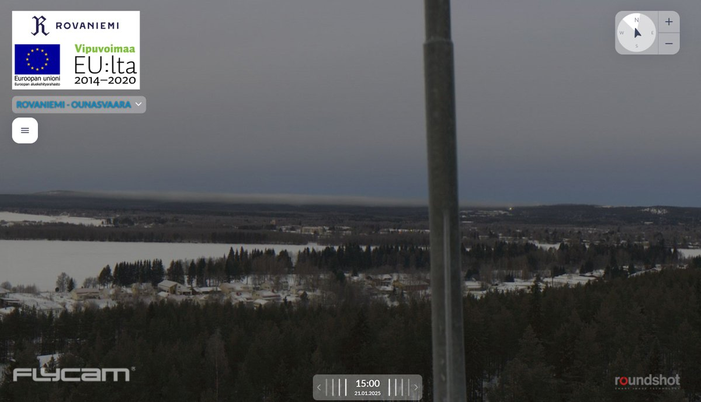

# Thread - 2025-01-20

**Original:** https://x.com/RiikonenMarko/status/1881390325023039718

---

### 1/3 - 2025-01-20 17:16 UTC

After a warm period that brought stratospheric clouds culminating in a massive show on 18 January https://t.co/a0xeCbJYjS it is well below freezing again. And there were guns running on the top of the Totto slope in Ounasvaara ski center. But just a pitiful cloud. Given there was a small area of diamond dust with pillars elsewhere in the city it is clear that again the pressure air is not used. The temp in the red display at the ski center was -13 C. So Rovaniemi is firmly at knackers yard. The season is over.

---

### 2/3 - 2025-01-21 08:39 UTC

The situation this morning 21 January. Ounasvaara is the gentle bump between the image transecting pole and the sun. No cloud whatsoever. Suosiola plume was most likely landing as ice fog and the direction for once would have been good for spotlight activities. But I had let my car cool completely down and it's -25 C.

---

### 3/3 - 2025-01-21 14:36 UTC

A closer scrutiny shows two unexpected ice fogs, one south of the Ounasvaara 360 camera, one north. What's cooking? I have marked the assumed source of the southern ice fog with an arrow (two first images), the source of the northern one (two last images) is more obvious, originating from airport / Santa Claus Village area. I actually saw both with my eyes already in the morning when I biked to the center. Given their all day duration, snow blower or airplane engine is out of question. At least in the past some businesses in Rovaniemi have at some point of the winter had need to make snow and I'd wager there is a solitary gun running in these locations now. Those ice clouds look too meaty and expansive for having been originated from any burning exhaust.

So there would have been action last night.

---

