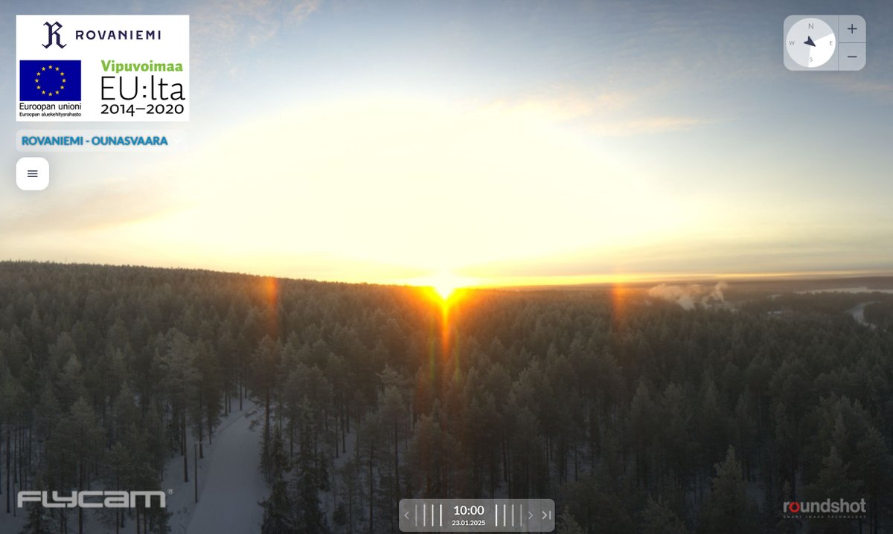
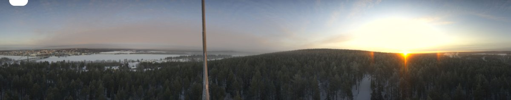

# Thread - 2025-01-23

**Original:** https://x.com/RiikonenMarko/status/1882361482672779651

---

### 1/1 - 2025-01-23 09:35 UTC

Parhelia at sunrise today 23 January 2025 for 20 minutes in Ounasvaara 360 camera. Can't say if this is from gunning. Last night I was at the slopes when they turned on the guns at the eastern Totto slope. Big cloud grew immediately so pressure air was back in the pipes. It gave me some odd radius action at bog Sieriaapa and Jokkavaara pits east from Ounasvaara. I hope to have a look at the photos soon, depends how busy the coming night will be. Maybe the airs are off already, I don't see any indication of gunning in the webcam.

---

