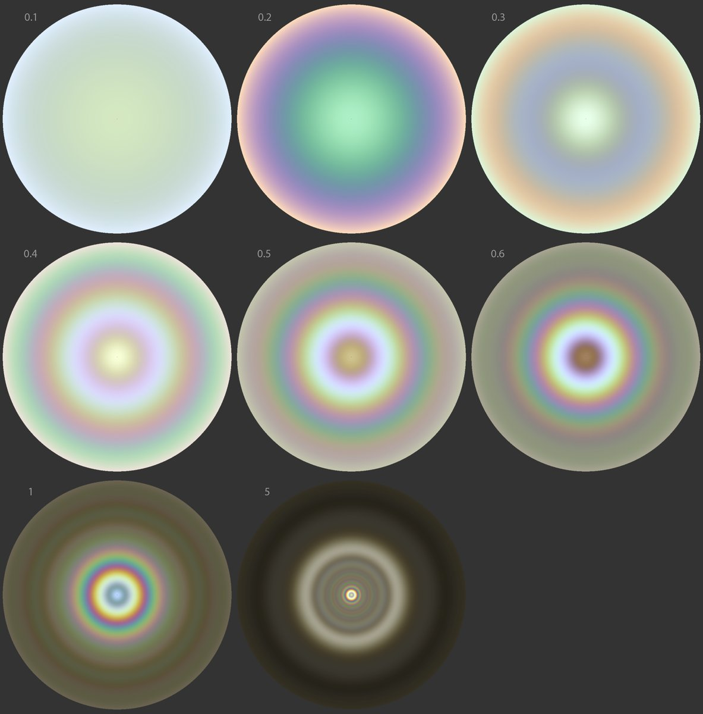
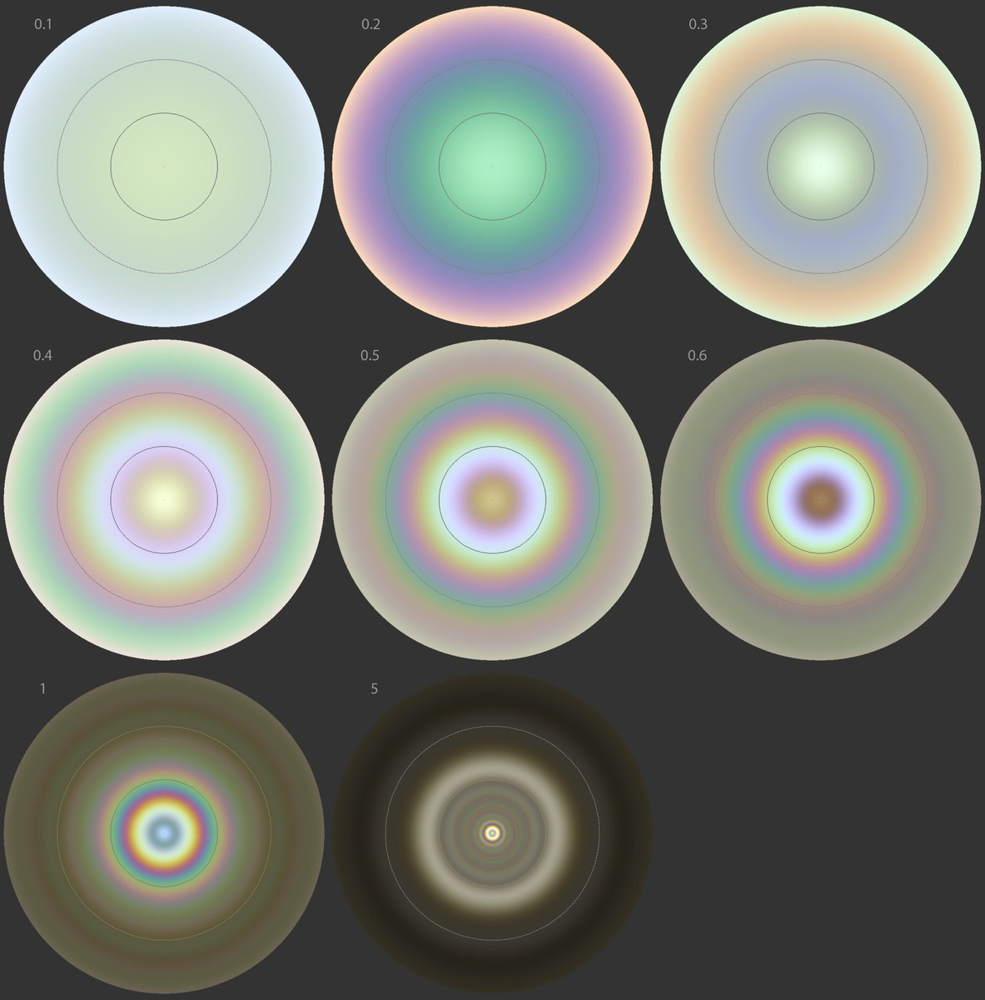
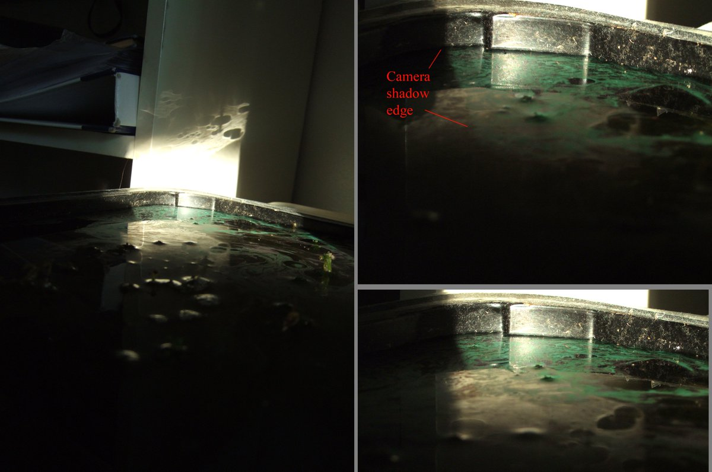

# Thread - 2025-01-24

**Original:** https://x.com/RiikonenMarko/status/1882803331921293804

---

### 1/2 - 2025-01-24 14:51 UTC

Marko Mikkilä documented nice coloring in stratospheric clouds on the opposite half of the sky (spanning from about 90 to 180 degree solar azimuth) on 18 January 2025 in Nivala https://t.co/RIg6PrLy88 It got me making some glory simulations with Philip Laven's MiePlot. Simulations have 180 degree fisheye view centered on the antisolar point. The auxiliary circles in the second image are 30 and 60 degrees in radius. On the basis of these simulations I'd say the crystals in those clouds have been in radius about one micrometer and less. I don't know if this is in line with what the literature says about Type II clouds (which are the ones that are spectrally colored).

Colors in Mikkilä's image show better if some saturation is applied. Also Timo Nevala got the opposite colors nicely bagged https://t.co/mfI0RCHSRn (photos 4 and 5).

It seems I've got some more down to earth stuff that I have photographed in the past related to that 0.2 um radius simulation. If I can only find it.

---

### 2/2 - 2025-01-24 15:27 UTC

All right, here is the more down to earth stuff. We see in a water filled container a shining green surface film flanking the camera shadow. I have been wondering about this glory effect and now the simulations in the above post appear to have provided an answer: it comes from particles about 0.2 um in radius. Much smaller than the 2.5 um radius particles that make the Chromophyton rosanoffii algal glory https://t.co/k3rA8HU0Zz

I think this is from bacteria. Maybe the bacteria particles themselves or perhaps droplets secreted by them.

Around the time of taking these photos in my apartment in Helsinki on 10 February 2007 I was experimenting with cultivating algal and bacterial surface films. I think I want get back on that horse and try to get the green specialty appear again.

---

