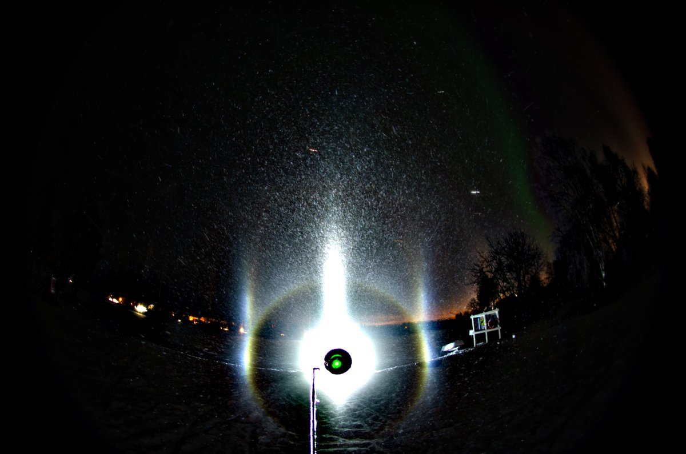
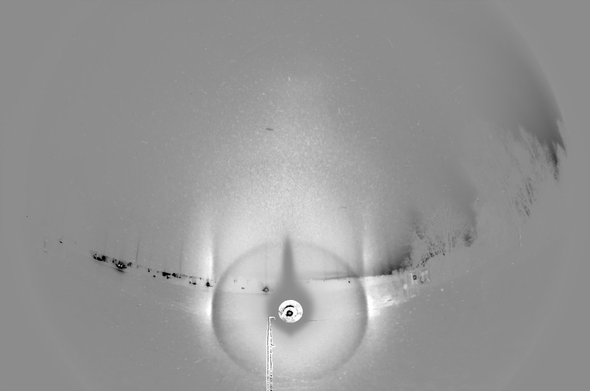
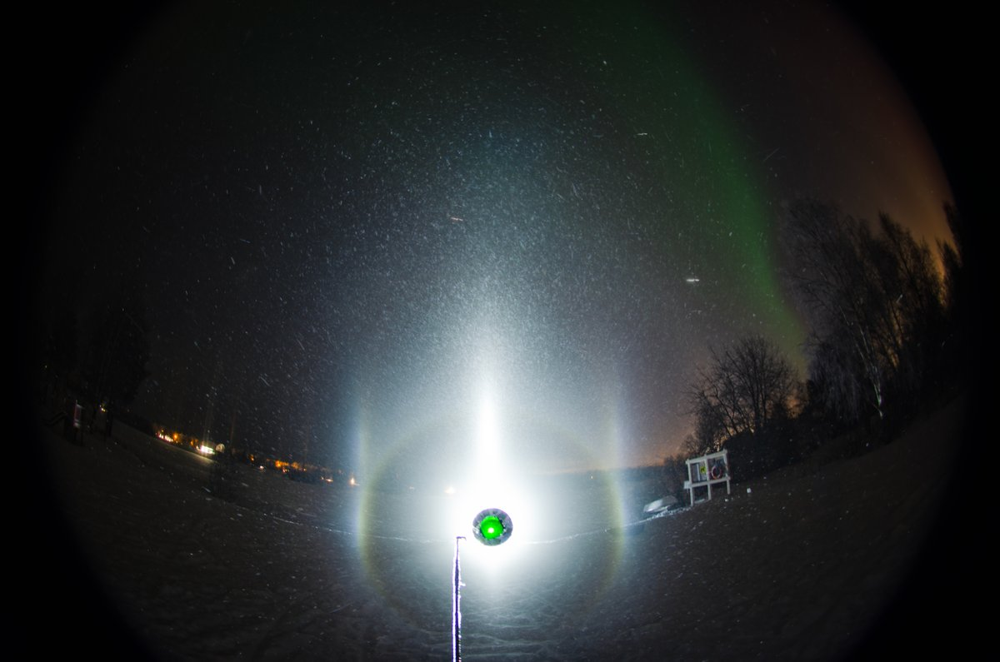
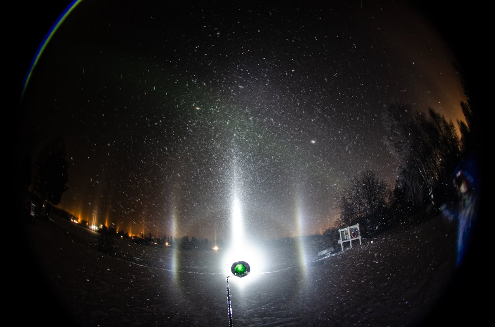
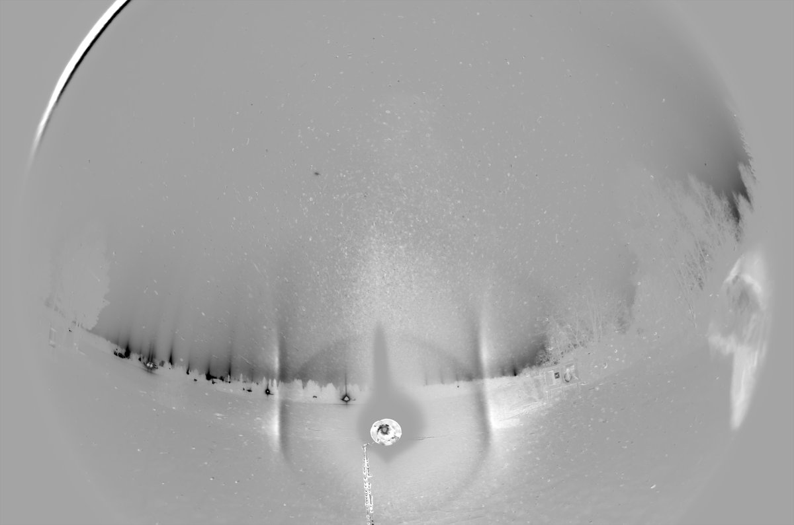
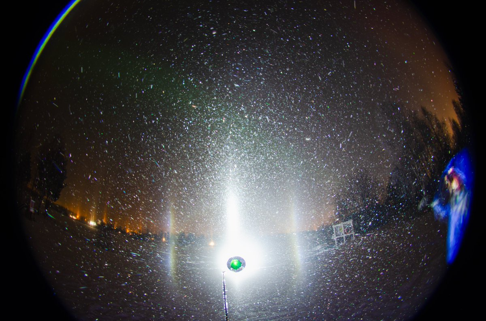
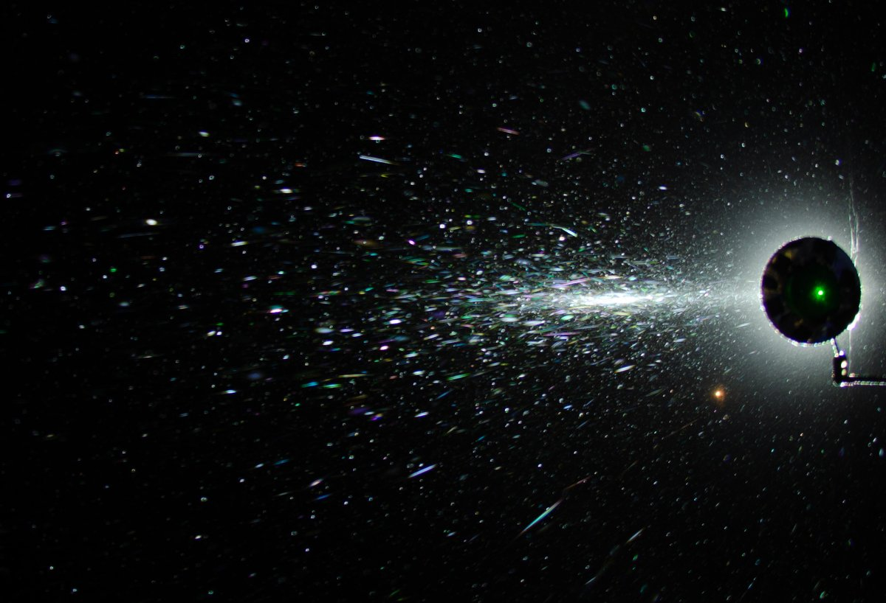
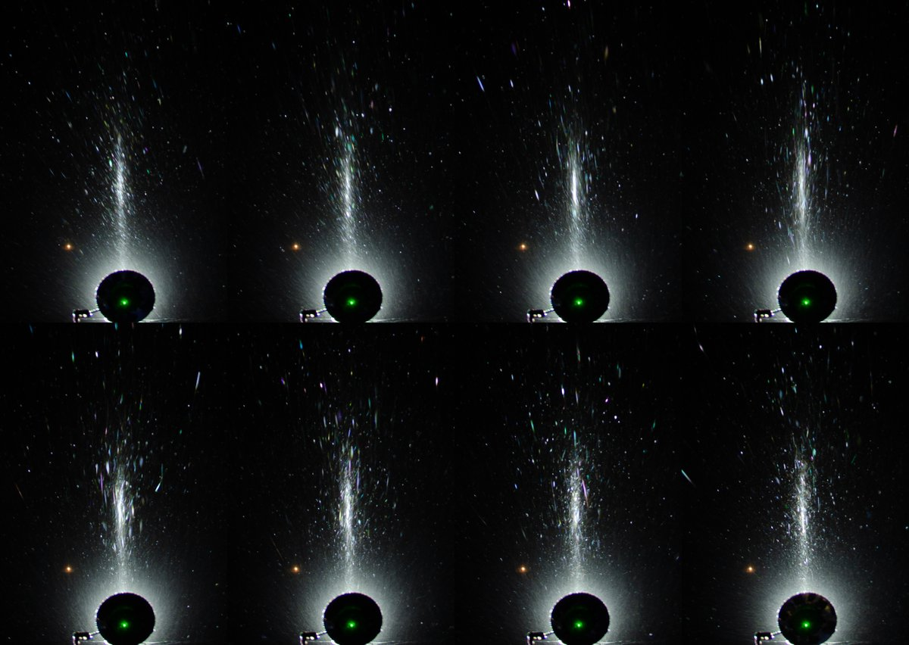

# Thread - 2025-01-26

**Original:** https://x.com/RiikonenMarko/status/1883463818312892924

---

### 1/4 - 2025-01-26 10:35 UTC

So there were two nights of ice fog, thanks to the snow gun operators putting the air back on. Here is the second night, 23/24 January 2025 Rovaniemi, in Pullinranta by the river. It is nothing to get excited about. In this and next post are versions of two stacks. Then further down some psychedelic colors and also a video of the ending of the display.

---

### 2/4 - 2025-01-26 10:35 UTC

23/24 January 2025 Rovaniemi.

---

### 3/4 - 2025-01-26 10:35 UTC

23/24 January 2025 Rovaniemi. Some psychedelic colors were visible, best in the countersun. The second image is max stack of the single photos. Exposure time 0.77s. I am still to get for this winter a proper all-sky psychedelic color display. They are not for granted – last winter brought none. I'd like to have a crystal sample.

---

### 4/4 - 2025-01-26 10:35 UTC

23/24 January 2025 Rovaniemi. This is the ending of the display. I made the video because it shows the typical way of how display ends when the ice fog either shifts or dies out completely. You have this short lived intensification of the display. All the crappy crystals get cleared away and the display gets momentarily better even while the ice fog is quickly thinning out. I'd say this is what happens more times than not when the display gets snuffed.

Here I should have though continued to photograph a little longer to show it fizzle out completely.

Maybe I have already written about this issue earlier.

When I left the place towards the city around 1:30 am I was soon back inside the shifted ice fog. It had grown huge, encompassing like half of Rovaniemi. But total crap. Given it was -19 C I decided go to sleep. Upon waking up in the morning I was shocked to realize that the temp at the railway station was -10 C. I hopped into car and went to check the situation, it was still dark enough. Nothing to worry about, there was parhelia but crapped by too much snowfall from the stratus / fog. Nothing missed, I think.

[🎬 1883463838701355048-4X2uL3i3nRkewinF.mp4](media/1883463838701355048-4X2uL3i3nRkewinF.mp4)

---

