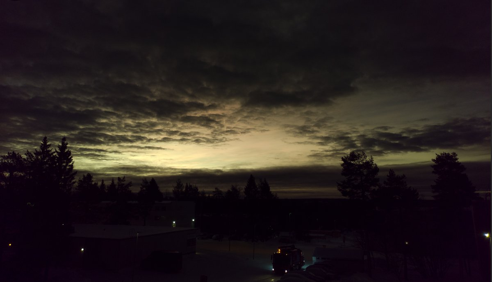

# Thread - 2025-01-26

**Original:** https://x.com/RiikonenMarko/status/1883505870002098334

---

### 1/1 - 2025-01-26 13:22 UTC

On the morning of 14 January I looked out and thought the window was applying some effect to the light. There was wrongness in the sky, as if white balance was off. I stepped on the balcony just to be sure that it was not the window. There were stratospheric clouds and somehow the combination of them and the lower clouds caused the awry coloring. This is what I came up when I adjusted the photo white balance immediately after taking it. Maybe it was something like that.

---

