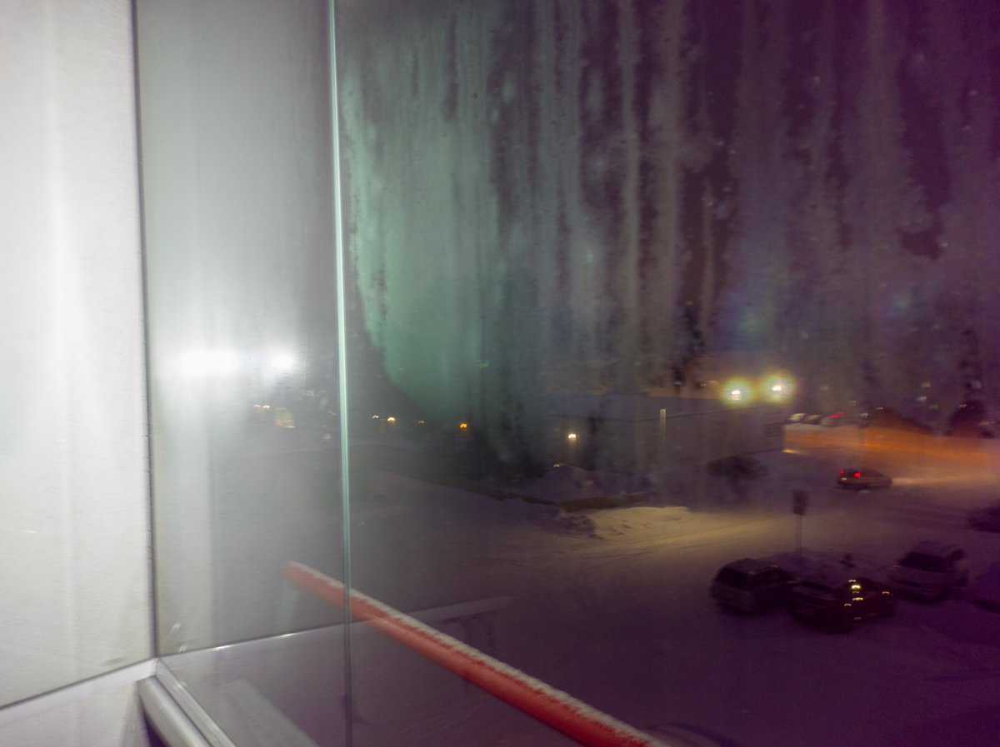
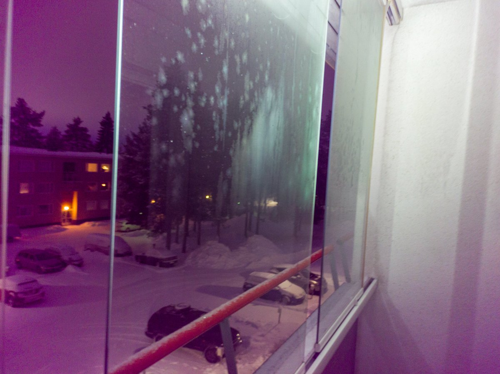

# Thread - 2025-01-28

**Original:** https://x.com/RiikonenMarko/status/1884265624815190225

---

### 1/3 - 2025-01-28 15:41 UTC

It appears trying one's luck with bacterial films on water is not needed to summon the green glory. It shows up well enough on freshly fogged balcony glass as shown by these photos that I just took with my phone camera. This in reference to the observation I made in 2007: https://t.co/vm4kIPqwxv

---

### 2/3 - 2025-01-28 15:41 UTC

Here is video. The whole glass kind of flashes green in the beginning, this is not real, it gets real from about 0:04, the green is visible at the edge of the glass just like in the photo above. There are also other colors further out. Those don't quite hew to the 0.2 um particle radius simulation I made: https://t.co/IV9EY2a3Pp Nor does the extent of the green, I think it is way too restricted.

Later in the video I move the lamp on the other side of the glass to try corona, but it is harder to capture faithfully. But clearly it is very different from the (non-)corona in the 0.2 um simulation https://t.co/ptWe6YnDHC

[🎬 1884265630448132246-xcLyobmusS_EgHhc.mp4](media/1884265630448132246-xcLyobmusS_EgHhc.mp4)

---

### 3/3 - 2025-01-28 15:55 UTC

The droplet size is probably not the same on the whole glass, the smallest may be on the edge. This could partly explain the mismatch with simulation. Also the light is very divergent. And the antisolar point can't be determined. Lots of things there to messy with neat pictures of the simulations. Taking it all in account, maybe there is still room for the green to be from 0.2 um radius droplets.

---

