# Thread - 2025-02-05

**Original:** https://x.com/RiikonenMarko/status/1887202799634817372

---

### 1/8 - 2025-02-05 18:13 UTC

A video on the night of 3/4 February 2025 of halo spots in the latest home-made ice plate. It came out pretty good and possibly this time I got also the Parry crystals photographed. Will add the results in this thread.

First the underside where the crystal growth is is facing the lamp. This is always the better view. No neat six pronged Ujvarosi star is seen. It is more like singular line formations dominate, but it is all pretty messy. At 1:16 I turn the underside facing me. Then at the end of the video I place a welding glass in between to get the exact lamp spot.

[🎬 1887202799634817372-A0si1ecPutib1hky.mp4](media/1887202799634817372-A0si1ecPutib1hky.mp4)

---

### 2/8 - 2025-02-05 18:52 UTC

3/4 February 2025. Here are four stills from the first video that I took through microscope of a fragment of the ice plate. In the first three images I am holding the fragment at an angle to the microscope objective. It is hard to say if those crystals are exactly upright to the plate plane, they could be tilted some. In the fourth photo the fragment is lying flat on the microscope stage. Those crystals seem exactly upright, i.e. in Parry orientation.

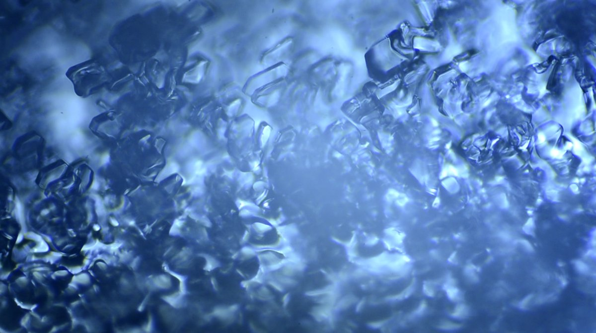

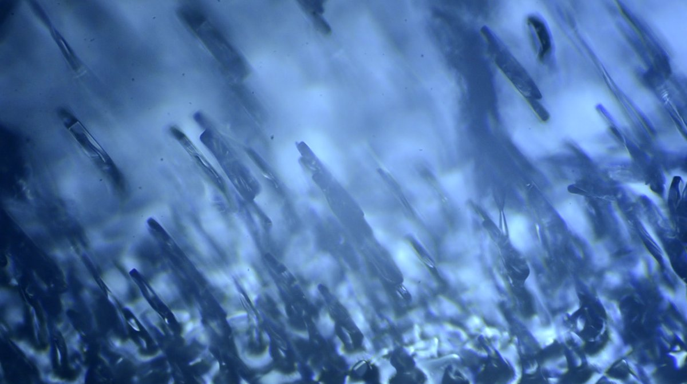

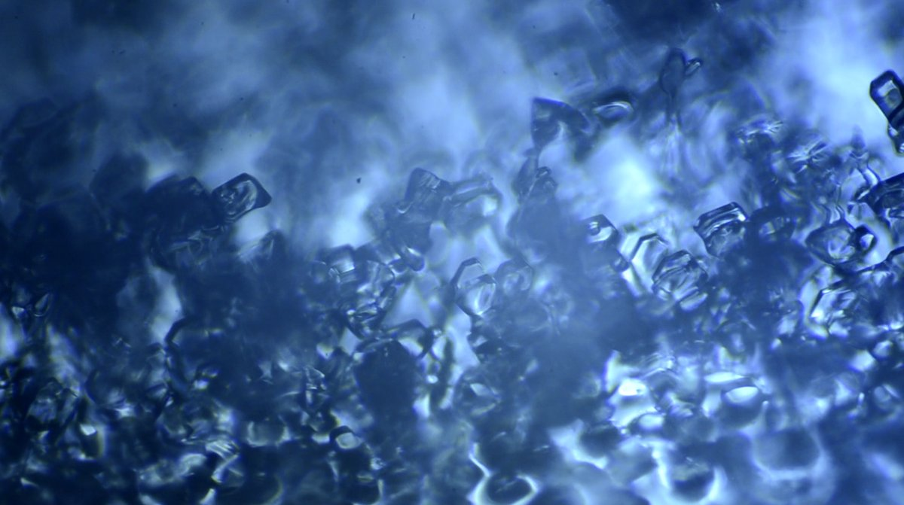

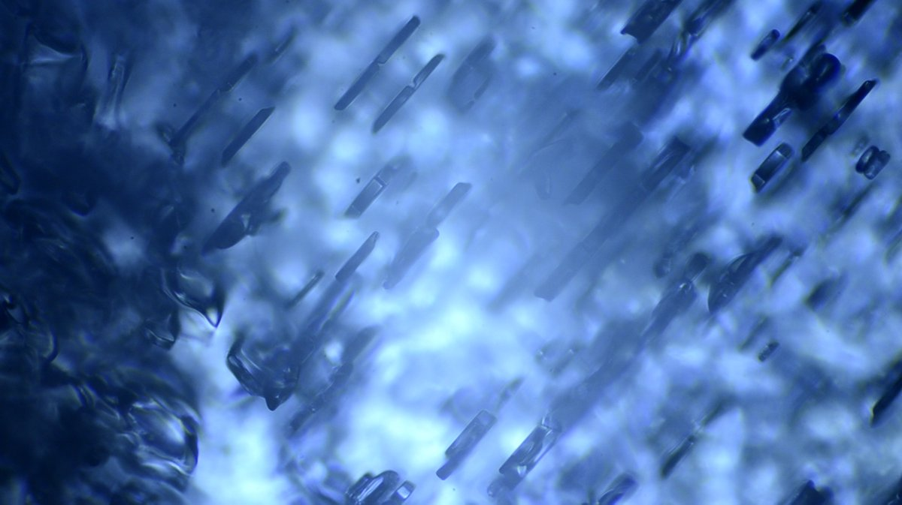

---

### 3/8 - 2025-02-05 19:08 UTC

3/4 February 2025. This is the video from which the above stills are (DSC6224). At first I am holding the fragment at an angle, from 3:08 the fragment is lying flat on the microscope stage. The whole video is in transmitted light, the lamp is underneath the microscope base.

From 3:08 at first we see growth in which crystals are laying quite flat, then more upright crystals from 4:00 and at the end exactly upright crystals.

[🎬 1887216842030063950-8oEFr0Og4ONDN7Te.mp4](media/1887216842030063950-8oEFr0Og4ONDN7Te.mp4)

---

### 4/8 - 2025-02-08 10:12 UTC

3/4 February 2025. This video looks at adjacent mosaic patches, the one on the left what I consider to be Parry oriented crystals and on the right more or less plate oriented crystals.

[🎬 1888169147176984860-L9mX0Moxpb9MQP9I.mp4](media/1888169147176984860-L9mX0Moxpb9MQP9I.mp4)

---

### 5/8 - 2025-02-08 10:52 UTC

3/4 February 2025. Examining yet another ice plate fragment (DSC6231). Of all fragments I looked at, here shows the best the three adjacent prism faces in Parry crystals from 1:44 onwards (before that the focus is on a mosaic patch with more or less plate oriented crystals). There are also triangulars with the top face missing. To be exact, this patch is not in exact Parry orientation as the crystals are a bit tilted to the ice plate plane. The ice fragment was lying flat on the microscope stage.

[🎬 1888178998015844419-nwMLwjFNZ-7X70M3.mp4](media/1888178998015844419-nwMLwjFNZ-7X70M3.mp4)

---

### 6/8 - 2025-02-08 11:37 UTC

The Ujvarosi star is a bit of mystery, because to make the six pronged formation Parry crystals need to be oriented at 60 angle to each other. In the ice place I examined this night there was no evidence of any such growth – which is in line with the fact that no Ujavarosi star was visible. The three images here show a selection of adjacent patches with an overlaid 60 degree angle. In image the angle between the crystals happens to be about 60 degrees, but not in the two others. 

I think Ujvarosi star forms in one patch, showing up at all resolutions. Maybe the solution is in the layered growth, different layers having crystals at different directions.

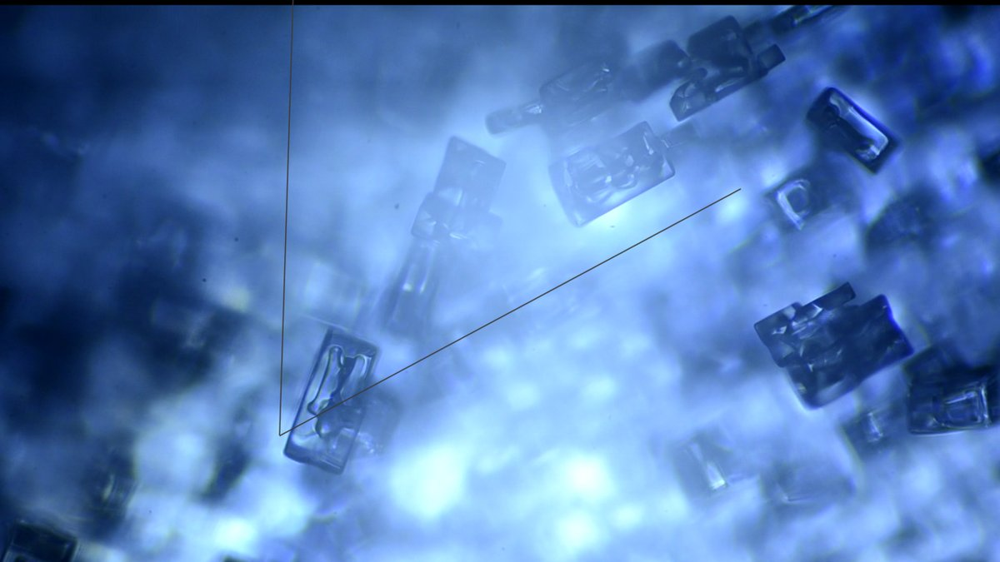

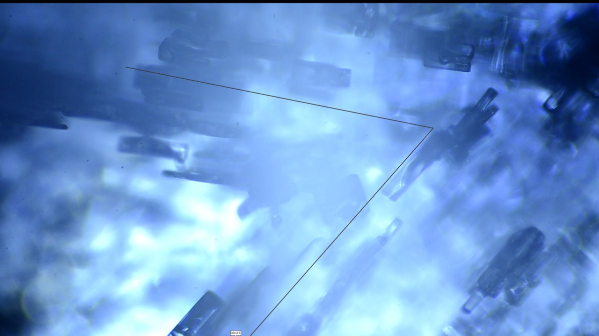

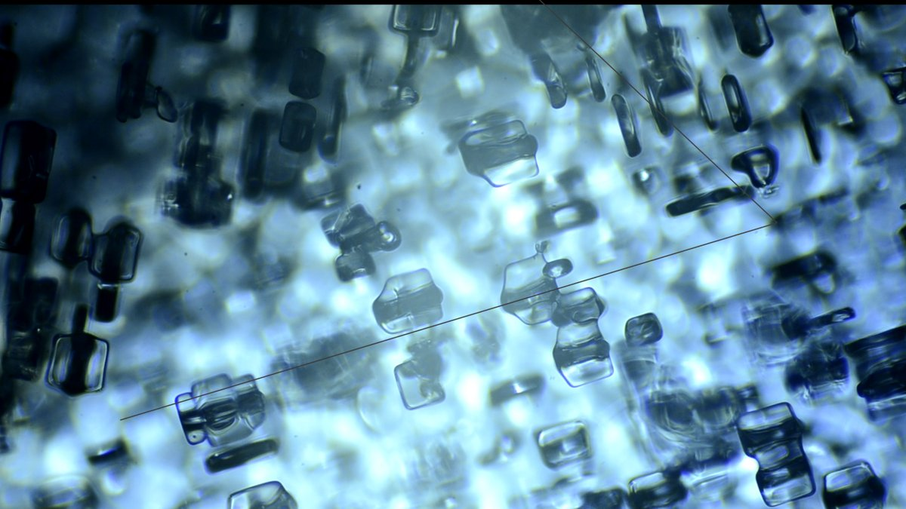

---

### 7/8 - 2025-02-08 14:41 UTC

In transmitted light, in many mosaic patches what appears to be the lamp is actually its off-set image due to the crystals being at an angle to the ice plate plane. The difference in position of the real lamp and off-set image allows to determine the tilting angle of the crystals to the ice plate plane supposing the other side of the ice plate is perfectly smooth (which it tends to be at least in home-made plates). But you need to know whether the off-set image is refraction or reflection borne. The former should show some coloring whereas the latter is white. The colored area in refraction spots is the smaller the smaller the refracting angle. And when taking video, that small color seems to gets easily overexposed – when I look at a video of ice plate, I always feel like there is less colored spots than there were on visual inspection.

Alternatively you could determine mosaic patch angles from the reflected spots when light and camera are on the same side of the plate.

Anyway, here is shown a selection of bright spots in the ice plate that I examined on the night of 3/4 February. I have marked the actual lamp location with black dot. In the first image the bright white spot is the true lamp, but other spots are off-set lamp images. In the second image the two spots on the opposite sides of the lamp location have red inner edge.

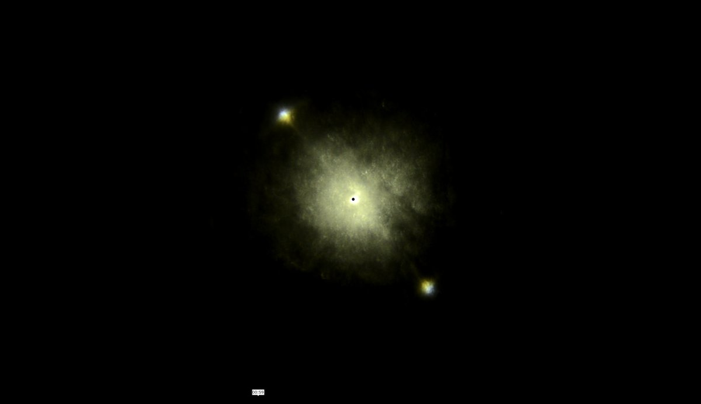

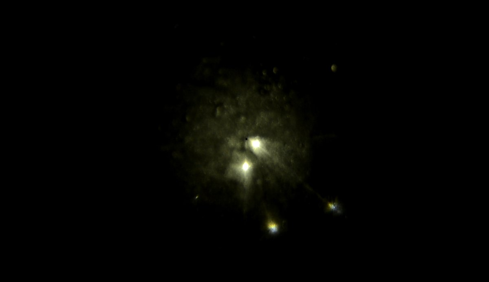

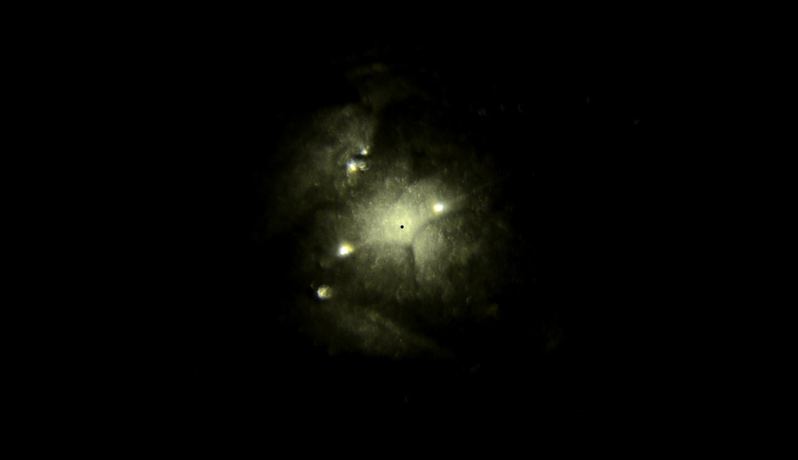

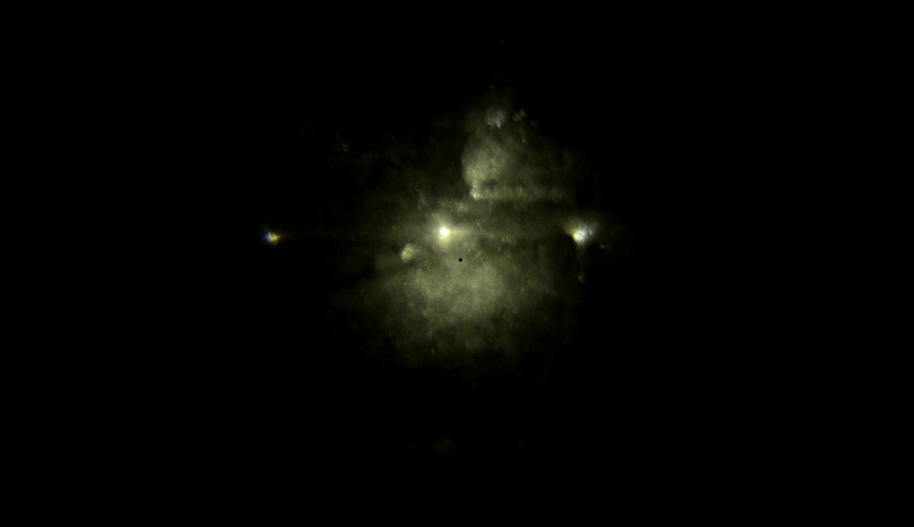

---

### 8/8 - 2025-02-08 15:02 UTC

An attempt to simulate the off-setting of the lamp image. With the same exit and entry faces, the reflection spot is further away from the helic point that the refraction spot. The angle between entry and exit faces in the simulation is 10 degrees. The refraction spot has red and blue fringes. As can be seen, the reflected rays are actually a little more intense, 0.98 vs 0.96 for the refracted rays. The reflection spot is fainter here only because of the crystal proportions. Had I chosen pyramid h/d 0.05 instead of 0.15 the spots would have been of equal brightness. The reflection spot raypath is equal to 345 in basic crystals – although the entry and exit faces are at an angle to each other, refraction gets cancelled due to the inner reflection.

I think usually it is the refraction spot that makes the fake lamp image. At least in mosaic patches with more or less plate oriented crystals that should be the case as there is much more surface area for the refracted rays than for the reflected rays.

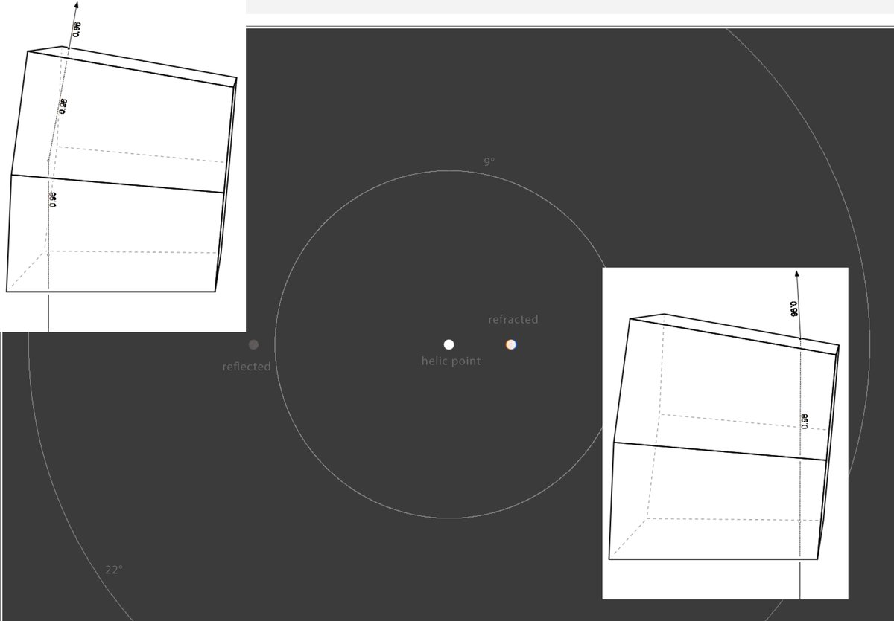

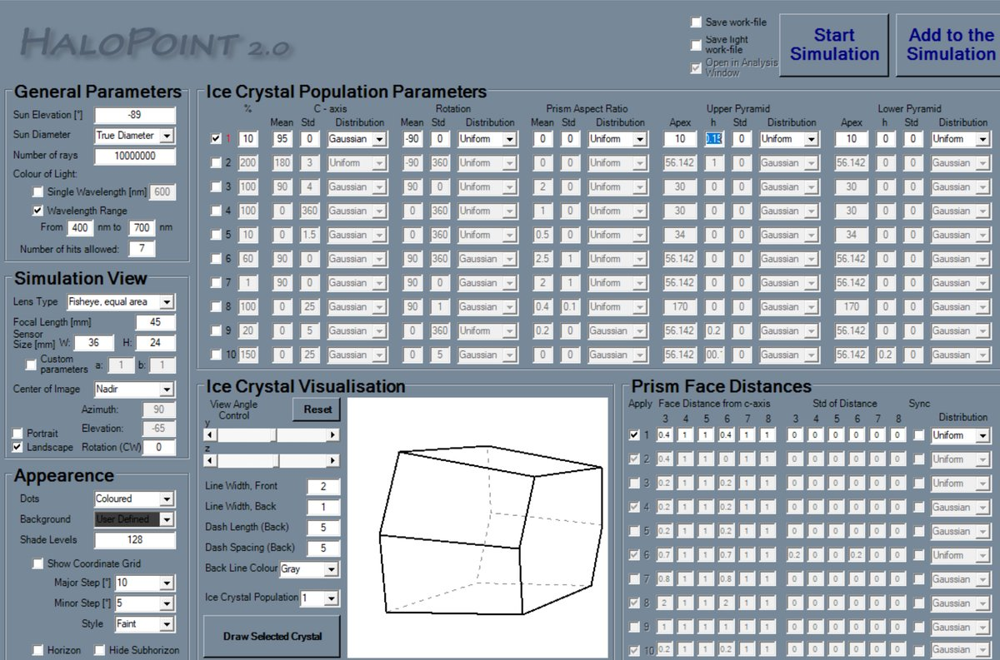

---

