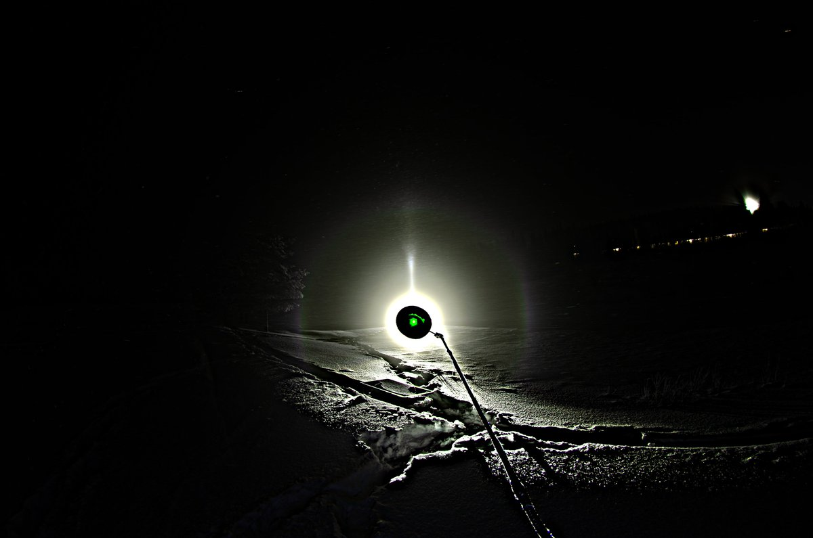
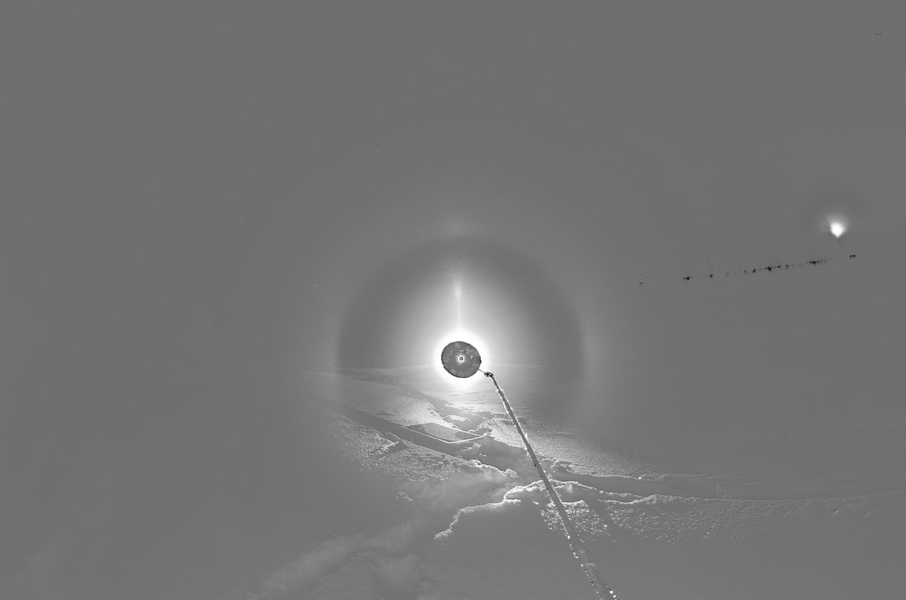
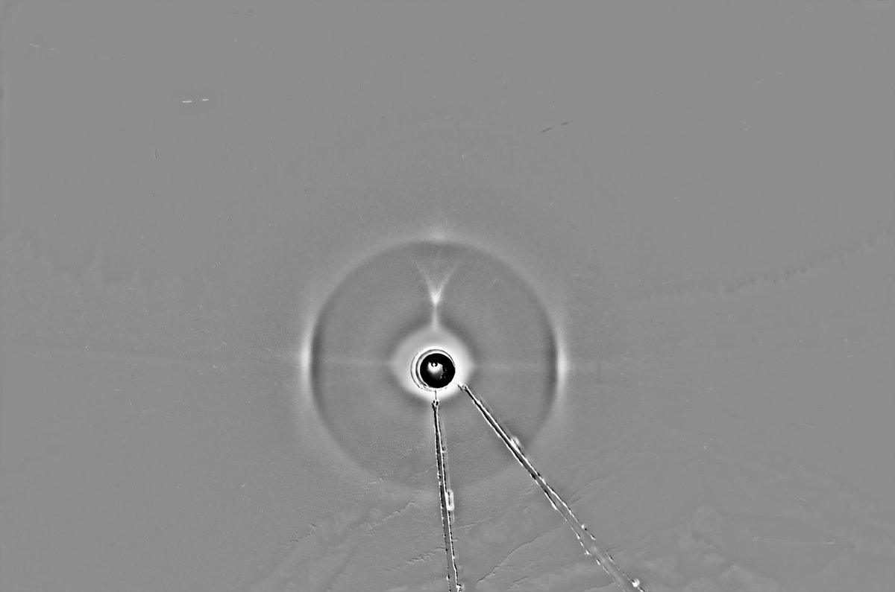
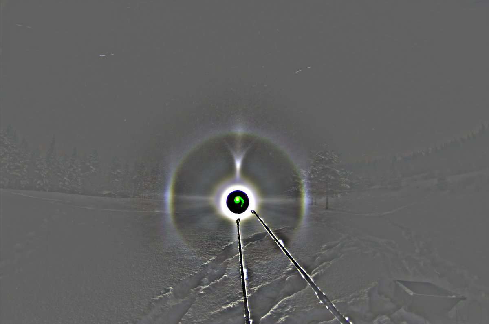
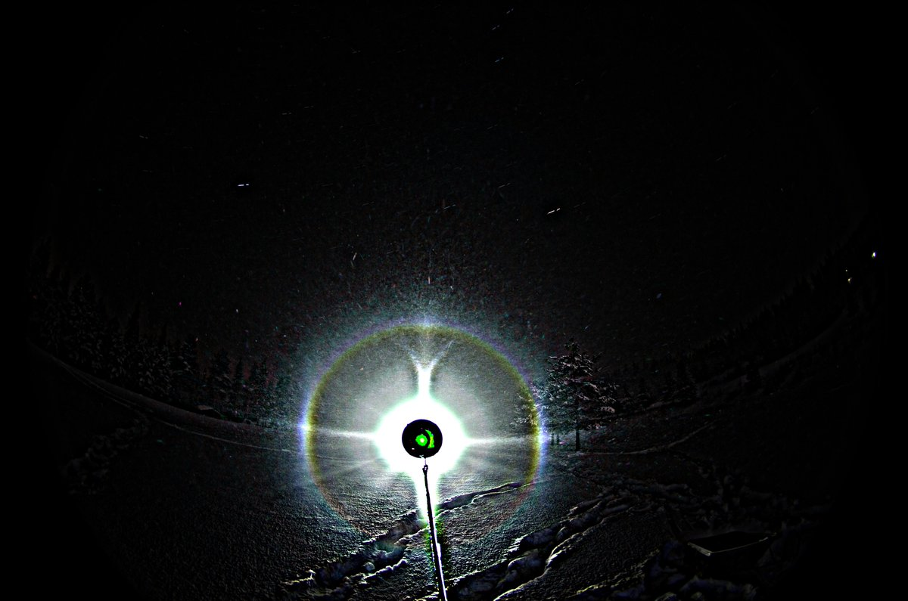
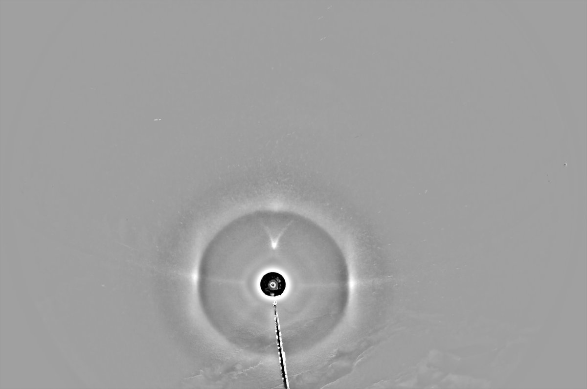
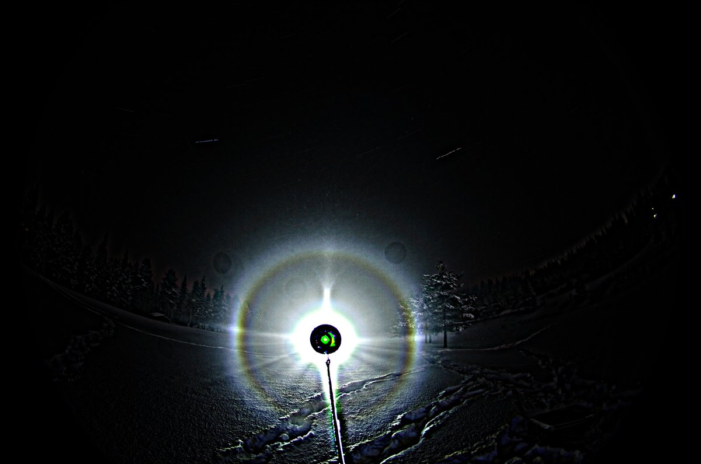
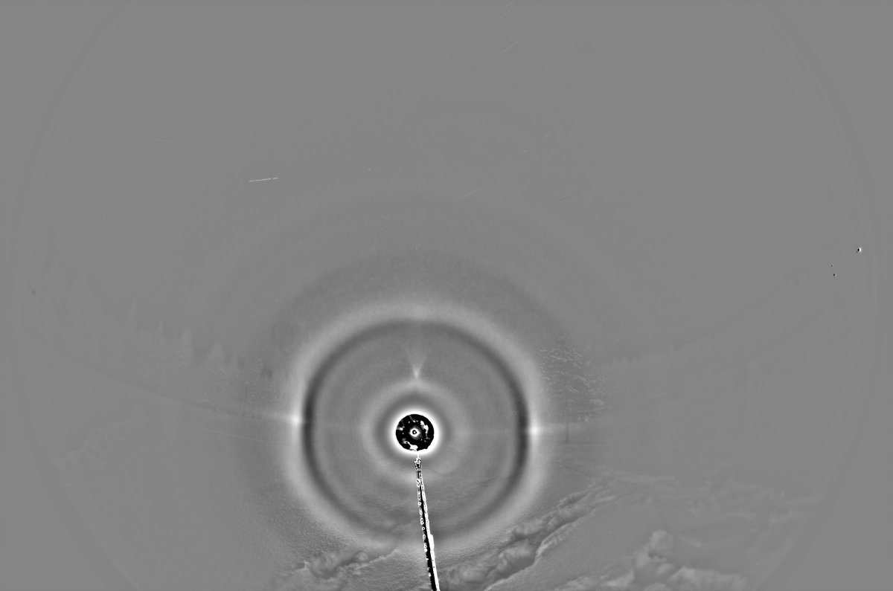
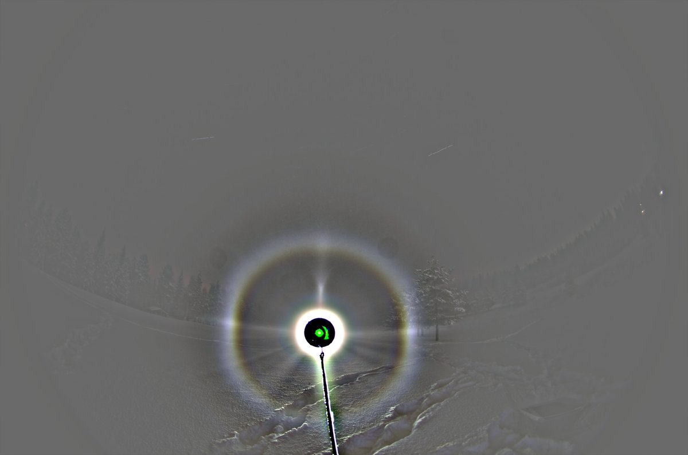

# Thread - 2025-02-07

**Original:** https://x.com/RiikonenMarko/status/1887789390732144783

---

### 1/3 - 2025-02-07 09:03 UTC

The night of 3/4 February 2025 got cold but when I visited in the evening the ski center after its closing time, no guns were on. So it was a surprise when I went for car warming ride after midnight to see massive diamond dust having enveloped Rovaniemi. Guns had been turned on and with pressure air despite the -30 C temps.

I settled at the golf track pond, which is one of the frequent locations. The nearest guns were running just 600 meters away at the bottom of the eastern Totto slope.

The display was not much to go by, crystals were smallish and there was quite some background glow. This winter has seen lots of such displays but on a positive note they have had odd radii. Here, though, I was not able recognize odd radii visually nor from the camera display. But there was Moilanen arc so I kept photographing. And then, as I found from the photos, it had on the quiet turned on an odd radii gear.

At first I had the lamp (Olight Javelot Turbo) down on the slushy or outright watery pond ice, giving some 5 degree negative elevation. The V of Moilanen arc is quite narrow (first two images). Then I realized the water was steaming and dimming the beam, so I took the lamp up on dry ground. Now the lamp and camera are more level, maybe one degree negative elevation (two last images). This is the configuration I kept to the end.

I don't know what to make of that spot at 8 clock position in the last set. It does not seem to be duplicated on the other side. Possibly some artefact.

---

### 2/3 - 2025-02-07 09:04 UTC

3/4 February 2025. Another stack of the Moilanen arc stage. Weak whiskers of helic arc are visible above the lamp. The spikes below the lamp are not halos, no Moilanen helic arc here, the beam was grazing the irregular snow surface giving rays of light and shadow. Actually, I went and tamped the snow for some some distance on the front the beam to give it a freer path.

I don't like the discoloring of 22° halo. Colors are not the same against the sky and against the ground. I think I need to think of using a different lamp, maybe back the good old hid. Then again, br seems to do just fine job for both parts.

---

### 3/3 - 2025-02-07 09:04 UTC

3/4 February 2025. Then the display became odd radii. This is 128 photo stack, exposure times 8 and 13 seconds. Total of 23 minutes, but I did not stack weighted.

Is that a 13 halo here? Earlier this winter, Jari Luomanen had marked tentatively 13° halo in his display on 5 January 2025 in Jämsä https://t.co/AZmribbS8z and the two displays indeed look alike.

Should this be 13° halo, then it is exciting news because we will be able to get a crystal sample in the future. I have been lazy on crystals this winter and not sampling this one (the Moilanen stage would have been interesting, too) calls again for some hours of relentless self-criticism at the podium of the next halo plenum. It must be made even more unforgiving because while this was on, I left the location to see if it would be better elsewhere and did not return when it was no good, instead called it a night (I was still an hour or so until twilight).

---

