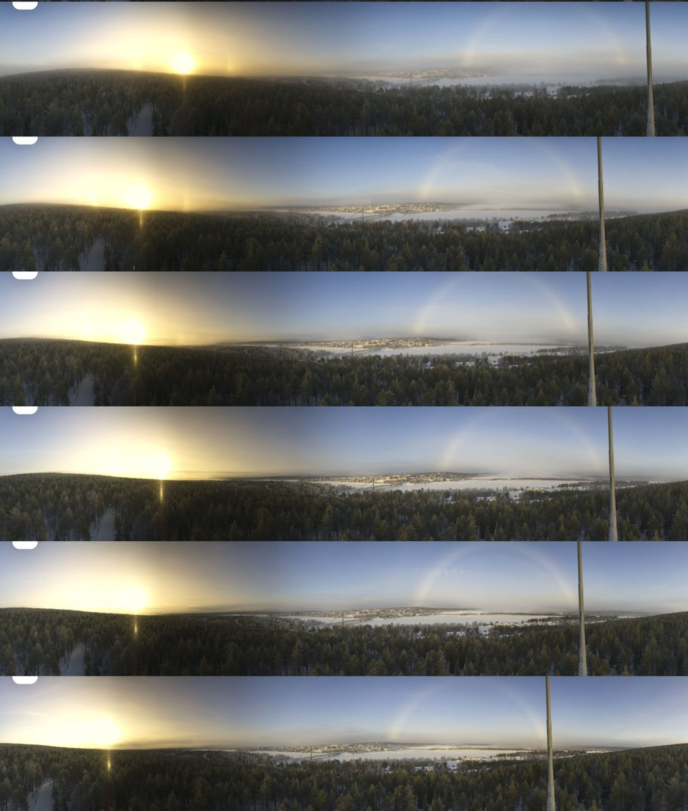
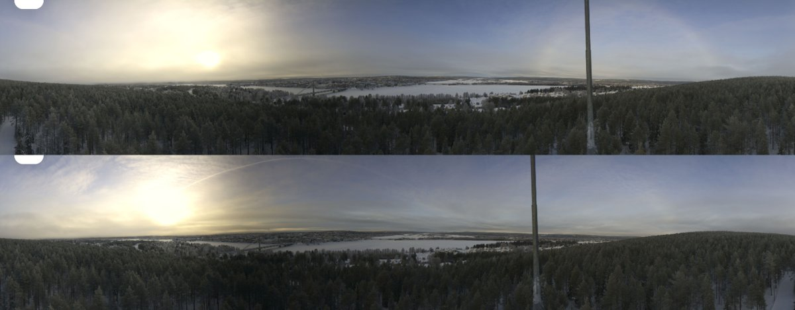

# Thread - 2025-02-17

**Original:** https://x.com/RiikonenMarko/status/1891421478069178405

---

### 1/2 - 2025-02-17 09:36 UTC

Bouguer in Ounasvaara 360 camera on 16 February 2025 Rovaniemi. The photos are every 10 minutes from 0930 to 1030. The 1030 shot was the last one with a halo, then it was only fogbow / cloudbow for some hours more. Fogbow / cloudbow definition is slippery in this case. In the next post down are photos from 1420 and 1440. They show a bow that can more cleanly understood as cloudbow.

The halo display is from snow gunning. I was prowling but did not find any place with any good halos. The stuff seen in these shots is better than anything I got.

---

### 2/2 - 2025-02-17 09:36 UTC

16 February 2025 Rovaniemi, at 1420 and 1440.

---

