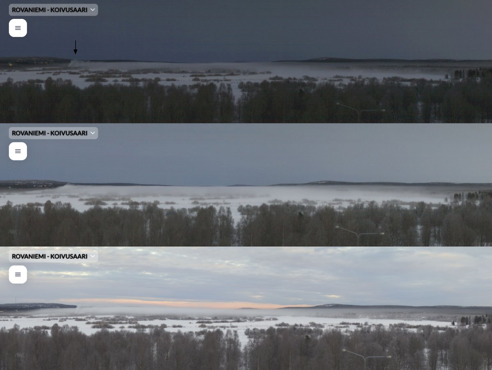
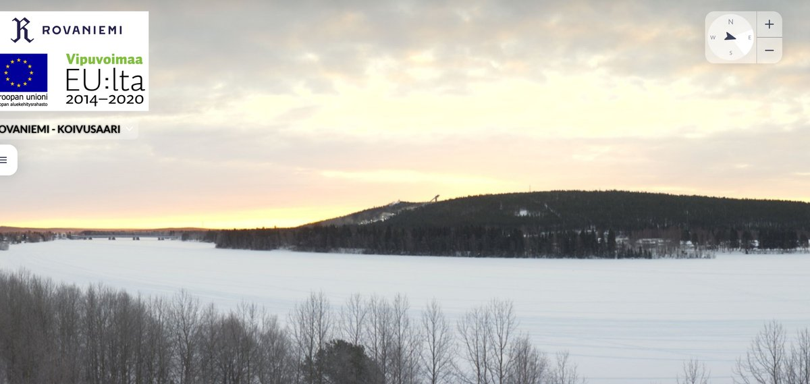
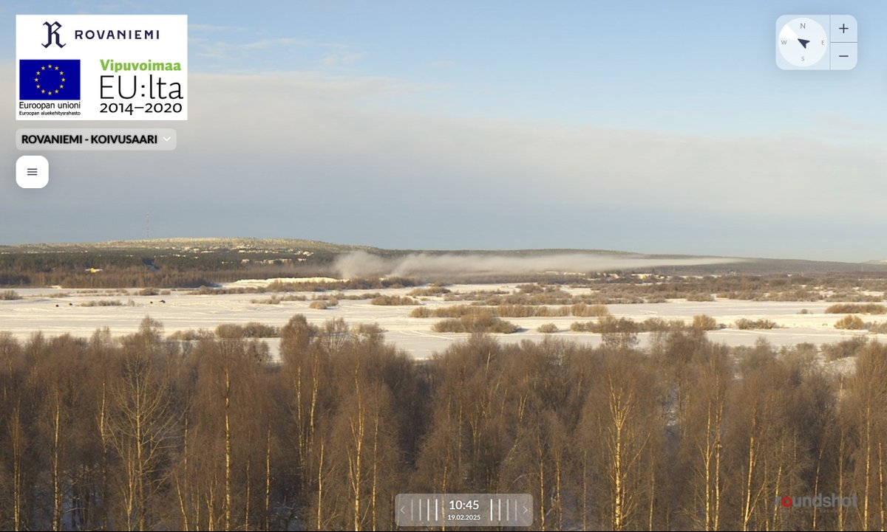
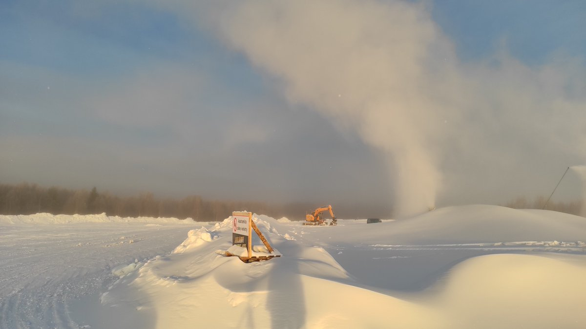
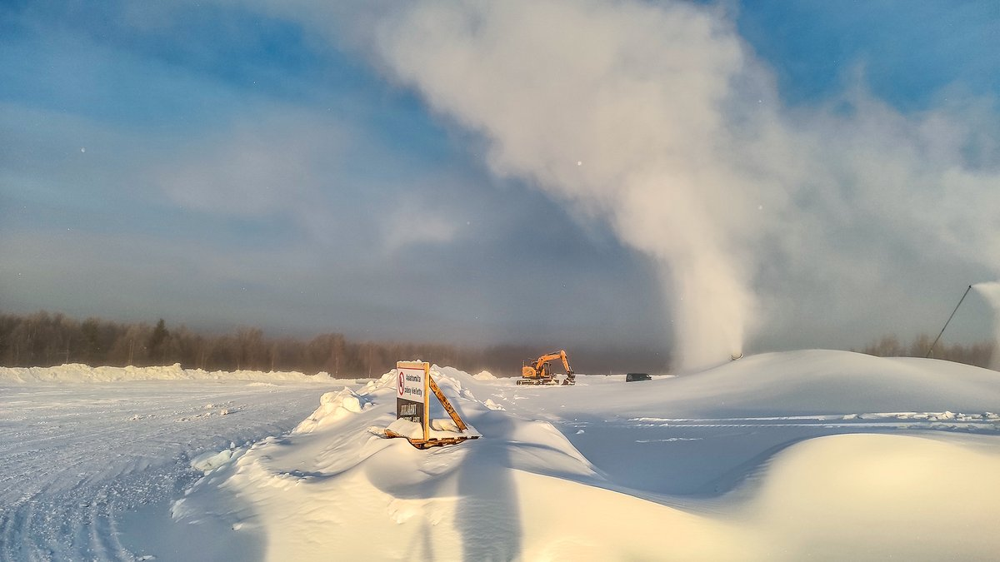
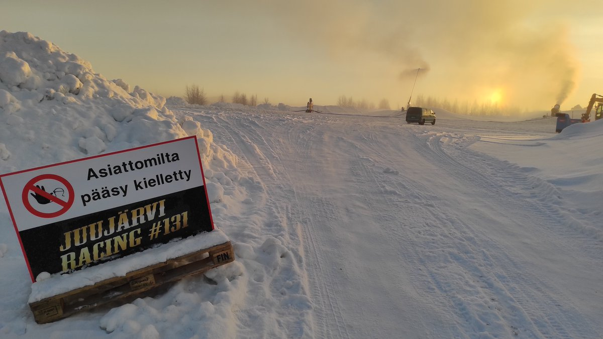

# Thread - 2025-02-19

**Original:** https://x.com/RiikonenMarko/status/1892119034122076624

---

### 1/4 - 2025-02-19 07:48 UTC

Whatteh? This morning, 19 February 2025, as I drove to the activity the unemployment office has seen good for me, I was surprised to see the river ice fogged west of the city. Koivusaari 360 webcam images reveal a snow gun running at the Ylikylä snowdump. It was on already yesterday (second image). What's going on there? I guess I need to go check. This ice fog is even more surprising given guns at the ski center made no ice fog (third image). Of course they may have again shut down the pressure air, but I don't think so, temps were quite high.

I had actually calculated that there wouldn't be ice fog last night because Apukka was windier and 4-5 C warmer than railways station (-10...11 C vs. -15 C). This has not been a good prospect in the past. So I slept, waking up only to check the numbers. Of course I know that playing it by the numbers makes you miss stuff. Often conditions are better than the numbers. The trigger for saddling up must be low.

---

### 2/4 - 2025-02-19 09:22 UTC

Dropped by quick at the site. There was a gun – or was there two? – running and no-entry sign saying Juujärvi Racing #13? (don't remember the last digit). Apparently they are making a track for a motorized vehicle race, something to do with snowmobiles, perhaps, something called snowcrossing. A very obscure venue, can't find any information.

Anyway, the shallowness of ice fog is unusual. Normally you have a cloud rising high up from the guns. Must be that the airmass at large was too dry, but the watery slush that by this time of winter is ubiquitous on any water body ice caused supersaturated conditions very low above the surface.

But then why guns at the Ounasvaara didn't spawn ice fog over the river nearby? Because the air was so dry the icy nuclei evaporated before drifting over the river? Even if the nuclei had survived the drift over the river, those invisible particles are so small that gravity don't much pull them down. They may have remained too high, never shaking hands with the supersaturated conditions below.

The mysteries of ice fog formation. Coming night should develop conditions and reveal whether the pressure air is on or not.

---

### 3/4 - 2025-02-20 16:07 UTC

Juujärvi racing #131 is actually a company name. It is explained here: https://t.co/deExgCVi0Z 

So I don't know why they are snowgunning here. I can't find any snowcross races coming for Rovaniemi. Maybe they have been contracted to make snow for whatever purpose. Of course I could have gone and asked the guy last night. He was sitting there in his van. But I didn't.

Talking of last night, just 50 meters from these guns I got quite interesting Moila data. I'll work the photos in the weekend.

I visited the place also this morning, 20 February 2025. I wonder if I saw Mikkilä's soul. At least that's what I thought and quickly snapped photo. Then it was gone. The pillar in the photo is really too weak to count a catch. I have actually not thought to look for Mikkilä's soul in solar display when chasing. It is quite common in spotlight beam, crossing off the celestial light source category is more demanding. I have found two instances from Ounasvaara 360 camera. 

Technically this phenomenon might be called 'pillar glory' or 'glory pillar'.

Anyway, I have series of photos for stacking from the sun side, will see how the display looked at the time of this perceived pillar.

---

### 4/4 - 2025-02-20 17:10 UTC

Now that I look at the thumbnail size images, maybe the ghosty Mikkilä's soul is just an illusion created by shadow  edge.

---

