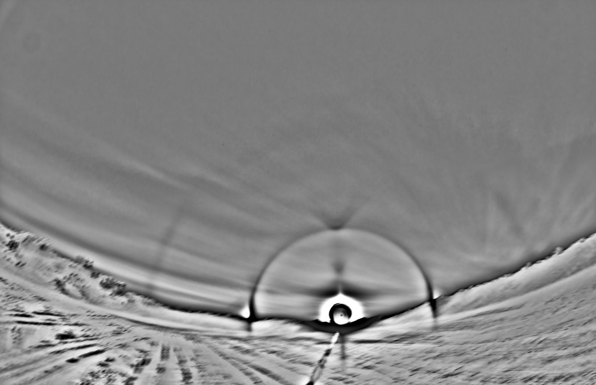
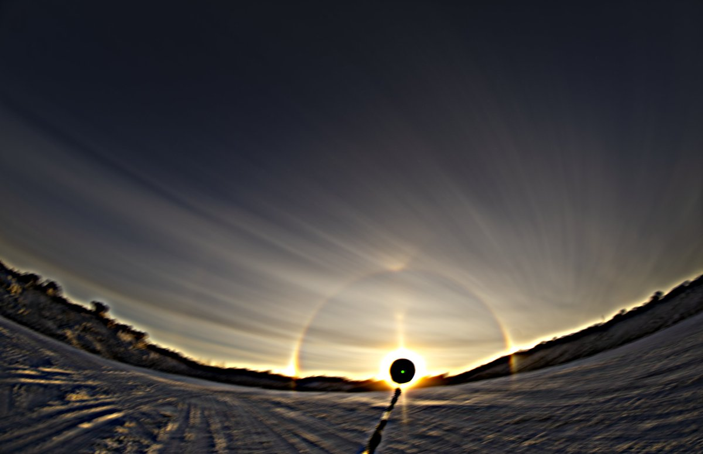
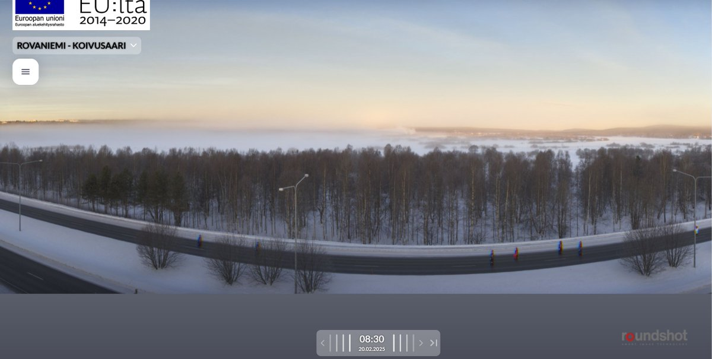

# Thread - 2025-03-01

**Original:** https://x.com/RiikonenMarko/status/1895787261846782078

---

### 1/1 - 2025-03-01 10:44 UTC

The Juujärvi racing display in the morning of 20 February 2025 in Rovaniemi. It is pretty much the same as in the previous night. High clouds make noise in the background. Photos every 4 seconds, 127 frames in the stack. The Koivusaari 360 camera image from 0830 has brightening opposite to the sun, perhaps diffuse anthelic arc. The photos I took were around 0850, ice fog already receding rapidly.

---

