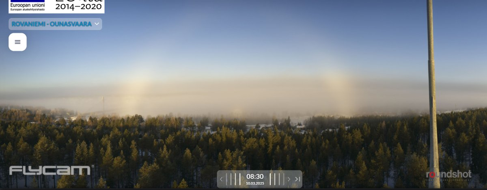
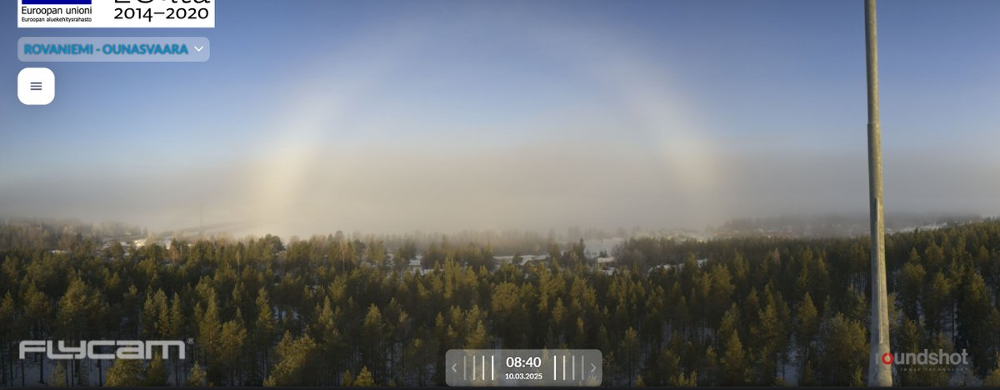
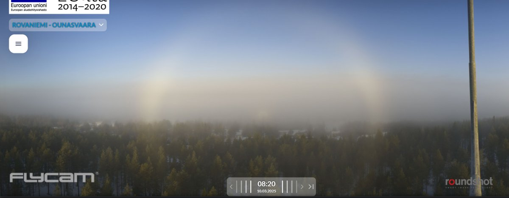
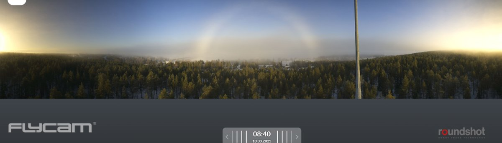

# Thread - 2025-03-10

**Original:** https://x.com/RiikonenMarko/status/1898997850068992075

---

### 1/1 - 2025-03-10 07:22 UTC

Such a waste! Big display temps last night and this morning, calm and fog – and no guns on. Eats man. Also, before weekend there were fogs at night at good temps. Possibly guns are not run anymore, the season is over.

Somebody drone owner should take a CO2 gas cylinder and spray a little morsel of dry ice inside a stocking and fly it above the fog like here. Could be that a big punch hole with a massive display is created. After all, it is entirely possible that the seed that forms the big displays from Stratus / Stratocumulus clouds at South Pole, for example, is just a tiny little thing.

Yeah, people should be stumbling over each other to try this.

---

