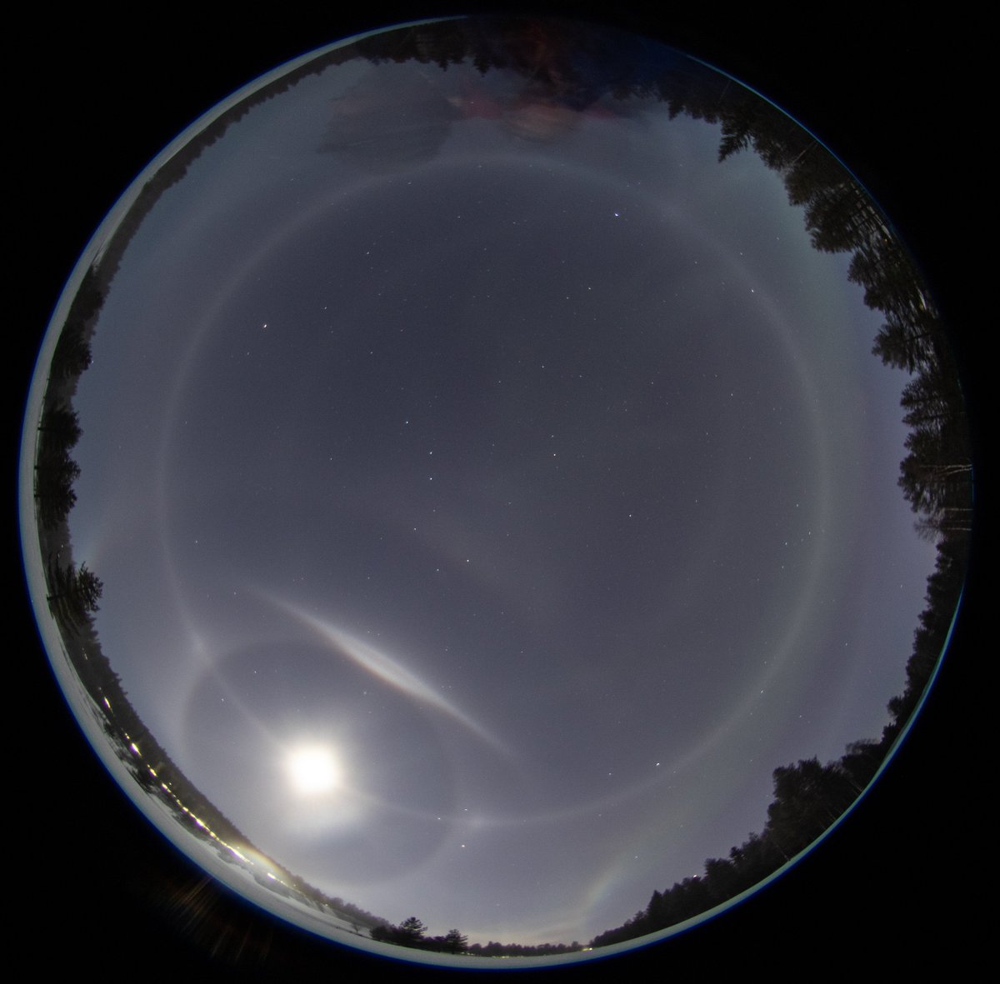
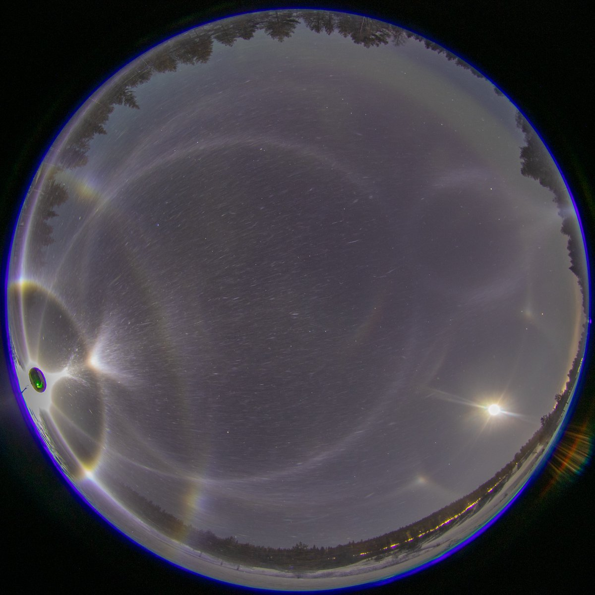
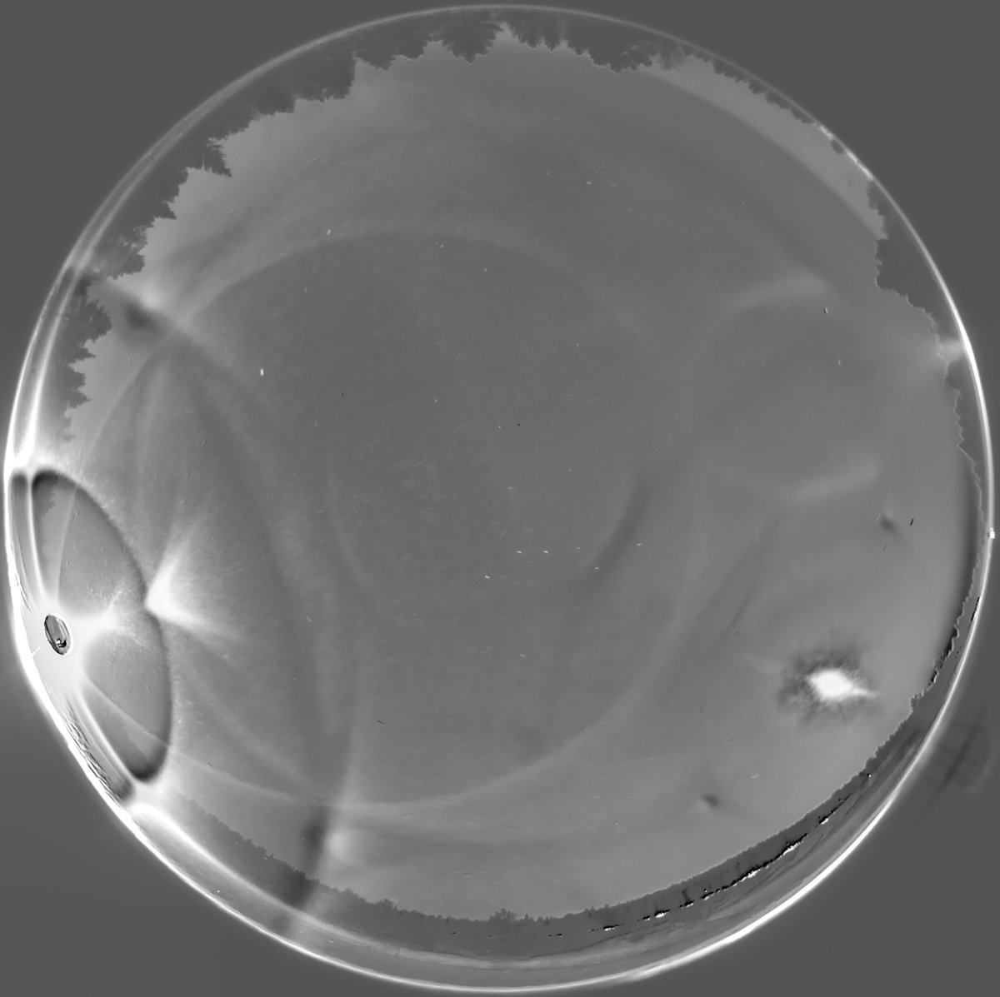
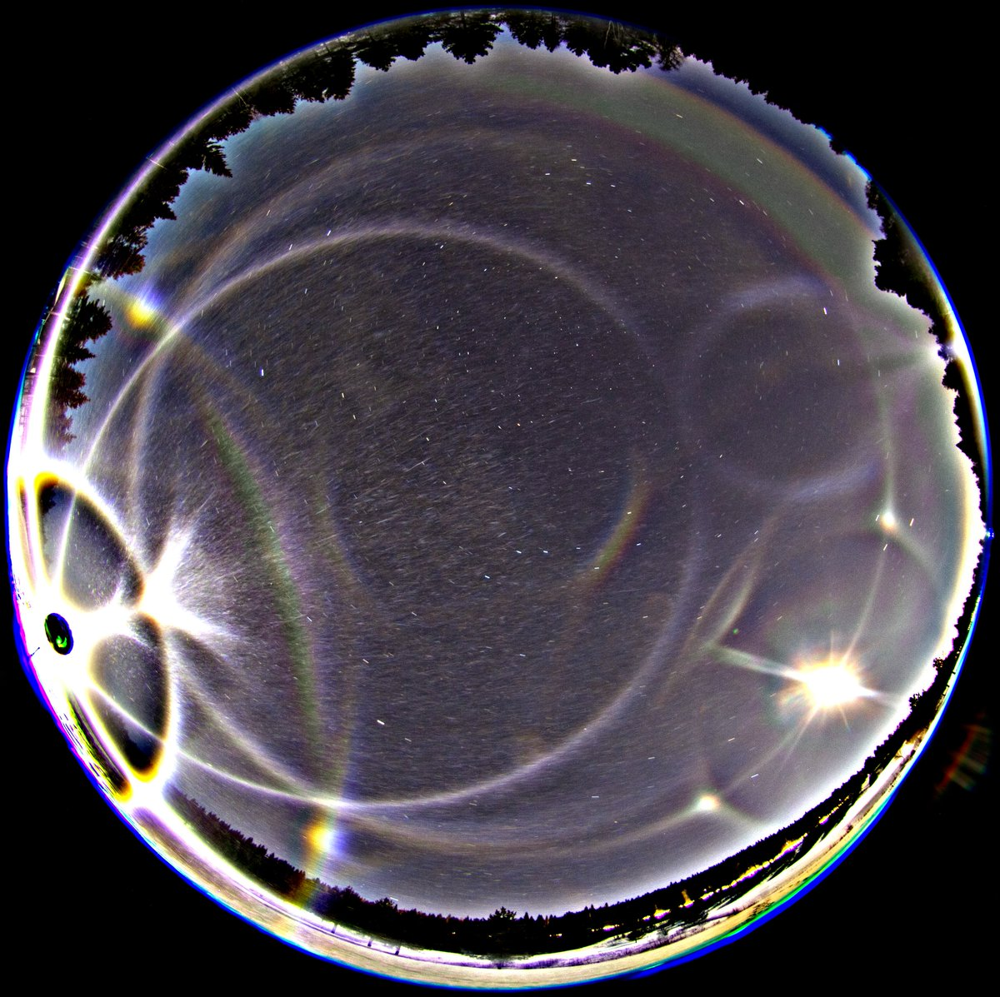
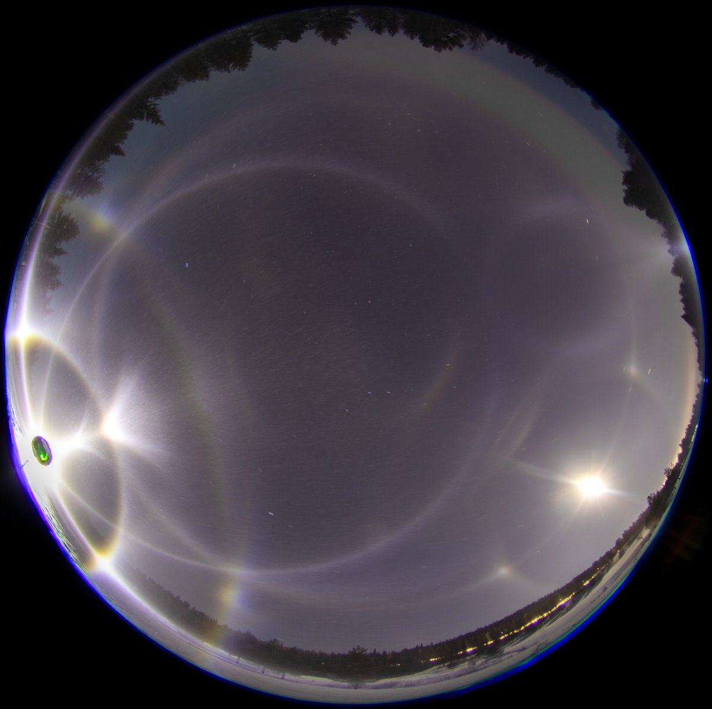
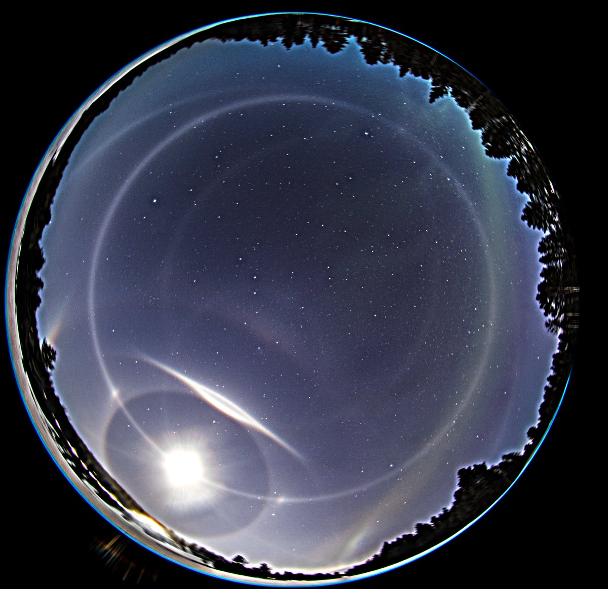
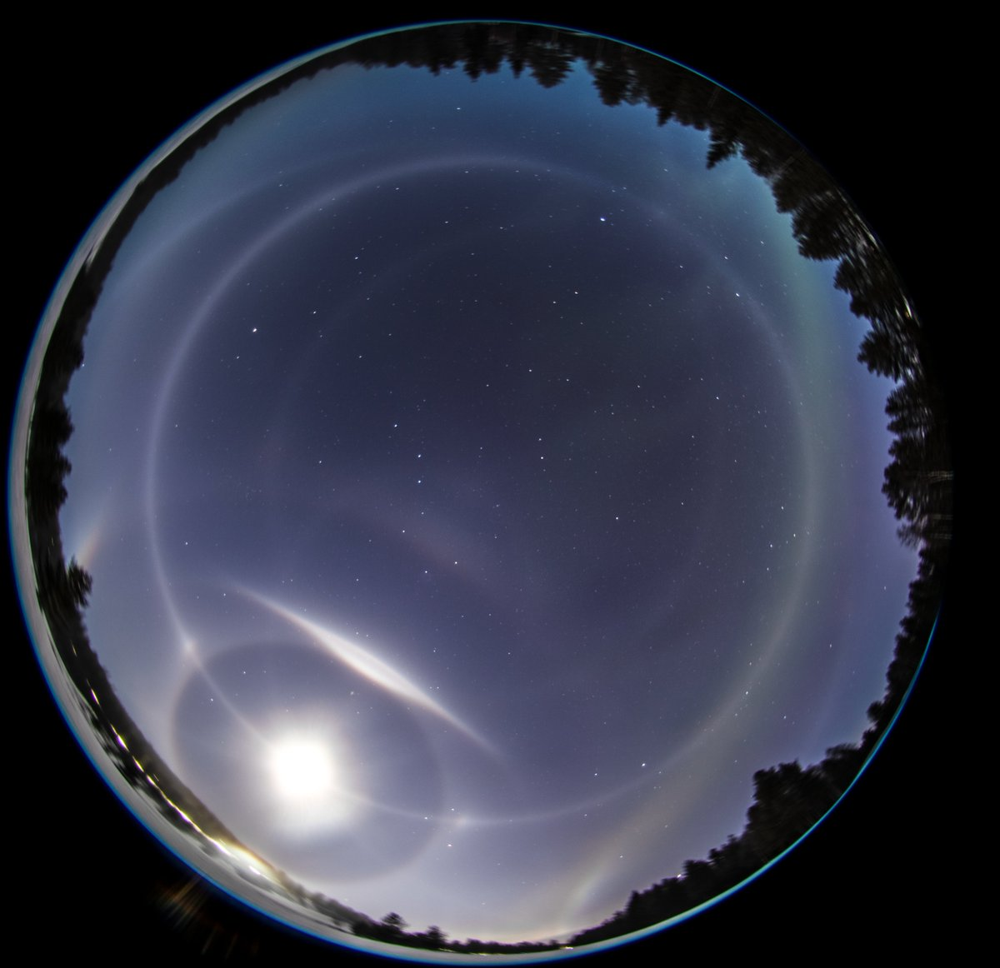
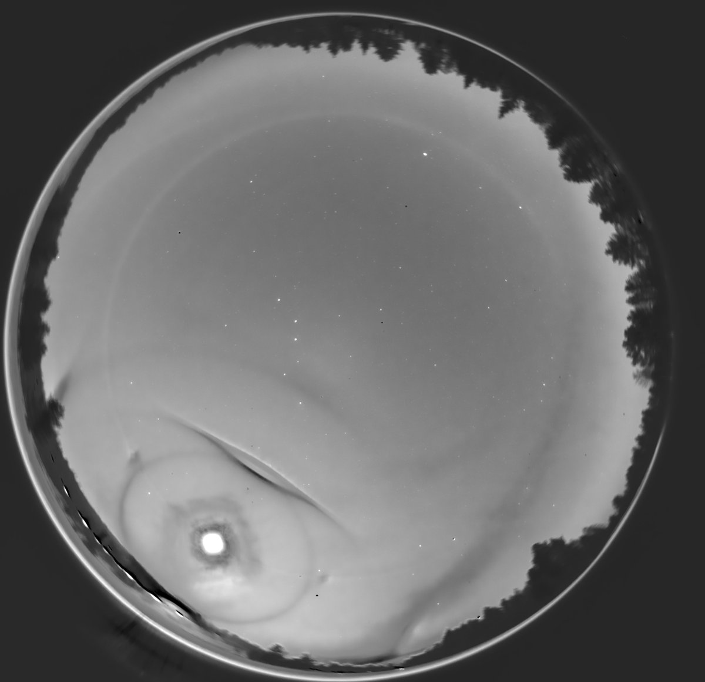
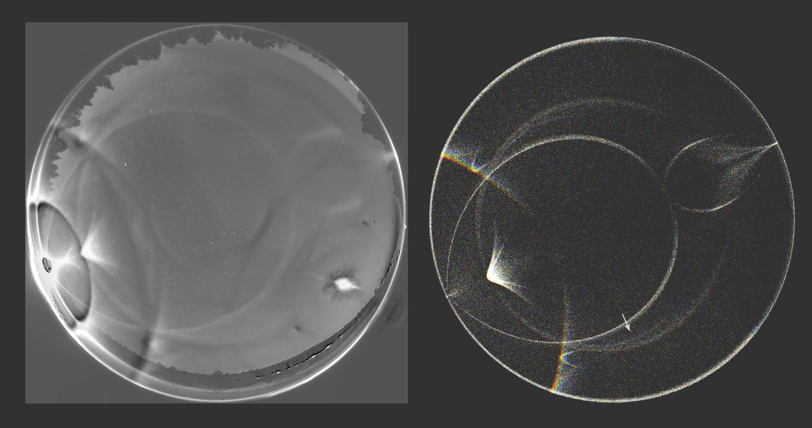

# Thread - 2025-03-11

**Original:** https://x.com/RiikonenMarko/status/1899351369309397117

---

### 1/6 - 2025-03-11 06:47 UTC

They turned on the guns last night (10/11 March 2025, Rovaniemi) and like the dutiful son I went at the coalface. Temps were good and the display had verve, but things didn't go that smooth. If it wasn't blocker not properly in place then it was the frosted lens. But I got also usable material and here are two single shots. May take some time before I get the stacks done, the forecast looks serious for the coming three nights.

---

### 2/6 - 2025-03-12 09:24 UTC

10/11 March 2025, Rovaniemi. 8 x 30s stack. Looks like 46° contact arcs are present in br. The Olight Javelot Turbo gives some funny coloring for halos, 46° halo / contact arc in particular this time. Flipanthelic (subanthelic) arc segment has blue spot at the bottom. I recall it has another on the top, but it doesn't show up.

Lamp was a a tiny bit above the camera, I'd say max 1 degrees. The broadening of the helic arc on the outside is probably because of the fliphelic arc.  

These joint displays are too messy. But I wouldn't like to shoot only lunar, I value spotlight more.

---

### 3/6 - 2025-03-12 09:39 UTC

10/11 March 2025. 10 x 30s stack. As I was driving to this location (golf course) and glanced out of the window, I thought there was aurora above the moon. Even when I got out of the car, at first glance I was thinking aurora. On the second glance the brain caught on and the usual panic hit in. To not waste any time I simply placed the camera on upturned sledge. Visually the tangent arc - Parry combo looked mighty impressive.

---

### 4/6 - 2025-03-20 18:19 UTC

Would seem like uppervex Hastings in the display.

On another note. Lost significant chunk of photos from this night. As moon got lower, Moilanen started to show up and I got long series for stacking. I though I did, but it appears in reality I had not copied those files from the memory card to my computer. And after that I pretty much shot those cards full. Already a second time to lose potentially good data this winter.

---

### 5/6 - 2025-03-23 11:30 UTC

10/11 March 2025. I had started the night and was driving to golf course. En route I dived into this ice fog from the snow dump gunning and opened the window to take video. In addition to parhelia there is tangent arc. Looks like helic arc there too, so could be actually tangent arc and Parry. Anyway, it is not nearly the top quality stuff. At the golf course ice fog was of different origin, from ski center guns. Original in Google Drive:  https://t.co/HoRd15htui

[🎬 1903771230533984580-bmPewOseNeKLpFws.mp4](media/1903771230533984580-bmPewOseNeKLpFws.mp4)

---

### 6/6 - 2025-03-23 11:46 UTC

The brighter spot in the sweeping tangent arc must be from azimuthally oriented crystals near the windshield. Such funny effects are commonplace when you drive in ice fog. Usually they are from reflection so you see them in ice fogs that make only pillars.

---

