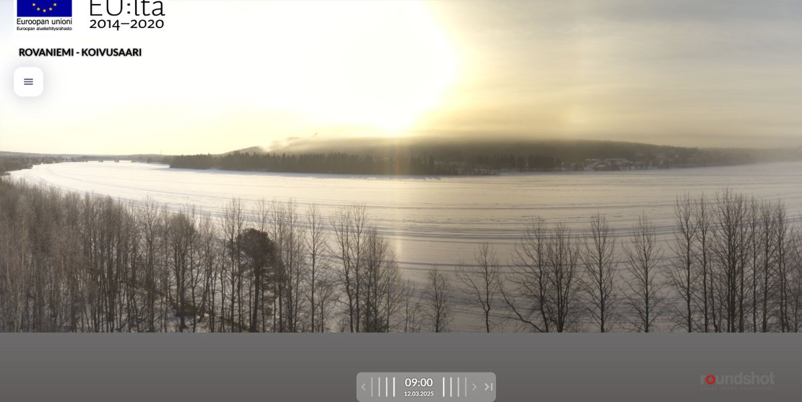
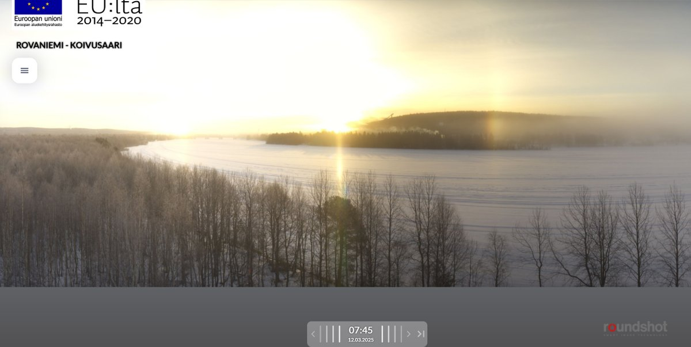
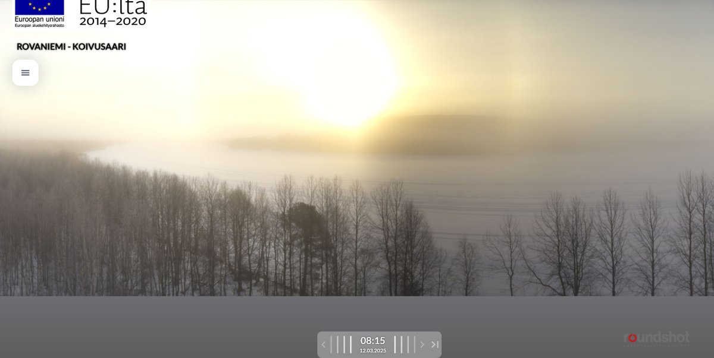

# Thread - 2025-03-12

**Original:** https://x.com/RiikonenMarko/status/1899749062426943792

---

### 1/1 - 2025-03-12 09:07 UTC

Last night (11/12 March 2025) I had the alarm off at 2:15 and dragged myself for a ride. It was all dry so I returned to bed (at 5 it is already twilight sky). At some point the conditions had developed as shown by these Koivusaari 360 camera images in the morning. I did some driving around before 8 but it was nothing to get excited about.

Coming night and morning could be big. Meteoblue forecasts fog starting midnight.

---

