# Thread - 2025-03-13

**Original:** https://x.com/RiikonenMarko/status/1900169659619410009

---

### 1/4 - 2025-03-13 12:58 UTC

12/13 March 2025, Rovaniemi. At the coalface almost the whole night, from 8pm to 4am. Took close to 1600 photos. And some videos. The theme was constantly present Moilanen arc. Here are just some random single images, not necessarily from the best stages. The temps got too low for big stuff.

Was right next to the Juujärvi racing company snowguns at the Ylikylä snowdump. Two nights ago I talked with the guy there: they are making deposit snow for the Ounasvaara ski center. They have to truck it over the river to Ounasvaara. They have been running simultaneously guns also at Ounasvaara, but maybe they don't have enough capacity.

I had to open the bonnet to cool the motor. It was overheating due to the coolant having all leaked out. I tend to keep the car on all the time to warm up the cameras. In the background is the setup, positive lamp elevation all night.

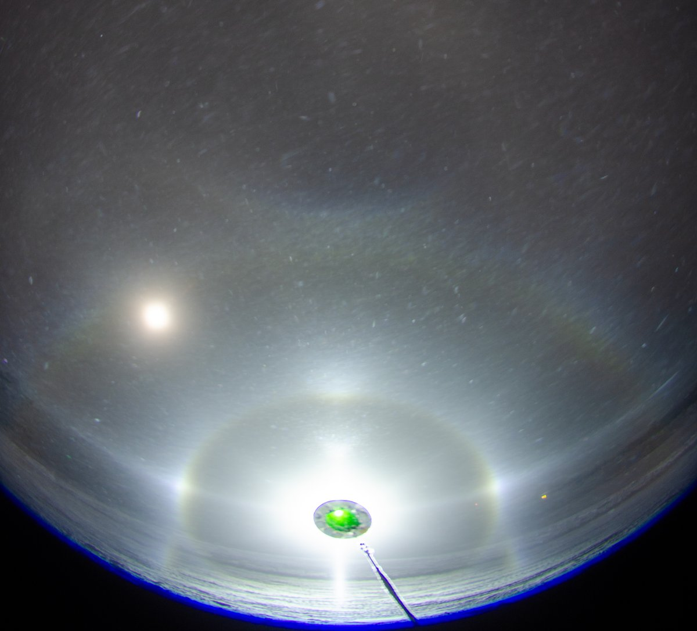

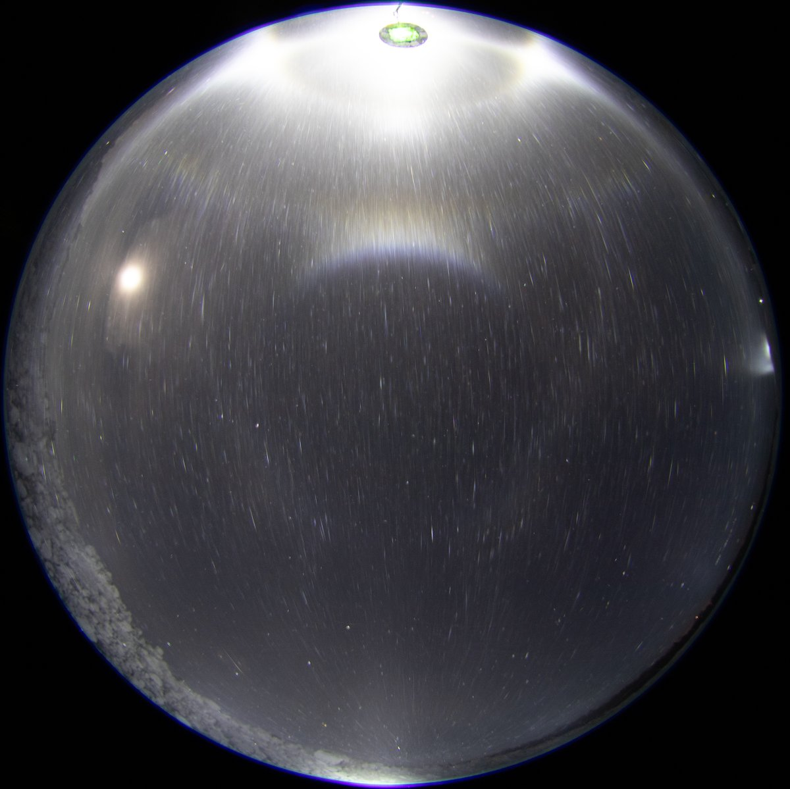

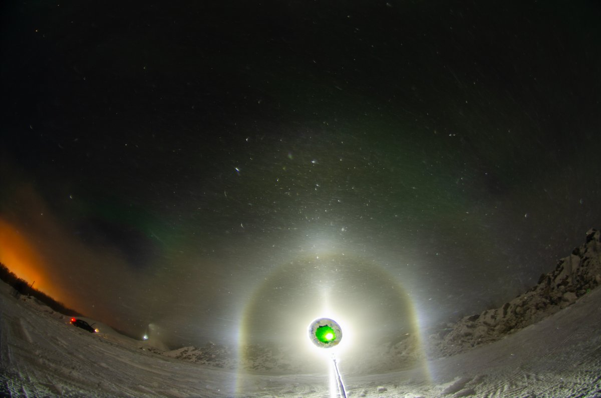

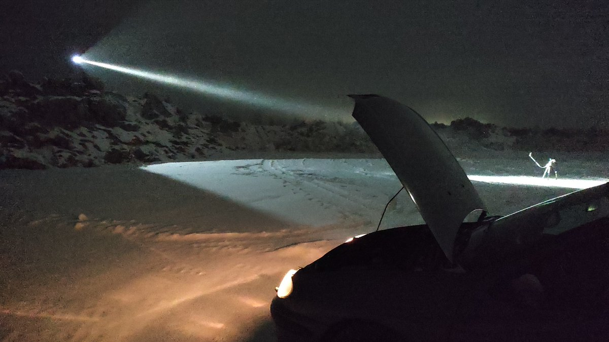

---

### 2/4 - 2025-03-14 09:22 UTC

In a meanwhile, a video of the night's action (12/13 March 2025, Rovaniemi). The original in Google Drive: https://drive.google.com/file/d/1eHGAIZprhdUFqfH5LWTglm9AQDUBcG23/view?usp=sharing

[🎬 1900477602315292836-xmhYsw_Cuj6AoLLe.mp4](media/1900477602315292836-xmhYsw_Cuj6AoLLe.mp4)

---

### 3/4 - 2025-03-22 08:10 UTC

12/13 March 2025. 76 x 5s. A Louekallio type stage. By which I mean Parry orientation dominance, but without well defined Parry arc. Marko Mikkilä has captured several such displays from Louiekallio ski resort ice fogs in Sievi:
https://t.co/XN8oLYKBDc
https://t.co/YNowxWRSnN
https://t.co/k3TZbW8hyd

So far lamp has been below horizon or max degree or two above in these kind of displays (in Rovaniemi we have seen similar ones as well, but the Mikkilä's cases are best ones), not allowing quite see the relation between Parry and tanarc because they are too close to each other. But here lamp is so high as to resolutely separate the two. What's revealed is that Parry arc is indeed there, but the brighter tanarc is just a smudge without V-shape

With HaloPoint, I tried two different scenarios to explain the tanarc. One was needle-like, other plate like crystals in poor Parry orientation (not poor column orientation because the crystals are not fully rotating – you might even call these poor Lowitz orientations). Even if I couldn't get sharp helic arc show up by keeping the Parry weaker than tanarc, on the whole I would say the latter scenario comes out as more believable. It replicates even what looks like Wegener next to tanarc (it does not seem like it would be parhelic circle from the moon).

The needle crystal explanation would also be weak in the sense that we would probably expect such crystals be falling pretty steadily. And I have never seen such crystals in snow gun display samples.

The green coloring is auroras. They are a pestilence. There was a time when I got stirred up by them, now I feel nothing no matter how big display.

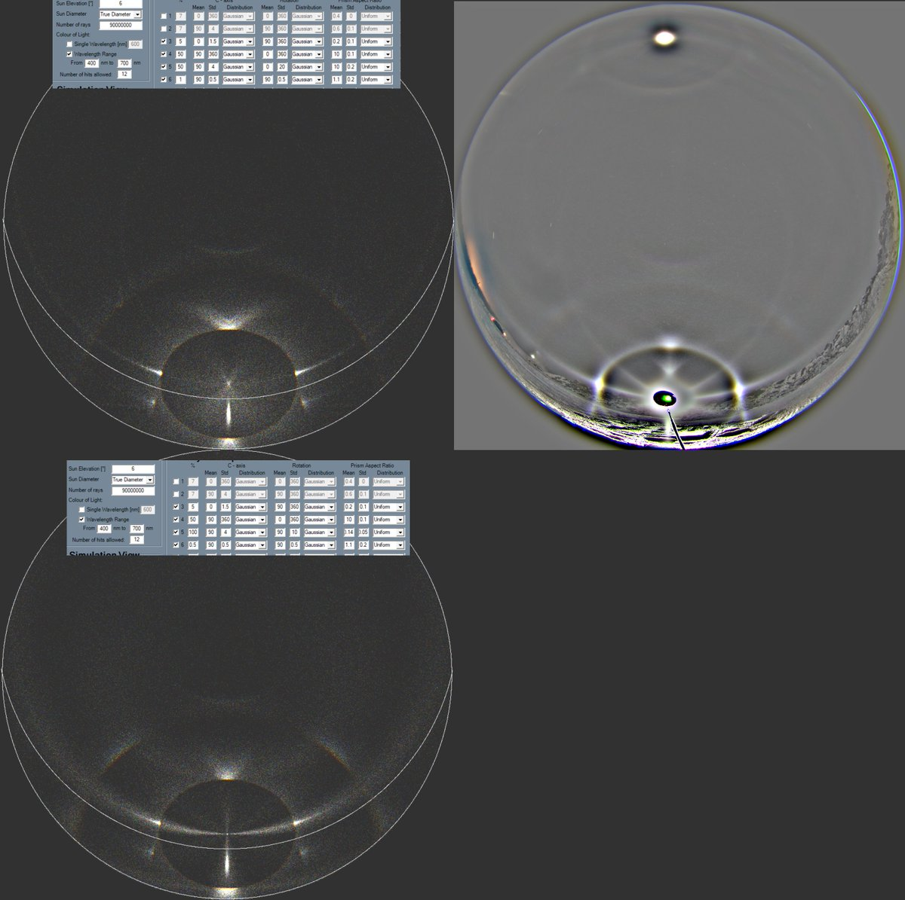

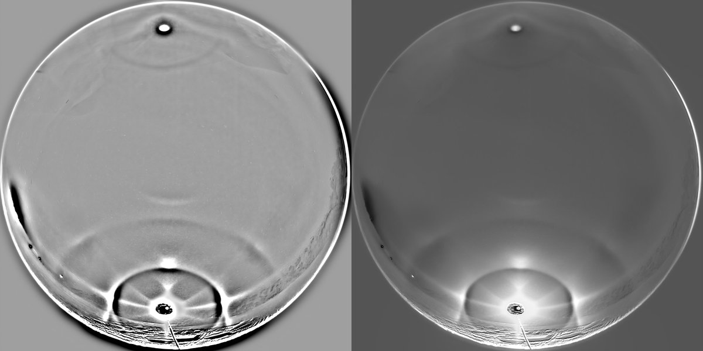

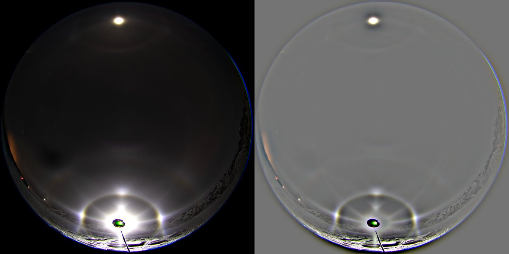

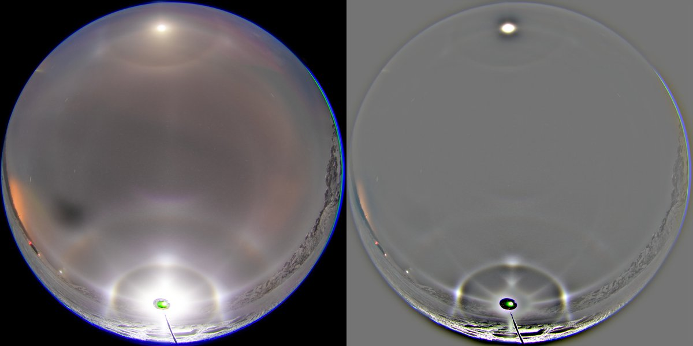

---

### 4/4 - 2025-03-28 06:54 UTC

12/13 March 2025. 71 x 2.5s. The background glow was really strong so I had to go for even darker image to not overexpose the Moilanen arc.

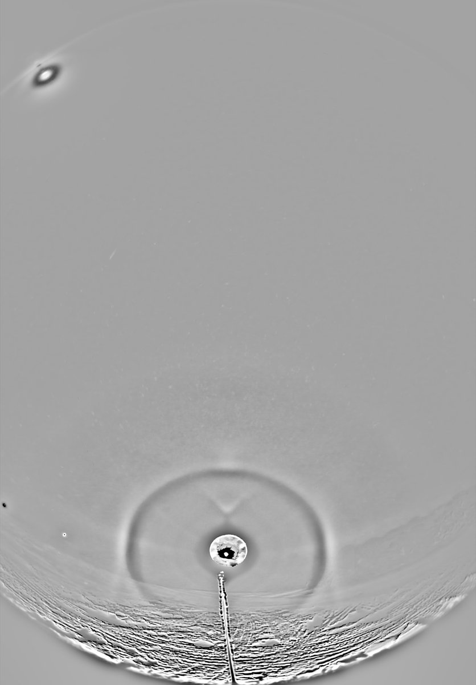

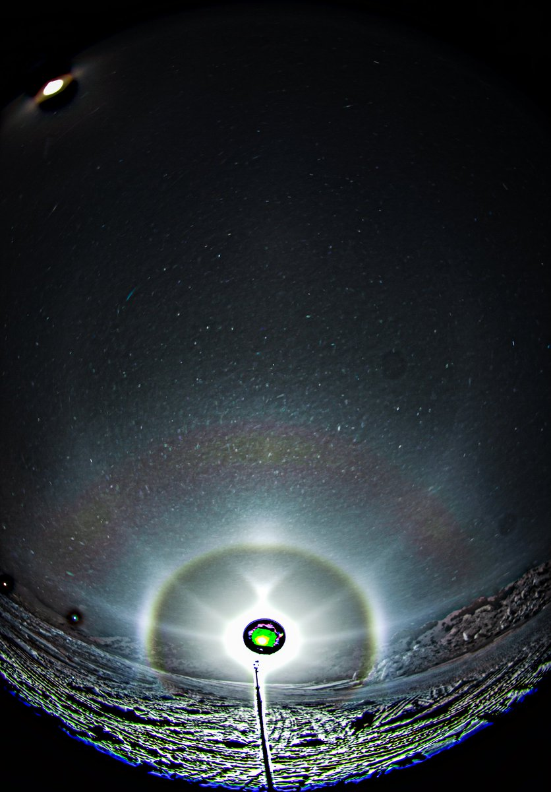

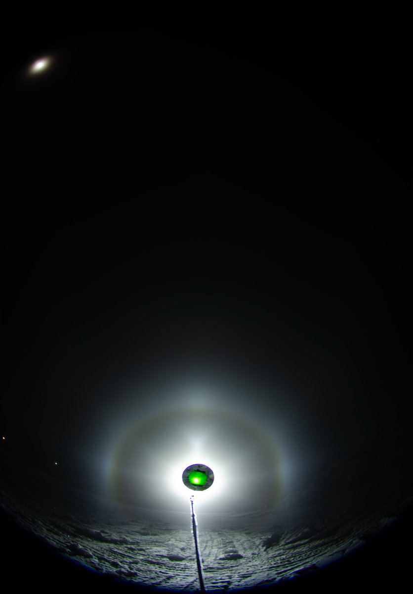

---

