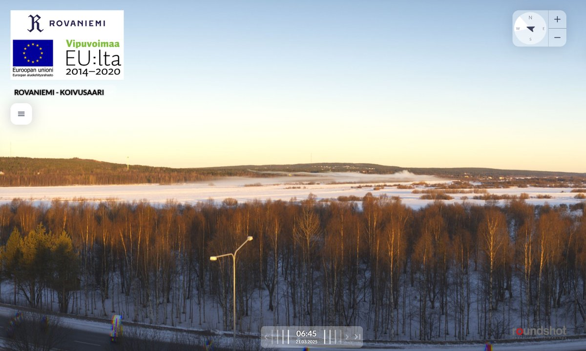

# Thread - 2025-03-21

**Original:** https://x.com/RiikonenMarko/status/1902981164056346771

---

### 1/1 - 2025-03-21 07:10 UTC

A small ice fog this morning (21 March 2025) from gunning at the Ylikylä snowdump. I was there, too, and no halo visible. Not even pillar. Temp at railway station -13 C, Apukka -20 C. Nights have been clear and they have been gunning at night non-stop (at ski center they gunned still on 15th March, but no more 17th when I was next time prowling). But too dry. Maybe this is the last gunning this spring, it warms up now.

Anyway, now I know, having talked with the Juujärvi racing company owner more, what's the deal with this snowmaking: they are making snow for the cross-country ski track early next season. This track is a city service. Usually the snow for it has been made by the ski center, but now the contract has been given for Juujärvi racing.

From the sound it, next winter looks glorious in Rovaniemi what comes to ice fog as it is not only the ski center that will be making snow. Various businesses have increasing demands for made snow, the more so the more snow poor the winter is.

But I won't be reaping from that. Things have become financially so restricting that keeping a car is a luxury I can't no more have.

---

