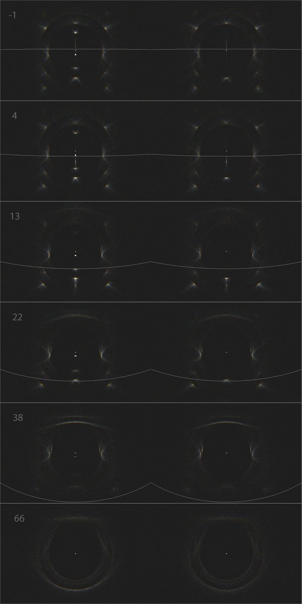
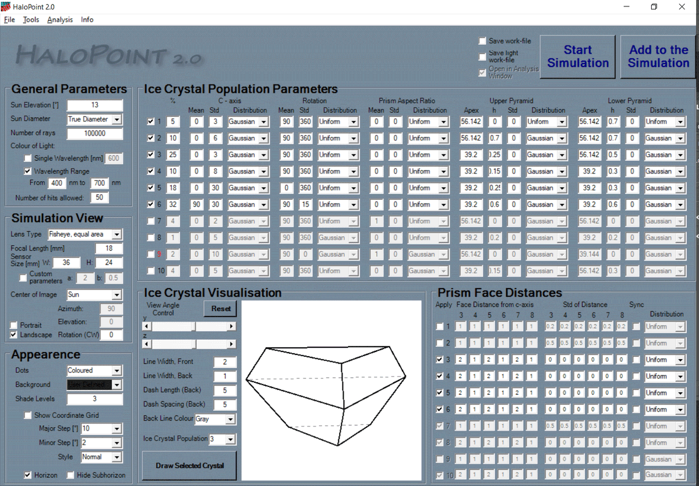
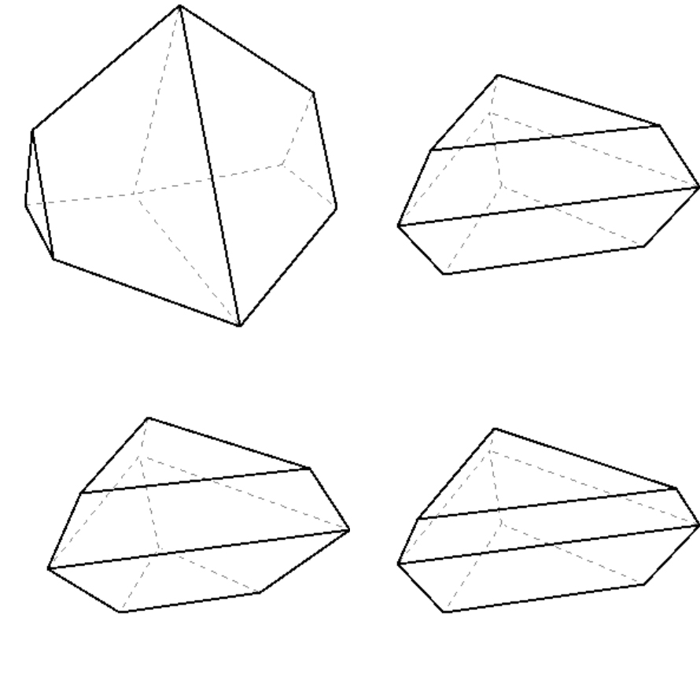
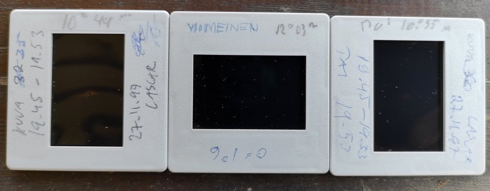

# Thread - 2025-03-26

**Original:** https://x.com/RiikonenMarko/status/1904803554205786387

---

### 1/6 - 2025-03-26 07:52 UTC

An alternative take on Lascar. I had send these some years ago to Lefa, Jia Hao and maybe some others (don't have the mails anymore, must have been lost during space freeing operation).

I don't agree that the V-shaped arc that appeared at low sun above the sun is the 13° arc predicted by the theory. I probably need to go in a later post into the whys and wherefores, but now it suffices just to present these simulations. On the left is the original Lefa model, on the right my version without 13° arc. It does not make the 3° arc below the sun either. The gradient method gleans out a spot about 3 degrees below sun in Lascar display slides, but I don't think the issue quite settled as yet. We should photograph other displays to make sure nothing similar comes up in them by application of this method.

---

### 2/6 - 2025-03-26 07:52 UTC

Respective parameters. First Lefa, second my take. People of course have recognized that using triangular crystals gets rid of the 13 and 3° arcs. But changing something can put other things off-kilter and I have not seen anyone actually try if you can still successfully simulate the display with such modified crystals. As it turned out, it was possible to leave the two arcs out without significant changes to the rest.

---

### 3/6 - 2025-03-28 06:25 UTC

Suppose the modified model that rids of 3 and 13° arcs is actually right. Then I find it noteworthy that the crystals in the four populations making Lascar halos are all fully triangular.

---

### 4/6 - 2025-05-07 07:53 UTC

All right, why I do not think the 13° upper arc predicted by the model was there:
- Measurement I made at the time from three slides give distances 10°44', 10°55' and 12°03' from the sun. This was done by using starfield photos taken with the same lens. ...

---

### 5/6 - 2025-05-07 07:54 UTC

- The arc was V-shaped. This indicates an elongated prism. A pyramidal crystal is poor candidate for making V-shape. I don't think we have yet seen V-shaped 9° plate arcs and even the 20° arcs tend to be fuzzy. In the photos the V-shape is unfortunately not visible.  ...

---

### 6/6 - 2025-05-07 07:56 UTC

- The arc was flickering. This behaviour was not seen on any other feature in the display. I remember of trying to time pressing the shutter to capture it when it was (relatively) strong, but after taking the photo I felt I had not succeed. ...

---

