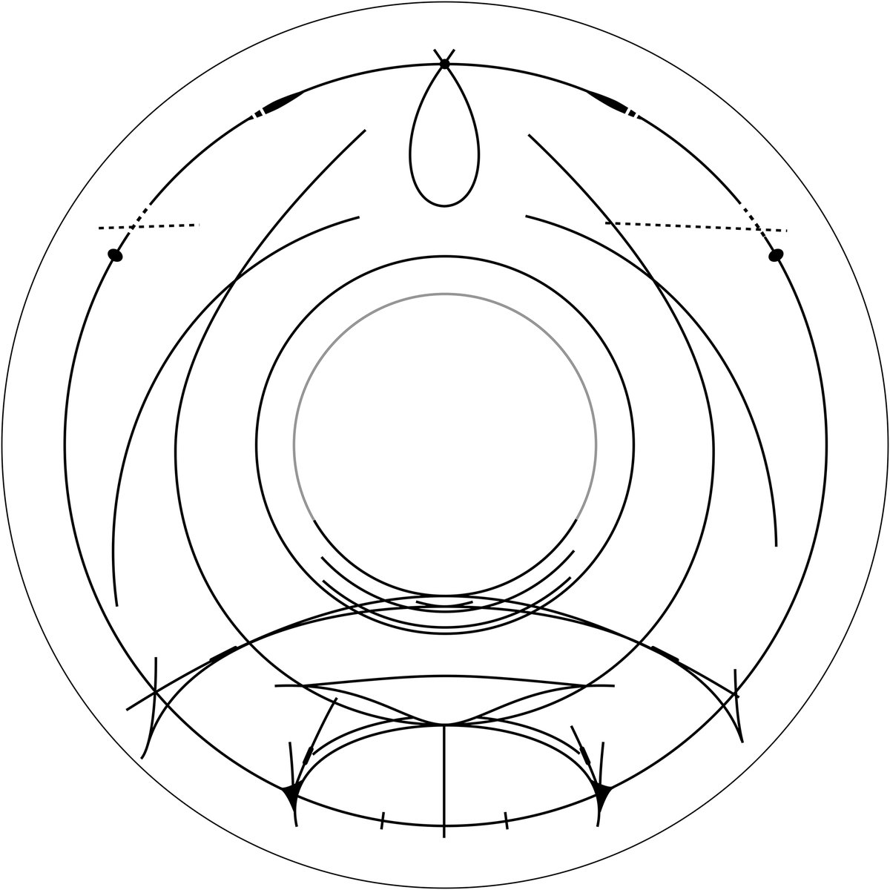

# Thread - 2025-04-03

**Original:** https://x.com/RiikonenMarko/status/1907859223415075233

---

### 1/1 - 2025-04-03 18:14 UTC

The Jutland display of 14 April 2020 is one in the Pantheon. Made line drawing based on photos by Anders Falk Jensen, Ole Jensen and Richard Østerballe. Dashing signifies a blue edge effect. I had raws to work with, a quite comprehensive collection as it turned out, much more than what's published online. I am not 100% on some features, like the Lilje blue spots, maybe Lilje itself and 46° contact arc. A compromise was necessary concerning the sun elevation, as some of the photos were taken at higher and some at lower sun. The two posts discussing the display in The Halo Vault:
https://t.co/6IdjNLDAEI
https://t.co/Vckjx7dj8p

---

