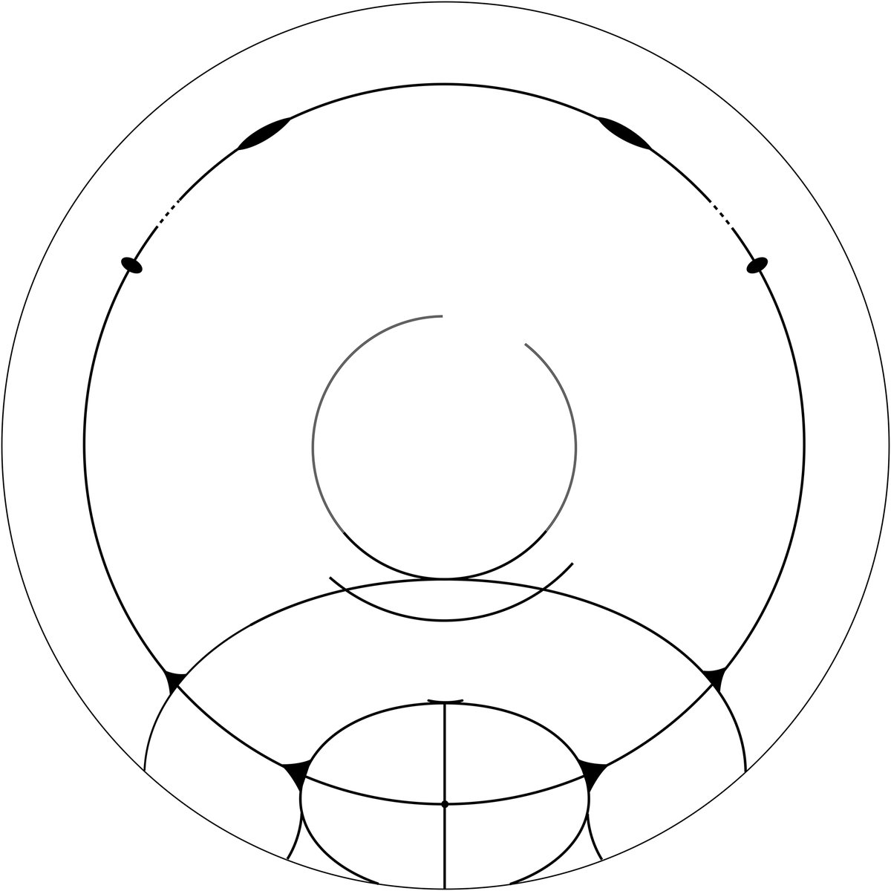

# Thread - 2025-04-04

**Original:** https://x.com/RiikonenMarko/status/1908012164633297374

---

### 1/1 - 2025-04-04 04:22 UTC

The Saskatoon-class Siziwang Qi display of February 14 2020. I have tried to be faithful to photographic documentation, which is why the gap in Dufay. In the Jutland display of the previous post I was not sure whether or not to draw the Dufay full, ditto the "integrated cza".

The two posts of Siziwang Qi in The Halo Vault:
https://t.co/FwgEYlKzWy
https://t.co/b19OGqvHme

---

