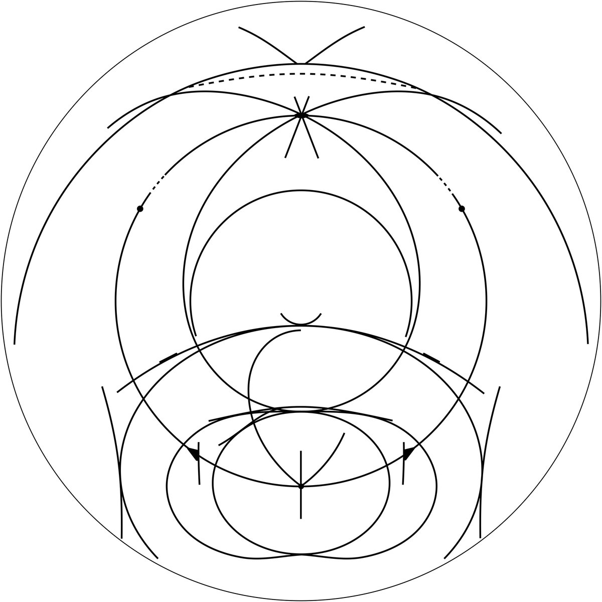
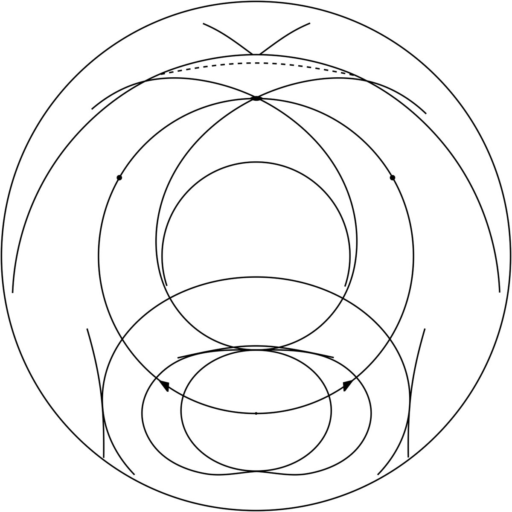
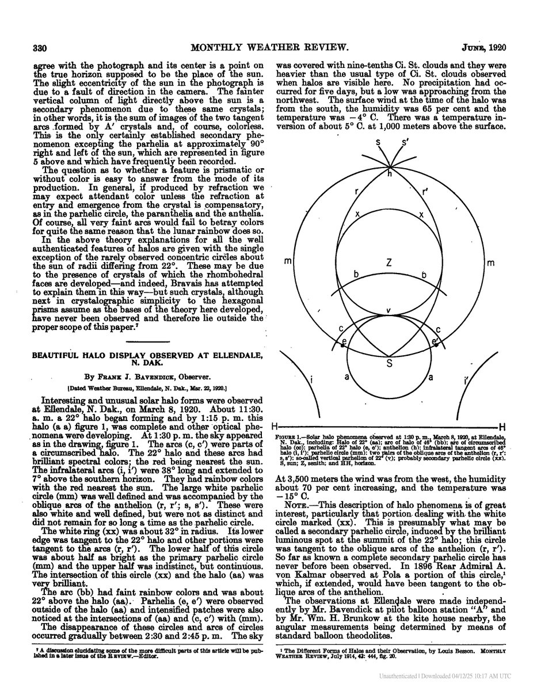

# Thread - 2025-04-05

**Original:** https://x.com/RiikonenMarko/status/1908389404063985931

---

### 1/3 - 2025-04-05 05:21 UTC

Another historical one is the 14 May 2014 display in Finland. More than 200 people contributed photos to Taivaanvahti, but only Marko Mikkilä's shots had the novel multiple scattering halo, the parhelic circle at 22° degrees. Observations' sun elevation range was wide and collecting every halo documented in one image which I chose to be somewhere around 38 degree light elevation necessitated some disregard of realism: CZA, 46° supralatarc, Tape arc, blue spot and the diffuse arcs' cross could not have occurred at this elevation.

---

### 2/3 - 2025-04-12 10:33 UTC

Here is Mikkilä-only version of the 14 May 2014 drawing, and more precicely Mikkilä-only at the time of the 22° parhelic circle. This is how I started, then just added everything else to come up with the full version. Mikkilä's observation: https://www.taivaanvahti.fi/observations/show/25534

---

### 3/3 - 2025-04-12 10:58 UTC

Bravais had foreseen 22° parhelic circle in 1847 and there are two subsequent historical candidates I know. The other one is by Bavendick and Brunkow on 8 March 1920 in North Dakota. I have lost the track of the other one. The 1896 case mentioned in the article is not that.

---

