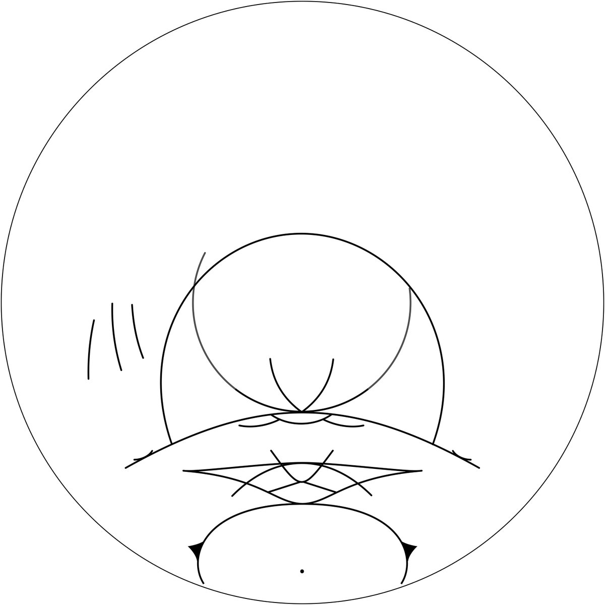

# Thread - 2025-04-06

**Original:** https://x.com/RiikonenMarko/status/1908770144765039078

---

### 1/1 - 2025-04-06 06:34 UTC

The display that Leesa Brown photographed on 23 April 2021 in Kissimmee, Florida, had a worthy collection of high rarities. What rises it in the Pantheon is the Ounasvaara arc – the first one in high clouds and from single photos at that.
https://thehalovault.blogspot.com/2021/05/the-first-ounasvaara-arc-in-high-cloud.html

---

