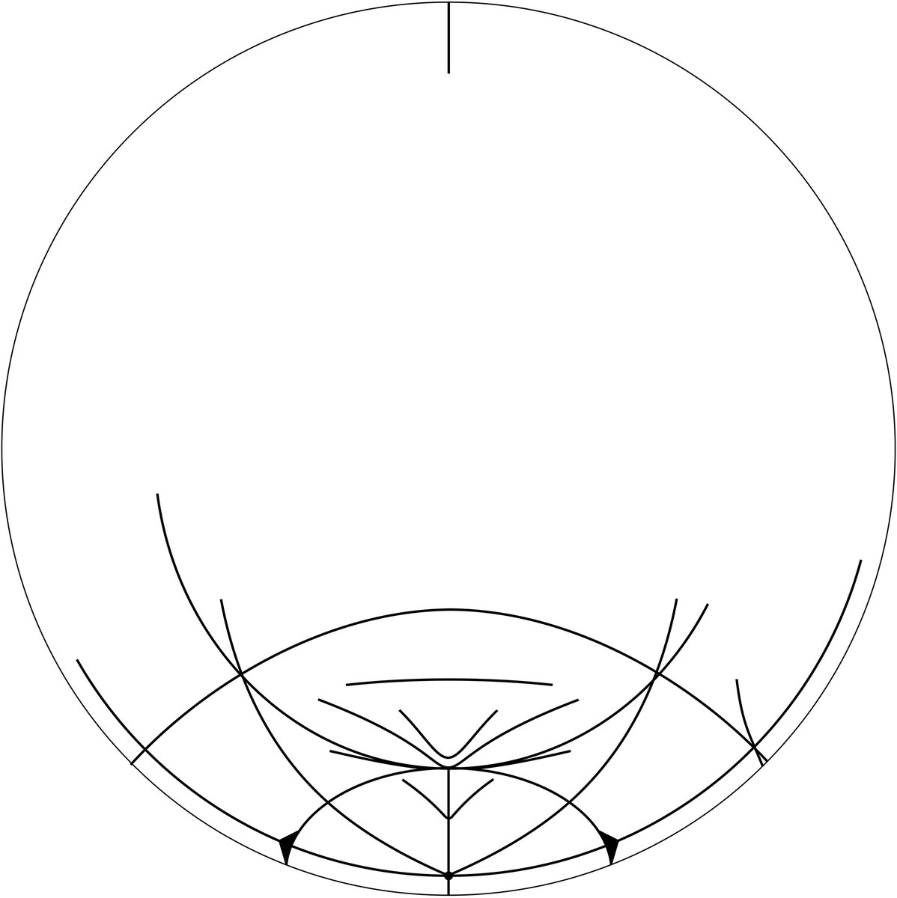

# Thread - 2025-04-10

**Original:** https://x.com/RiikonenMarko/status/1910358981932949659

---

### 1/1 - 2025-04-10 15:47 UTC

A more recent date to remember is 20 February 2025. This display, photographed by Tero Sipinen in Kouvola, Finland, provided the first celestial light source documentation of the unexplained feature that looks like Wegener gone awry. https://www.taivaanvahti.fi/observations/show/131995

---

