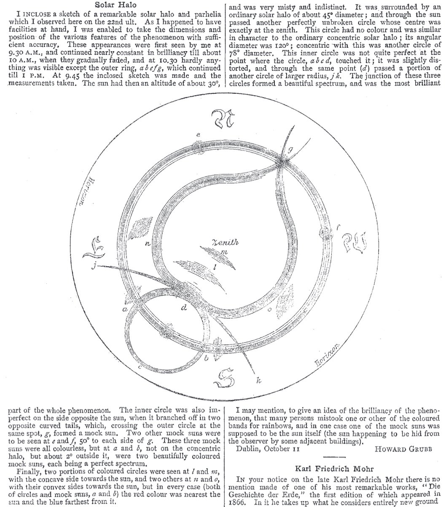

# Thread - 2025-04-16

**Original:** https://x.com/RiikonenMarko/status/1912513237016367451

---

### 1/1 - 2025-04-16 14:27 UTC

Bumped upon this surprisingly solid old observation from Dublin by Howard Grubb. Even if some things are confused, everything is identifiable. Not sure about the date – 22 September 1879? Nature vol. 20, p 628 (1879) https://rdcu.be/eh0UF

---

