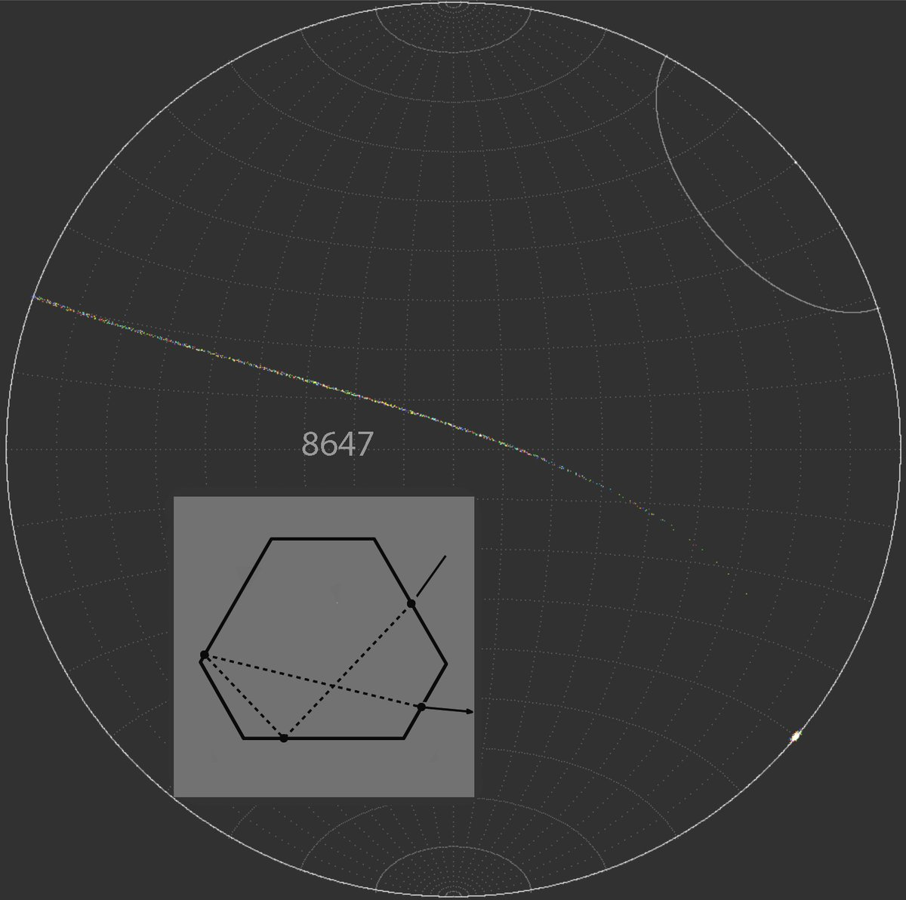
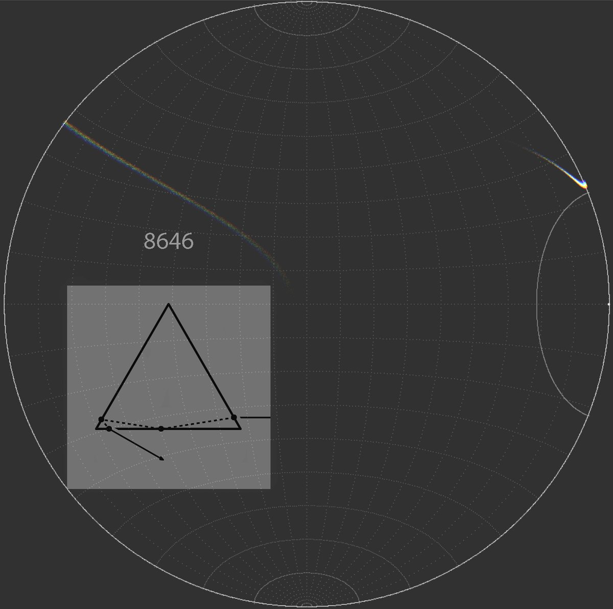

# Thread - 2025-05-17

**Original:** https://x.com/RiikonenMarko/status/1923655054210277583

---

### 1/1 - 2025-05-17 08:21 UTC

"What does ‘8647’ really mean", asks The Guardian https://theguardian.com/us-news/2025/may/16/8647-meaning-james-comey-instagram-trump It is of course the counterhelic arc. And 8646, for that matter, is rotated uppervex Parry arc.

---

