# Thread - 2025-07-08

**Original:** https://x.com/RiikonenMarko/status/1942549613002776710

---

### 1/3 - 2025-07-08 11:41 UTC

1/3 Elliptical halos in Tbilisi on three days in Sept 2022. I have published these already in Taivaanvahti. I saw none of these, camera was photographing by itself. ND 100 000  filter allowed long exposures. This one occurred 2 Sept. More info https://www.taivaanvahti.fi/observations/show/117807

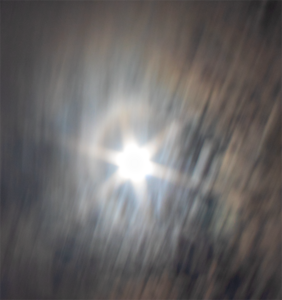

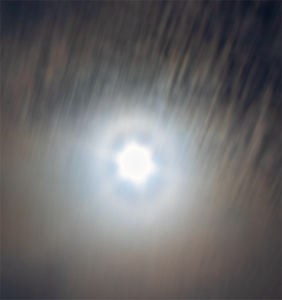

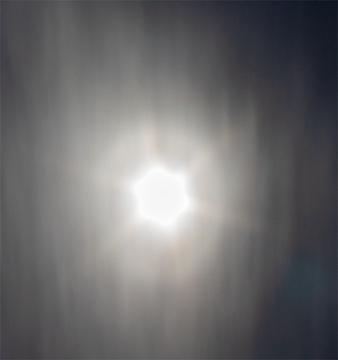

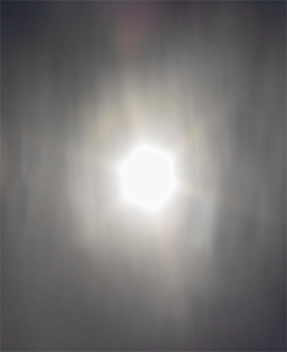

---

### 2/3 - 2025-07-08 11:41 UTC

2/3. Next day, 3 Sept, another ellipse. More info: https://taivaanvahti.fi/observations/show/117904 There was an abundance Ac virga in Tbilisi in the summer. If that is indeed a fixed yearly feature, then I wager elliptical halo displays number there more than normal displays.

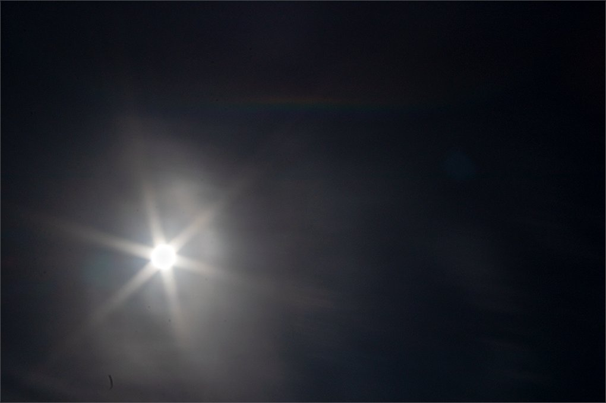

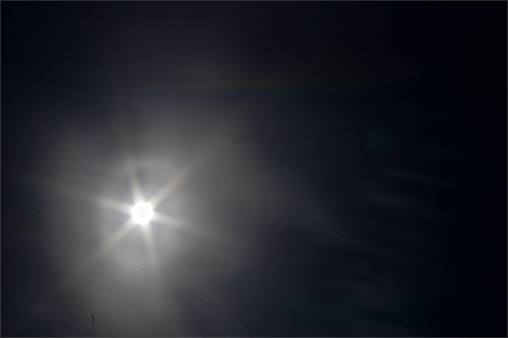

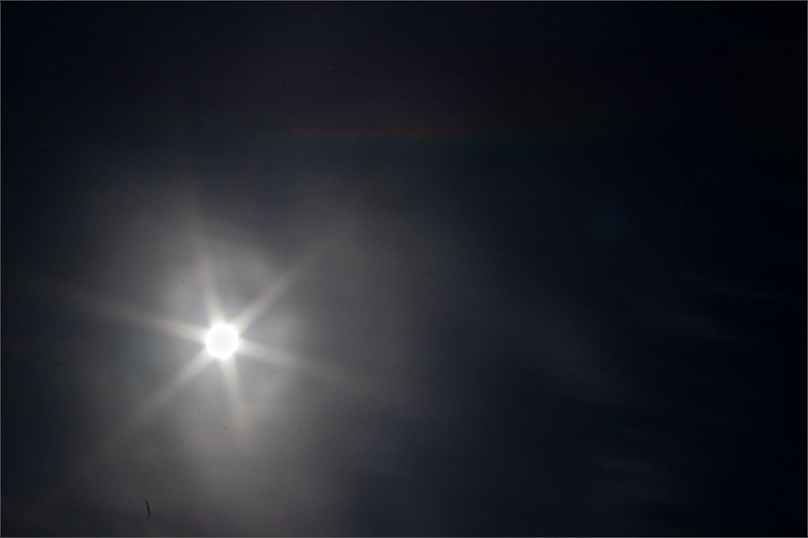

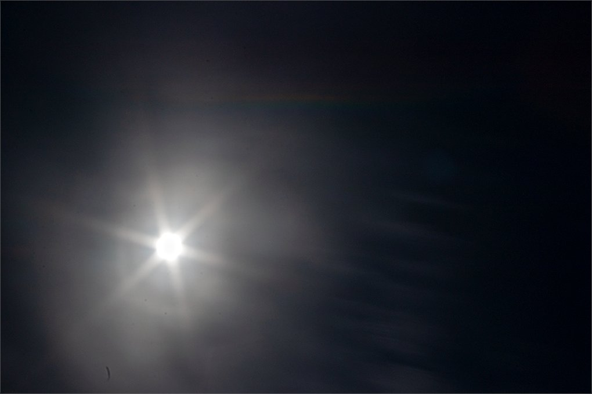

---

### 3/3 - 2025-07-08 11:41 UTC

3/3 On September 21. https://taivaanvahti.fi/observations/show/117920 I woke up late to photographing those virgas. Started in late August when I had been there already from the beginning of June. By September virgas were already becoming less. Definitely worth a revisit to do it properly.

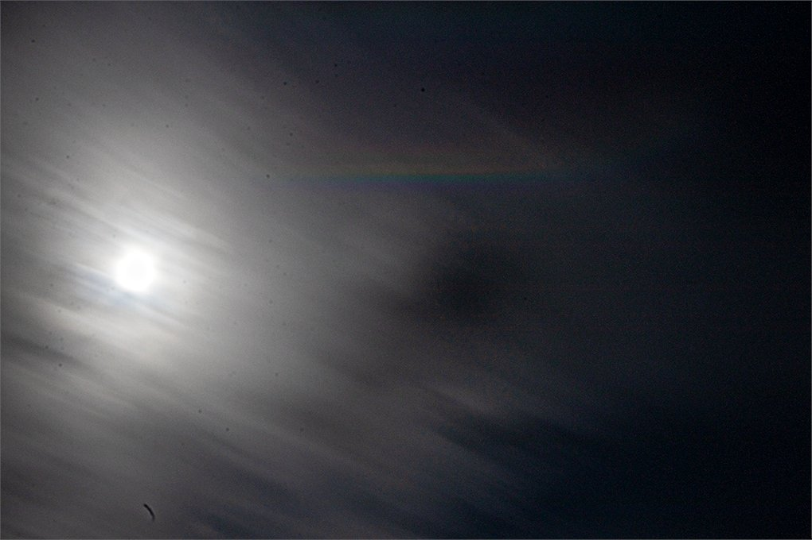

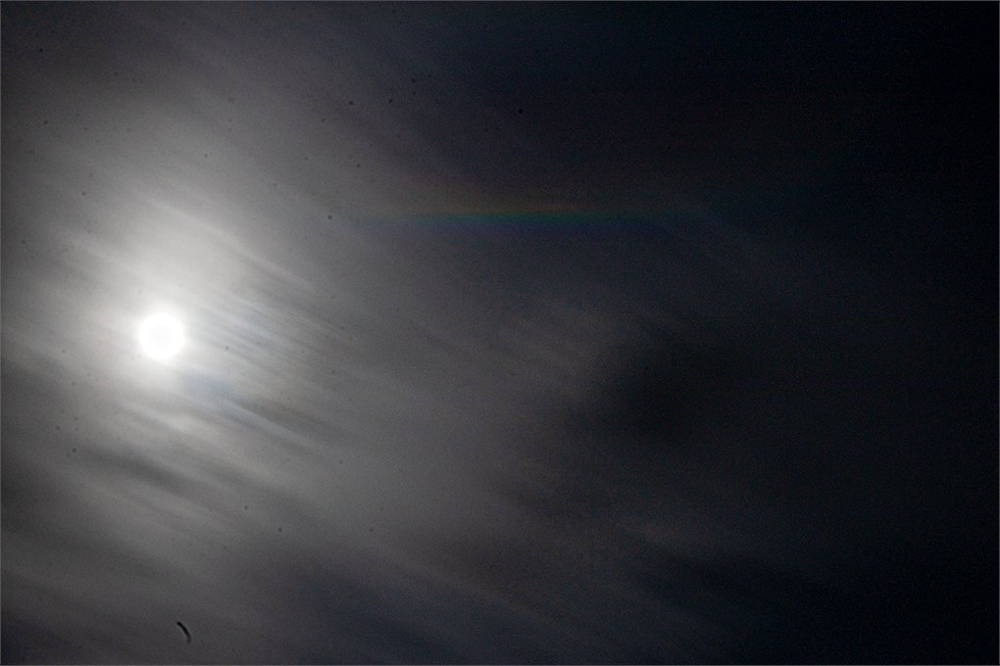

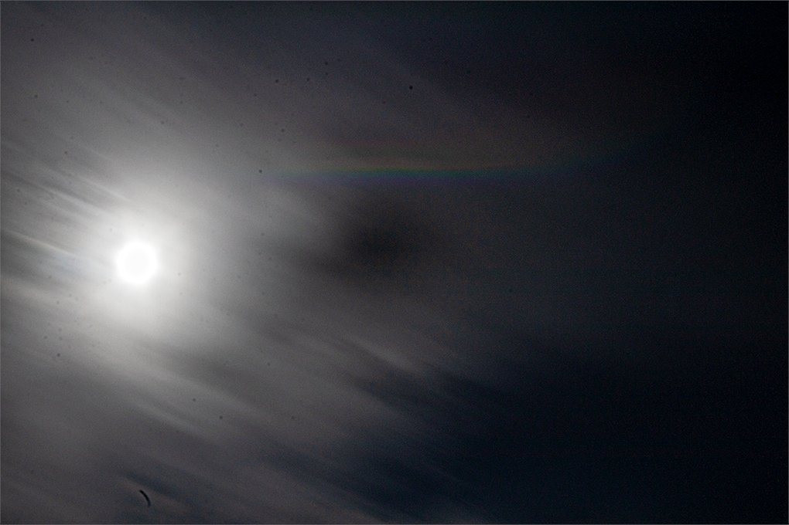

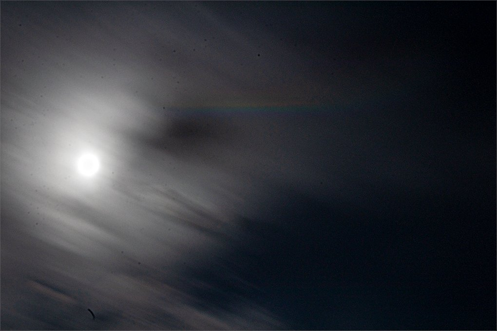

---

