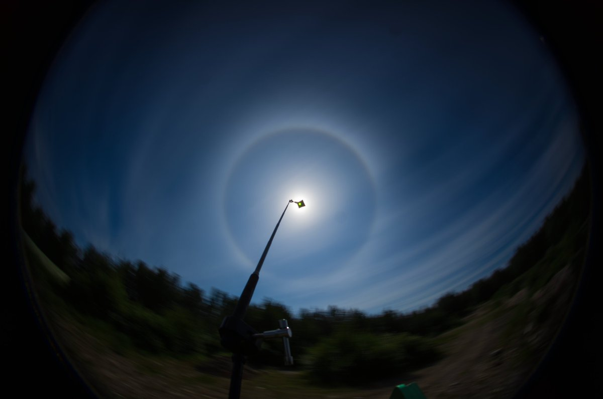
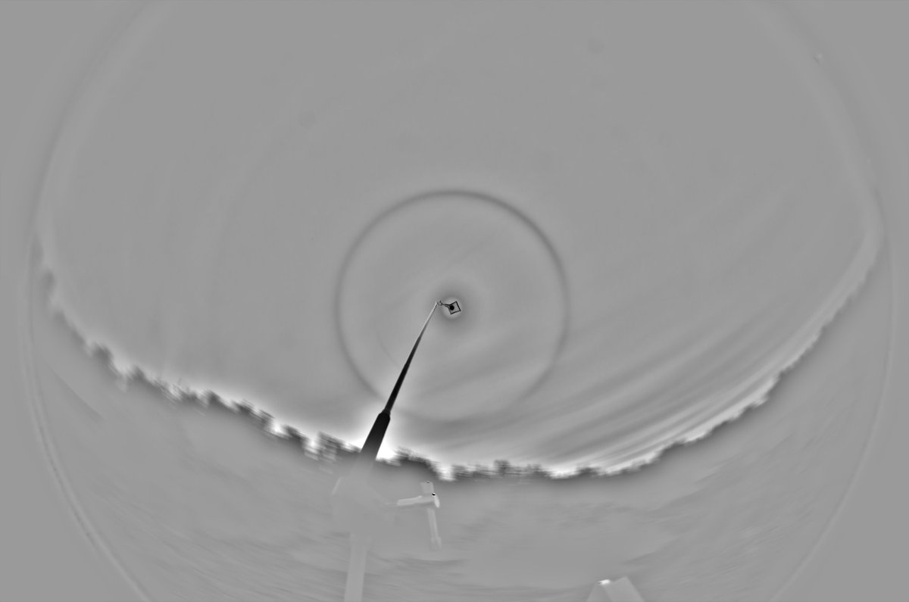

# Thread - 2025-07-12

**Original:** https://x.com/RiikonenMarko/status/1944051869745070331

---

### 1/1 - 2025-07-12 15:10 UTC

Small blocker is the way to go if we want to photograph the 6° halo again. This blocker shaded only part of the lens and a little lens reflection is seen, but there is no mistaking it for a halo. SolarQuest kept the sun steadily in place for the more than hour that I took photos.

---

