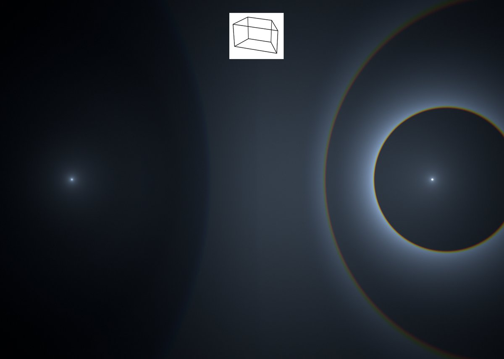
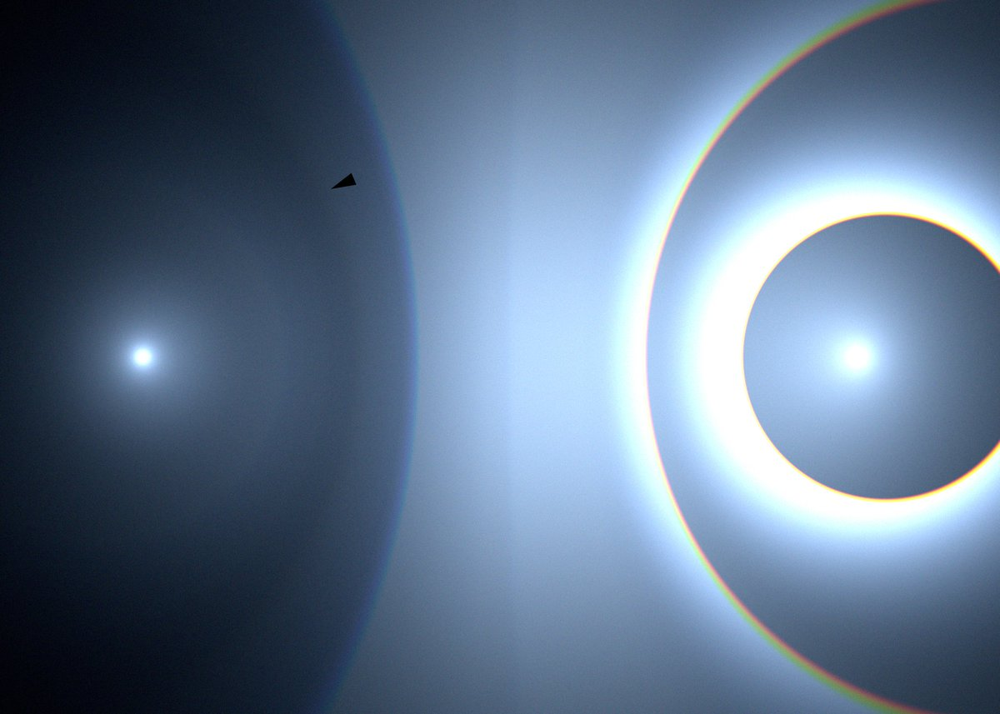
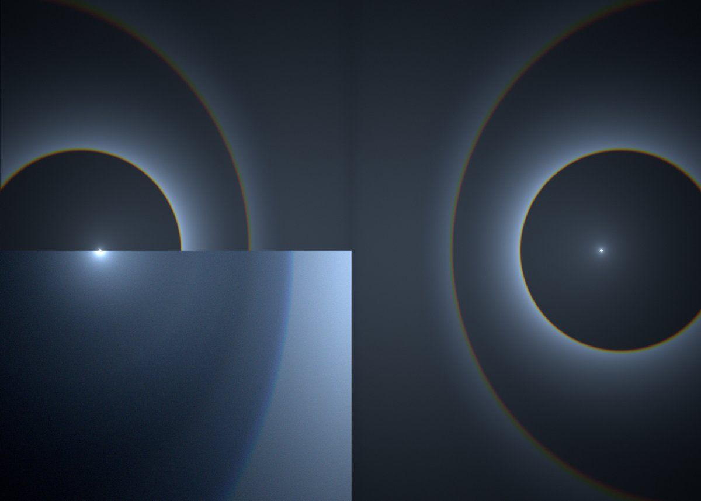
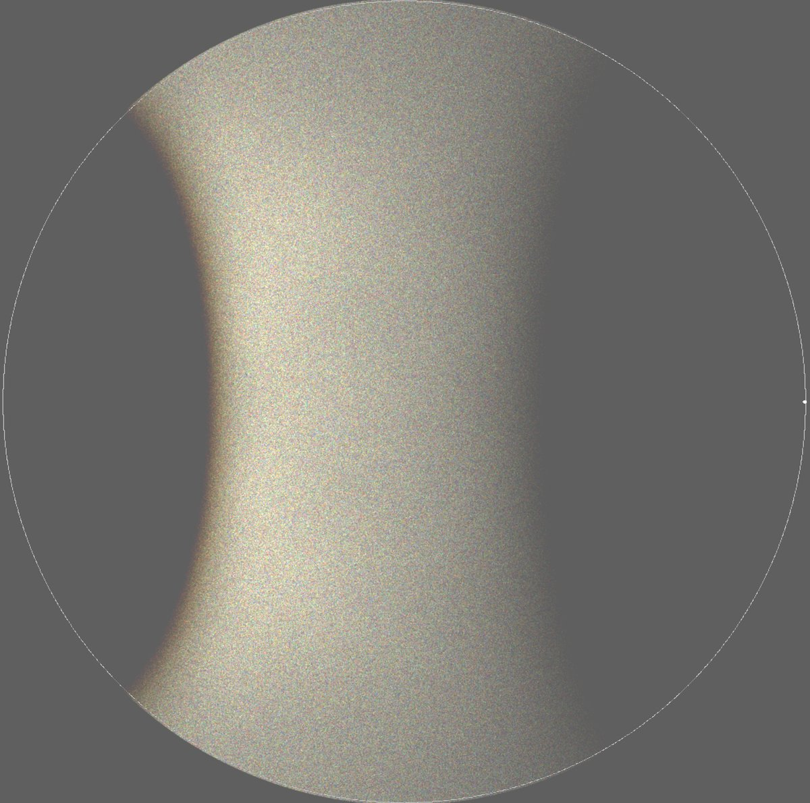

# Thread - 2025-07-23

**Original:** https://x.com/RiikonenMarko/status/1948083220823584915

---

### 1/2 - 2025-07-23 18:10 UTC

A couple of covert circular refraction halos from basic crystals are hiding in simulations. One is "antisolar 46° halo". Normally other rays overwhelm it, but with trapezius crystals the area inside the blue circle is dark enough for it to come up without filtering. 1/2

---

### 2/2 - 2025-07-23 18:10 UTC

The 1st image is the original simulation with Haloray, 2nd one has been levels-enhanced. In the 3rd image the antisolar 46° halo radius has been compared to the normal 46° halo. The 4th is a HaloPoint filtered simulation. The dominant raypaths are 12346 and 31562. 2/2

---

